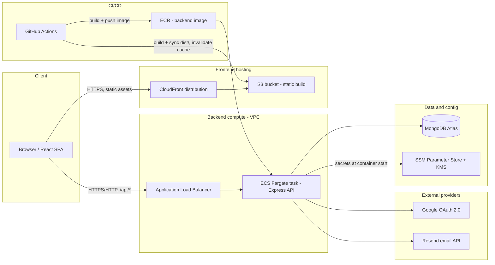
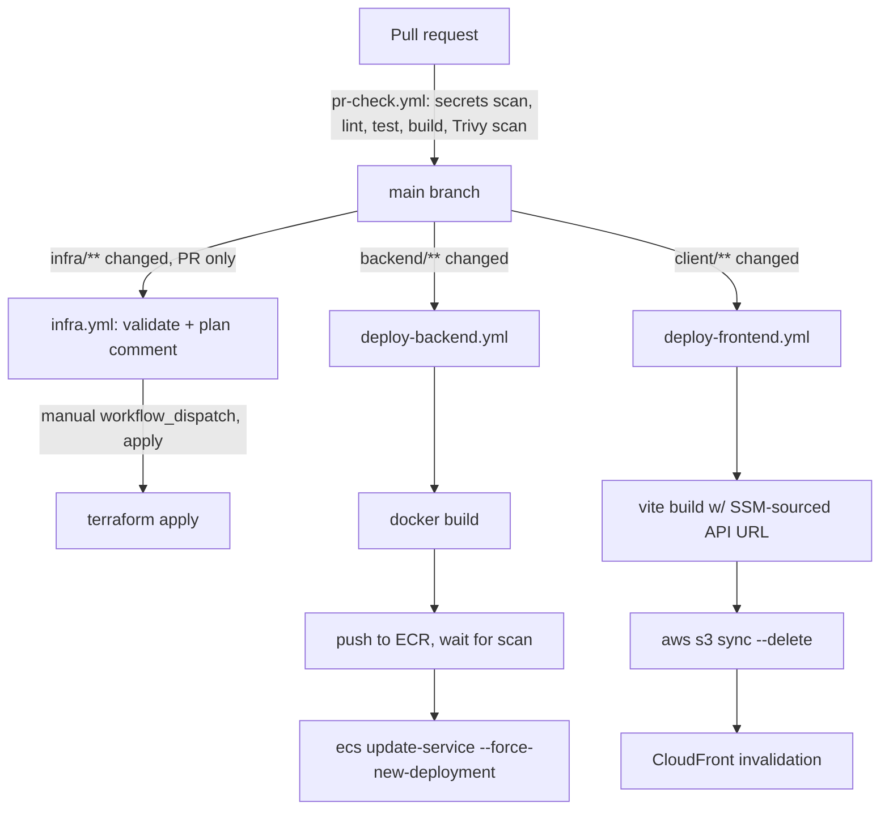

# AstriX — System Architecture

> This is the root of the AstriX engineering curriculum (see [`PLAN.md`](./PLAN.md) for how the rest of `docs/` is organized, and for the teaching contract every file below follows). It is a map, not a chapter: it establishes the shared vocabulary, the real code landmarks, and the diagrams that `docs/backend/`, `docs/frontend/`, `docs/infra/`, and `docs/testing/` all link back to. Read this first, then follow the links into whichever layer you're studying.

AstriX is a workspace/project/task management app (think a lightweight Jira/Asana): a React SPA talking to an Express/MongoDB API, deployed on AWS as static assets behind CloudFront and a containerized API behind an Application Load Balancer.

---

## 1. Architectural style — the landscape, then AstriX's choice

Before drawing AstriX's boxes and arrows, it's worth naming the actual menu of options a team has when deciding how to structure a whole system, because AstriX's choice only makes sense in contrast to the alternatives:

- **Monolith** — one deployable unit contains the entire backend (all domains: auth, billing, notifications, everything) as one process, one codebase, usually one database. Simple to run and reason about locally; scales as a single unit, so a hot path in one domain forces you to scale the whole thing.
- **Microservices** — each business capability (auth, billing, notifications, ...) is its own deployable service, its own datastore, talking over the network (REST/gRPC/events). Independent scaling and deployment per service; the cost is distributed-systems complexity — network calls where there used to be function calls, eventual consistency, service discovery, and a much heavier ops/observability bill.
- **Modular monolith** — a middle path: one deployable process, but the *internal* code is organized into clearly bounded modules (by domain, not by technical layer) with disciplined boundaries between them, so it could be split into services later without a rewrite, but you don't pay microservices' operational tax on day one.
- **Serverless/FaaS** — no long-running process at all; individual functions run on-demand behind a managed platform (AWS Lambda, etc.). Removes server/scaling ops almost entirely, at the cost of cold starts, execution-time limits, and a different (often harder) local-dev/debugging story.

**AstriX is a monolith** — specifically, a single Express process handling every domain (auth, workspaces, projects, tasks, members), backed by one MongoDB database, shipped as one Docker image (`backend/Dockerfile`) and run as one ECS Fargate service. It is *not* internally organized as a modular monolith by domain (workspace code, project code, and task code are not isolated from each other) — it's organized by **technical layer** instead (all routes together, all controllers together, all services together). That's a distinct decision from "monolith vs. microservices," and it's significant enough to get its own chapter: see [`docs/backend/01-architecture-patterns-and-project-structure.md`](./backend/01-architecture-patterns-and-project-structure.md) for the full survey of layered-vs-feature-based-vs-hexagonal folder organization and why AstriX picked layered.

The frontend and backend are two genuinely separate deployables (the browser talks to each independently — see §2 below), which is a common enough pattern that it's worth naming: this isn't a monolith in the "one process serves both HTML and API" sense (there's no server-rendered page, no shared process) — it's a **decoupled SPA + API** pair, each independently built, deployed, and scaled, sharing nothing at runtime except the REST contract between them.

---

## 2. System topology

Two independent origins are reached directly by the browser — the API is **not** proxied through the CDN. This is a deliberate choice, called out explicitly in the infra code's own comments:

```hcl
# infra/modules/cloudfront_s3/main.tf:13-14
# CloudFront serves ONLY the frontend (React SPA).
# Backend API calls go directly to the ALB, bypassing CloudFront entirely.
```



The backend's own bootstrap code is explicit about which proxy hop it trusts, which only makes sense once you've seen this topology — CloudFront never touches API traffic, so the "one hop" the app trusts is the ALB:

```ts
// backend/src/index.ts:29-33
/**
 * We run behind CloudFront → ALB → Express
 * So we must trust the first proxy.
 */
app.set("trust proxy", 1);
```

- **Frontend**: React SPA, built by Vite, uploaded to a private S3 bucket, served through CloudFront via Origin Access Control (no public S3 access). A CloudFront Function rewrites extension-less paths to `/index.html` for client-side routing (`infra/modules/cloudfront_s3/main.tf:398-428`).
- **Backend**: a single Express container running on ECS Fargate, in private subnets, reachable only from the ALB's security group (`infra/modules/security/main.tf:91-104`), registered to the ALB's target group by IP (`infra/modules/ecs/main.tf:216-245`).
- **Database**: MongoDB (Atlas, external to the VPC) via Mongoose. Connection pool sizing is deliberately capped — every ECS task shares Atlas's total connection ceiling.
- **Secrets/config**: AWS SSM Parameter Store, optionally KMS-encrypted for sensitive values (Mongo URI, JWT secrets, Google client secret), injected into the ECS task definition's `secrets` block at container start (`infra/modules/ecs/main.tf:114-160`). Non-sensitive values (`PORT`, `NODE_ENV`) are plain task-definition env vars.
- **External providers**: Google OAuth 2.0 (manual authorization-code flow, no SDK) and Resend (transactional email), both called directly from the backend — see `backend/src/providers/`.

Full per-layer topology, module-by-module, lives in [`docs/infra/00-master-infra-architecture.md`](./infra/00-master-infra-architecture.md).

---

## 3. Request lifecycle — the shared spine, with real code

Every deep-dive file traces some slice of this same path. Knowing it once here, in actual code, saves re-deriving it a dozen times.

### 3.1 Public page load — the frontend boots

```tsx
// client/src/main.tsx:1-19
import { StrictMode } from "react";
import { createRoot } from "react-dom/client";
import { NuqsAdapter } from "nuqs/adapters/react";

import "./index.css";
import App from "./App.tsx";
import QueryProvider from "./context/query-provider.tsx";
import { Toaster } from "./components/ui/toaster.tsx";

createRoot(document.getElementById("root")!).render(
  <StrictMode>
    <QueryProvider>
      <NuqsAdapter>
        <App />
      </NuqsAdapter>
      <Toaster />
    </QueryProvider>
  </StrictMode>
);
```

```tsx
// client/src/App.tsx:1-13
import AppRoutes from "./routes";
import ErrorBoundary from "./components/error-boundary";

function App() {
  return (
    <ErrorBoundary>
      <AppRoutes />
    </ErrorBoundary>
  );
}

export default App;
```

Provider nesting, outermost to innermost: `StrictMode` → `QueryProvider` (React Query) → `NuqsAdapter` (URL-state) → `App`'s `ErrorBoundary` → `AppRoutes` (which mounts `BrowserRouter` itself, at `client/src/routes/index.tsx:16`). Notably there's **no global `AuthProvider` here** — it's mounted deeper, only inside the authenticated layout (`client/src/layout/app.layout.tsx`), so public pages never pay for auth-context setup they don't need.

Route guards then determine "am I logged in" the same way every time: not by reading a local flag, but by calling `useAuth()` (a React Query hook hitting `GET /user/current`) and checking whether it returns a user. There is no client-only source of truth for authentication — see §4 below for why.

### 3.2 Authenticated API call — the backend receives it

The client's axios instance attaches the bearer token on every outgoing request, reading it directly out of the Zustand store rather than React state — interceptors run outside the component tree, so there's nothing else to read from:

```ts
// client/src/lib/axios-client.ts:40-46
API.interceptors.request.use((config) => {
  const accessToken = useStoreBase.getState().accessToken;
  if (accessToken) {
    config.headers["Authorization"] = "Bearer " + accessToken;
  }
  return config;
});
```

On the server, every protected router is mounted behind `authenticate` at the point it's registered — not inside each individual route file:

```ts
// backend/src/index.ts:147-155
// Auth routes (mostly public)
app.use(`${BASE_PATH}/auth`, authRoutes);

// Protected routes (require JWT)
app.use(`${BASE_PATH}/user`, authenticate, userRoutes);
app.use(`${BASE_PATH}/workspace`, authenticate, workspaceRoutes);
app.use(`${BASE_PATH}/project`, authenticate, projectRoutes);
app.use(`${BASE_PATH}/task`, authenticate, taskRoutes);
app.use(`${BASE_PATH}/member`, authenticate, memberRoutes);
```

`authenticate` itself does four separate checks before letting a request through — not just "is the JWT signature valid," but "is the user still active" and "is the session it names still valid":

```ts
// backend/src/middlewares/auth.middleware.ts:1-57
import { Request, Response, NextFunction } from "express";
import {
  extractBearerToken,
  verifyAccessTokenAndGetPayload,
} from "../utils/jwt";
import { UnauthorizedException } from "../utils/appError";
import UserModel from "../models/user.model";
import SessionModel from "../models/session.model";

export const authenticate = async (
  req: Request,
  res: Response,
  next: NextFunction
) => {
  try {
    const authHeader = req.headers.authorization;
    const token = extractBearerToken(authHeader);

    if (!token) {
      throw new UnauthorizedException("Token not found");
    }

    const payload = verifyAccessTokenAndGetPayload(token);

    const user = await UserModel.findById(payload.userId);

    if (!user) {
      throw new UnauthorizedException("User not found");
    }

    if (!user.isActive) {
      throw new UnauthorizedException("User is not active");
    }

    const session = await SessionModel.findById(payload.sessionId);

    if (!session) {
      throw new UnauthorizedException("Session not found");
    }
    if (!session.isValid) {
      throw new UnauthorizedException("Session has been revoked");
    }
    if (session.expiresAt <= new Date()) {
      throw new UnauthorizedException("Session has expired");
    }

    if (session.userId.toString() != user._id.toString()) {
      throw new UnauthorizedException("Invalid Session");
    }
    req.user = user;
    req.session = session;

    next();
  } catch (error) {
    next(error);
  }
};
```

Notice the JWT alone is never sufficient — a valid signature just proves the token was issued by this server; the middleware still round-trips to Mongo to confirm the *session* it names hasn't been revoked. That's what makes server-side logout (§4) actually work despite using stateless-looking JWTs. Full middleware-pipeline detail (mount order, rate limiting, `helmet`/CORS) is in [`docs/backend/03-middleware-and-request-pipeline.md`](./backend/03-middleware-and-request-pipeline.md); the full `authenticate`/session/OAuth story is in [`docs/backend/02-authentication-and-authorization.md`](./backend/02-authentication-and-authorization.md).

### 3.3 Errors funnel to one place

Whatever fails past that point — a Zod validation error, a Mongoose cast/validation error, a duplicate-key conflict, or a thrown `AppError` — reaches the exact same handler, because every controller is wrapped in `asyncHandler`:

```ts
// backend/src/middlewares/asyncHandler.middleware.ts:13-21
export const asyncHandler =
  (controller: AsyncControllerType): AsyncControllerType =>
  async (req, res, next) => {
    try {
      await controller(req, res, next);
    } catch (error) {
      next(error);
    }
  };
```

...and the handler at the end of the middleware chain decides the shape of the response by error type, in a fixed precedence order (full code and precedence table in [`docs/backend/04-error-handling-patterns.md`](./backend/04-error-handling-patterns.md)):

```ts
// backend/src/middlewares/errorHandles.middleware.ts:134-147 (excerpt — final two branches)
  if (error instanceof AppError) {
    return res.status(error.statusCode).json({
      message: error.message,
      errorCode: error.errorCode,
    });
  }

  return res.status(HTTPSTATUS.INTERNAL_SERVER_ERROR).json({
    message: "Internal Server Error",
    error:
      config.NODE_ENV === "production"
        ? "Unknown error occurred"
        : error?.message || "Unknow error occurred",
  });
};
```

### 3.4 The client auto-recovers from an expired access token

If the access token has expired, the *first* 401 the client sees doesn't reach the calling code as a failure — the response interceptor silently refreshes and retries once, queuing any other requests that fail concurrently behind the same in-flight refresh so a page that fires five requests at once doesn't trigger five parallel refresh calls:

```ts
// client/src/lib/axios-client.ts:52-136
API.interceptors.response.use(
  (response) => response,
  async (error: AxiosError) => {
    const originalRequest = error.config as InternalAxiosRequestConfig & {
      _retry?: boolean;
    };

    const data = error.response?.data as { errorCode?: string } | undefined;
    const customError: CustomError = {
      ...error,
      errorCode: data?.errorCode || "UNKNOWN_ERROR",
    };

    if (error.response?.status !== 401) {
      return Promise.reject(customError);
    }

    if (originalRequest.url?.includes("/auth/refresh")) {
      useStoreBase.getState().clearAuth();
      window.location.href = "/sign-in";
      return Promise.reject(customError);
    }

    if (originalRequest._retry) {
      return Promise.reject(customError);
    }

    if (isRefreshing) {
      return new Promise((resolve, reject) => {
        failedQueue.push({
          resolve: (token: string) => {
            originalRequest.headers.Authorization = `Bearer ${token}`;
            resolve(API(originalRequest));
          },
          reject: (err: unknown) => reject(err),
        });
      });
    }

    originalRequest._retry = true;
    isRefreshing = true;

    try {
      const response = await axios.post(
        `${baseURL}/auth/refresh`,
        {},
        { withCredentials: true }
      );

      const { access_token } = response.data;
      useStoreBase.getState().setAccessToken(access_token);
      processQueue(null, access_token);

      originalRequest.headers.Authorization = `Bearer ${access_token}`;
      return API(originalRequest);
    } catch (refreshError) {
      processQueue(refreshError, null);
      useStoreBase.getState().clearAuth();

      const currentPath = window.location.pathname;
      if (
        !currentPath.includes("/sign-in") &&
        !currentPath.includes("/sign-up")
      ) {
        window.location.href = "/sign-in";
      }

      return Promise.reject(refreshError);
    } finally {
      isRefreshing = false;
    }
  }
);
```

Full request/response-cycle detail, including the exact Zod schemas and Mongoose queries per domain, lives in [`docs/backend/00-master-backend-architecture.md`](./backend/00-master-backend-architecture.md).

---

## 4. Cross-cutting auth model

Auth is the one flow that touches every layer, so it gets a summary here in addition to its own chapter ([`docs/backend/02-authentication-and-authorization.md`](./backend/02-authentication-and-authorization.md), [`docs/frontend/`](./frontend/) auth-flows file once written).

- **No `passport` and no `express-session`.** Auth is hand-rolled: stateless JWTs plus a server-tracked `Session` document that can be revoked out from under a still-unexpired JWT — that combination is what makes "log out this device" or "reuse detected, kill this session" actually possible, which pure stateless JWTs alone can't do.
- **Two tokens, two lifetimes**, both signed by one function:

```ts
// backend/src/utils/jwt.ts:20-58
const defaults: SignOptions = {
  audience: ["user"],
  algorithm: "HS256",
};

export const accessTokenSignOptions: SignOptsAndSecret = {
  expiresIn: config.JWT.ACCESS_TOKEN_EXPIRES_IN || "15m",
  secret: config.JWT.ACCESS_TOKEN_SECRET,
};

export const refreshTokenSignOptions: SignOptsAndSecret = {
  expiresIn: config.JWT.REFRESH_TOKEN_EXPIRES_IN || "7d",
  secret: config.JWT.REFRESH_TOKEN_SECRET,
};

export const signJwtToken = <T extends object>(
  payload: T,
  options: SignOptsAndSecret = accessTokenSignOptions
): string => {
  const { secret, ...opts } = options;
  return jwt.sign(payload, secret, { ...defaults, ...opts });
};

export const generateTokenPair = (
  userId: UserDocument["_id"],
  sessionId: string
): { accessToken: string; refreshToken: string } => {
  const accessToken = signJwtToken<AccessTokenPayload>(
    { userId, sessionId },
    accessTokenSignOptions
  );

  const refreshToken = signJwtToken<RefreshTokenPayload>(
    { userId, sessionId },
    refreshTokenSignOptions
  );

  return { accessToken, refreshToken };
};
```

- **Refresh tokens rotate and are single-use, with reuse detection.** Only a *hash* of the current refresh token is ever persisted — never the token itself:

```ts
// backend/src/services/auth.service.ts:335-383
export const refreshAccessTokenService = async (
  refreshToken: string
): Promise<{ accessToken: string; refreshToken: string }> => {
  const result = verifyRefreshToken(refreshToken);
  if (!result.valid) {
    throw new UnauthorizedException(result.error);
  }

  const { userId, sessionId } = result.payload;

  const session = await SessionModel.findById(sessionId);
  if (!session || !session.isValid) {
    throw new UnauthorizedException("Session expired or invalid");
  }

  if (session.expiresAt < new Date()) {
    await SessionModel.findByIdAndDelete(sessionId);
    throw new UnauthorizedException("Session expired");
  }

  // Refresh tokens are single-use. A structurally valid token whose hash is
  // no longer the one this session is bound to has already been rotated
  // away - which means two parties hold tokens for this session, i.e. one
  // was stolen. Kill the session outright rather than just rejecting this
  // one request, so the thief and the victim both have to re-authenticate.
  if (
    session.refreshTokenHash &&
    session.refreshTokenHash !== hashToken(refreshToken)
  ) {
    await invalidateSessionService(sessionId);
    throw new UnauthorizedException(
      "Refresh token reuse detected. Please log in again."
    );
  }

  const tokens = generateTokenPair(userId, sessionId);
  session.refreshTokenHash = hashToken(tokens.refreshToken);
  await session.save();

  return { accessToken: tokens.accessToken, refreshToken: tokens.refreshToken };
};
```

- **Sessions self-expire** via a Mongo TTL index on `Session` — no cron/cleanup job needed.
- **Google OAuth is a manual authorization-code flow** (`backend/src/providers/google.provider.ts`), not a `passport` strategy: it builds the consent URL, sets a CSRF `state` cookie, exchanges the code for tokens, and fetches the OpenID userinfo endpoint directly via `axios`.
- **The client holds the access token in memory only** — the Zustand auth slice explicitly skips the `persist` middleware so a token never touches `localStorage`; only the httpOnly refresh cookie survives a reload, and the client re-derives "am I logged in" by calling `/user/current` on boot (§3.1).
- **Authorization (RBAC) is a separate concern from authentication.** A user can hold a perfectly valid session and still be forbidden from an action — `roleGuard` checks a per-workspace role against a static `RolePermissions` map, enforced per-controller-call, not globally.

---

## 5. Deploy flow



- **`pr-check.yml`** runs on every PR to `main`: Gitleaks secret scanning, backend build/test/coverage, backend Docker build + Trivy scan, frontend lint/test/build.
- **`deploy-backend.yml`** (push to `main` touching `backend/**`): assumes an AWS IAM role via GitHub OIDC, builds and pushes the Docker image to ECR tagged with both the commit SHA and `latest`, blocks on the ECR image scan for CRITICAL findings, then forces an ECS service redeploy and waits for stability.
- **`deploy-frontend.yml`** (push to `main` touching `client/**`): reads `VITE_API_BASE_URL` from SSM at build time (so the API URL is baked into the static bundle, not runtime-configurable), builds, `s3 sync --delete`, then invalidates the CloudFront cache.
- **`infra.yml`**: every infra PR gets `terraform validate` + `tfsec` + a `terraform plan` posted as a PR comment; `terraform apply` only runs on a manual `workflow_dispatch`, gated by a GitHub Environment.
- **`rollback.yml`**: manual dispatch to re-register a prior ECS task definition and/or rebuild+resync the frontend from an older commit SHA.
- Terraform state is remote: S3 bucket + DynamoDB lock table (`infra/environments/dev/backend.tf:8-29`). Only one environment currently exists — `dev`.

Full workflow-by-workflow detail lives in [`docs/infra/`](./infra/) (CI/CD deep dive, file number assigned when that module is planned).

---

## 6. Tech stack at a glance

| Layer | Choice | Notes |
|---|---|---|
| Frontend framework | React 18 + TypeScript, Vite 6 | `client/package.json` |
| Frontend routing | `react-router-dom` v7 | `BrowserRouter` in `client/src/routes/index.tsx:16` |
| Frontend server-state | TanStack React Query v5 | one `QueryClient`, mounted at `client/src/main.tsx:10` |
| Frontend client-state | Zustand v4 (+ `immer`) | in-memory only, no `persist` — `client/src/store/store.ts` |
| Frontend forms | `react-hook-form` + `zod` via `@hookform/resolvers` | e.g. `client/src/page/auth/Sign-in.tsx` |
| Frontend UI | Tailwind + Radix primitives (shadcn pattern) | `client/src/components/ui/` |
| Backend framework | Express 4 + TypeScript | single bootstrap file, `backend/src/index.ts` |
| Backend validation | Zod | one schema module per domain, `backend/src/validation/` |
| Backend ORM/DB | Mongoose 8 + MongoDB | `backend/src/models/`, transactions via `mongoose.startSession()` |
| Backend auth | Hand-rolled JWT + session rotation + manual Google OAuth | see §4 above |
| Backend logging | `pino` + `pino-http` | request-correlated structured logs |
| Backend rate limiting | `express-rate-limit` + `rate-limit-mongo` | cluster-wide counters across ECS tasks |
| Backend email | Resend | `backend/src/providers/email.provider.ts` |
| API docs | `swagger-jsdoc` + `swagger-ui-express` | mounted at `/api/docs`, non-production only |
| Backend testing | Vitest, Supertest, `mongodb-memory-server` | `backend/tests/` |
| Frontend testing | Vitest, Testing Library, jsdom | `client/src/**/__tests__/` |
| Containerization | Docker, multi-stage, `node:20-alpine` | `backend/Dockerfile` |
| Compute | ECS Fargate behind an ALB | `infra/modules/ecs`, `infra/modules/alb` |
| Static hosting | S3 + CloudFront (OAC, SPA routing function) | `infra/modules/cloudfront_s3` |
| Networking | VPC, 2 public + 2 private subnets, NAT | `infra/modules/networking` |
| Secrets | SSM Parameter Store (+ optional KMS CMK) | `infra/modules/parameter-store` |
| IaC | Terraform, S3+DynamoDB remote state, one `dev` environment | `infra/environments/dev` |
| CI/CD | GitHub Actions, OIDC-federated AWS role | `.github/workflows/` |
| Dependency hygiene | Dependabot (npm ×2, github-actions, terraform) | `.github/dependabot.yml` |

---

## 7. Where to go next

Each module below gets its own master file (system map + tech table for that layer) and a set of deep dives, following the [eight-step teaching template](./PLAN.md) — the general landscape of approaches first, then AstriX's choice, then the real code, request/data flow, design tradeoffs, security considerations, 2026 best-practice comparison, and a debug drill.

| Module | Covers |
|---|---|
| [`docs/backend/`](./backend/00-master-backend-architecture.md) | Project-structure patterns, request lifecycle, auth/session internals, middleware pipeline, error handling, validation, service layer, database schema and queries, API design and external providers |
| [`docs/frontend/`](./frontend/00-master-frontend-architecture.md) | Component tree, routing, the three-way state split (Zustand/React Query/Context), the axios/API layer, forms, auth UI, build/bundling |
| [`docs/infra/`](./infra/00-master-infra-architecture.md) | Full Terraform module graph, containers/ECR, networking/IAM, ECS/ALB, CloudFront/S3, CI/CD, observability |
| [`docs/testing/`](./testing/00-master-testing-strategy.md) | The testing pyramid as actually implemented on both sides, unit/integration/e2e patterns, regression-test case studies, and dedicated security-testing practices (SAST, dependency/secret scanning, permission-boundary tests) |

Security is not a separate module here — every deep dive above carries its own mandatory "Security Considerations" section for that layer, and the `docs/testing/` module's dedicated security-testing file covers how those concerns get verified in CI.

---

## 8. Planned evolution

Everything above this line describes AstriX **as it exists today**, verified against real code. It deliberately does not exist, at all: file storage, a cache layer, a message broker, WebSocket/real-time transport, and billing. Whether and when to add each of those — with the reasoning tied to what a comparable product (Jira/Linear/Asana) actually needs, not a generic checklist — is planned separately in [`docs/ROADMAP.md`](./ROADMAP.md), so that "what is" and "what's proposed" never blur into one document.

The one topology fact worth anchoring here, because every planned addition in the roadmap hangs off it: today's request path is `Browser → CloudFront/S3` (static) and `Browser → ALB → ECS Fargate → MongoDB Atlas` (API), with no cache, no queue, and no persistent connection anywhere in it. The roadmap's Phase 2 backbone — Redis (cache + pub/sub) and SQS (background jobs, fed by a second ECS **service** sharing the existing Docker image) — plugs into this same VPC and IAM structure rather than replacing it; `infra/modules/iam` already has unused SQS IAM statements scaffolded, which is the clearest signal in the repo that this was anticipated, not an afterthought. A WebSocket layer on top of that would be the first time this system holds a long-lived connection at all, which is why the roadmap calls out ALB idle-timeout and multi-task fan-out (via the same Redis) as the two things to verify, not assume, before shipping it.

See [`docs/ROADMAP.md`](./ROADMAP.md) for the full phased plan, the infra each phase requires, and — equally deliberately — the list of things (microservices, Kubernetes, GraphQL, CRDT editing, event sourcing, multi-region) considered and rejected for now, with the condition under which each would be revisited.
