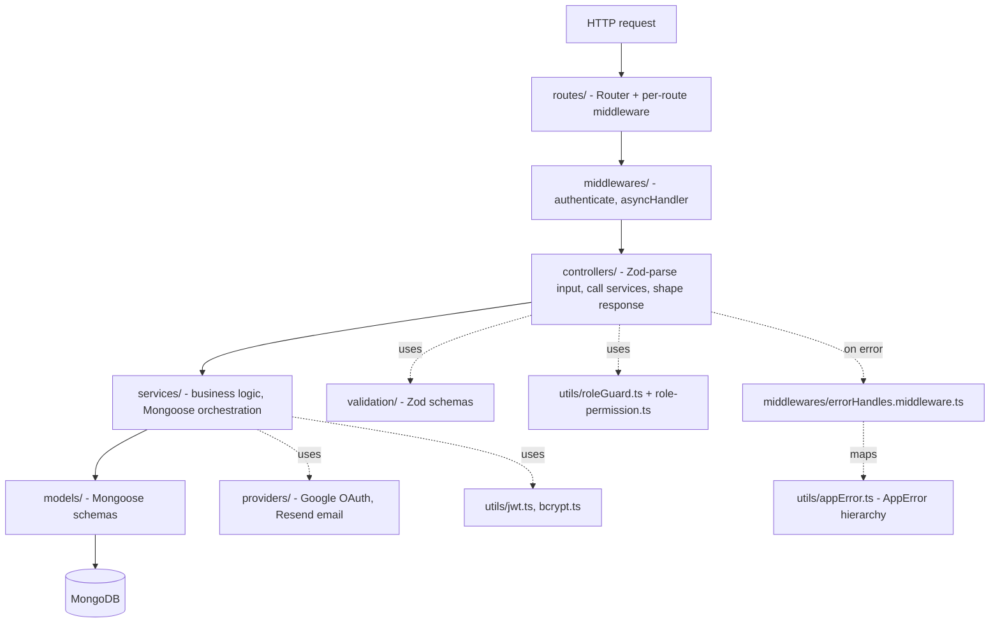

# Backend — Master Architecture

> Part of the [AstriX engineering curriculum](../Architecture.md). This file is the system map for `backend/`: layered structure, the full bootstrap file read top to bottom, and a bird's-eye request lifecycle with real code. Each deep dive below goes chapter-deep — landscape of alternatives first, then AstriX's actual implementation — into one slice of it.

AstriX's backend is a single Express + TypeScript service, deployed as one container (see [`docs/infra/`](../infra/) containers file), talking to MongoDB via Mongoose. There is no framework-level DI container, no microservice split, and no repository/DAO abstraction between services and Mongoose models — it's a classic layered monolith, organized by technical layer (all routes together, all controllers together, all services together) rather than by feature/domain. **That folder-organization choice — layered vs. feature-based vs. hexagonal — is not obvious or universal**, and it's significant enough to be its own chapter: [`01-architecture-patterns-and-project-structure.md`](./01-architecture-patterns-and-project-structure.md) surveys the real alternatives before explaining why AstriX ended up here. This file assumes that choice as a given and maps what sits inside it.

---

## 1. Layered architecture



Every layer flows one direction — routes call into middleware, middleware into controllers, controllers into services, services into models — and errors flow back out through one centralized handler rather than being caught piecemeal at each layer.

## 2. Folder map (`backend/src/`)

| Folder | Purpose | Deep dive |
|---|---|---|
| `config/` | Env-derived singletons: app config, HTTP status codes, Mongo connection, Swagger setup | [08](./08-database-queries-and-transactions.md), [09](./09-api-design-and-external-providers.md) |
| `routes/` | `Router` definitions — HTTP verb + path → controller, plus per-route rate limiters | [03](./03-middleware-and-request-pipeline.md), [09](./09-api-design-and-external-providers.md) |
| `middlewares/` | `authenticate` (JWT guard), `asyncHandler` (error-forwarding wrapper), `errorHandler` (centralized error mapping) | [02](./02-authentication-and-authorization.md), [03](./03-middleware-and-request-pipeline.md), [04](./04-error-handling-patterns.md) |
| `controllers/` | Request handlers: validate input, authorize, call services, shape the HTTP response | [05](./05-validation-strategies.md), [06](./06-services-and-business-logic-layer.md) |
| `services/` | Business logic and Mongoose orchestration, including multi-document transactions | [06](./06-services-and-business-logic-layer.md), [08](./08-database-queries-and-transactions.md) |
| `validation/` | One Zod schema module per domain (`auth`, `project`, `task`, `user`, `workspace`) | [05](./05-validation-strategies.md) |
| `models/` | Mongoose schemas — 10 models, 544 lines total | [07](./07-database-schema-design.md) |
| `providers/` | External-service adapters: `google.provider.ts` (manual OAuth2), `email.provider.ts` (Resend) | [02](./02-authentication-and-authorization.md), [09](./09-api-design-and-external-providers.md) |
| `utils/` | JWT signing/verification, bcrypt, `AppError` hierarchy, structured logger, Mongo-backed rate limiter, role/permission guard, UUIDs | throughout |
| `enums/` | Shared string enums: roles/permissions, error codes, OAuth providers, task fields | throughout |
| `docs/schemas/` | Swagger/OpenAPI component fragments, imported into `config/swagger.config.ts` | [09](./09-api-design-and-external-providers.md) |
| `seeders/` | One-off DB seed script for roles | [07](./07-database-schema-design.md) |
| `@types/` | Ambient Express `Request` augmentation (`user`, `session`, `log`) + third-party shims | — |
| `index.ts` | App bootstrap — see §3 below | — |

## 3. Bootstrap, in full (`backend/src/index.ts`)

This is the entire file — no separate `app.ts`/`server.ts` split, one linear script executed top to bottom:

```ts
// backend/src/index.ts:1-27
import "dotenv/config";
import crypto from "crypto";
import express, { Request, Response } from "express";
import cors from "cors";
import cookieParser from "cookie-parser";
import helmet from "helmet";
import pinoHttp from "pino-http";
import mongoose from "mongoose";
import { config } from "./config/app.config";
import { HTTPSTATUS } from "./config/http.config";
import swaggerUi from "swagger-ui-express";
import { swaggerSpec } from "./config/swagger.config";
import connectDatabase from "./config/database.config";
import { logger } from "./utils/logger";
import { createRateLimiter } from "./utils/rate-limiter";

import { errorHandler } from "./middlewares/errorHandles.middleware";

import authRoutes from "./routes/auth.route";
import userRoutes from "./routes/user.route";
import workspaceRoutes from "./routes/workspace.routes";
import projectRoutes from "./routes/project.route";
import taskRoutes from "./routes/task.route";
import memberRoutes from "./routes/member.route";
import { authenticate } from "./middlewares/auth.middleware";

const app = express();
```

`dotenv/config` is the very first import (line 1) — every other import, including `config/app.config`, runs *after* `.env` is loaded, which matters because `app.config.ts` reads `process.env` at module-evaluation time, not lazily.

```ts
// backend/src/index.ts:29-42
/**
 * We run behind CloudFront → ALB → Express
 * So we must trust the first proxy.
 */
app.set("trust proxy", 1);

const BASE_PATH = config.BASE_PATH;

// ============================================
// SECURITY MIDDLEWARE
// ============================================

// Security headers (XSS protection, etc.)
app.use(helmet());
```

```ts
// backend/src/index.ts:44-58
// ============================================
// REQUEST LOGGING (structured, with per-request correlation id)
// ============================================

app.use(
  pinoHttp({
    logger,
    genReqId: (req, res) => {
      const existing = req.headers["x-request-id"];
      const id = typeof existing === "string" ? existing : crypto.randomUUID();
      res.setHeader("x-request-id", id);
      return id;
    },
  })
);
```

```ts
// backend/src/index.ts:60-80
// ============================================
// BODY PARSING
// ============================================

// This API is JSON-only - no route reads a form-encoded body, so we don't
// mount express.urlencoded(). An explicit size limit replaces the implicit
// (and undocumented) 100kb default.
app.use(express.json({ limit: "1mb" }));

// ============================================
// COOKIE PARSER - CRITICAL FOR REFRESH TOKENS!
// ============================================

/**
 * This parses cookies from incoming requests
 * Without this, req.cookies will be undefined!
 *
 * The refresh token is sent as an httpOnly cookie,
 * so we MUST be able to read it.
 */
app.use(cookieParser());
```

```ts
// backend/src/index.ts:82-99
// ============================================
// CORS CONFIGURATION
// ============================================

// FRONTEND_ORIGIN may be a single origin or a comma-separated list (e.g.
// staging + prod, or an apex domain + its "www" subdomain).
const allowedOrigins = config.FRONTEND_ORIGIN.split(",")
  .map((origin) => origin.trim())
  .filter(Boolean);

app.use(
  cors({
    origin: allowedOrigins,
    credentials: true, // CRITICAL: Allows cookies to be sent cross-origin
    methods: ["GET", "POST", "PUT", "PATCH", "DELETE", "OPTIONS"],
    allowedHeaders: ["Content-Type", "Authorization"],
  })
);
```

```ts
// backend/src/index.ts:101-125
// ============================================
// RATE LIMITING (general) - /auth/* has its own stricter, route-specific
// limiters (see auth.route.ts); this is the floor for everything else so
// no route is left completely unlimited.
// ============================================

const apiLimiter = createRateLimiter("api", {
  max: 300,
  // Health checks (e.g. an ALB target-group check) can legitimately fire
  // far more often than any real API consumer and shouldn't be limited.
  skip: (req) => req.path === "/health",
});

app.use(apiLimiter);

// ============================================
// API DOCUMENTATION
// ============================================

// Not mounted in production - it's a full route/schema map handed to
// anyone who requests it, and CloudFront proxies /api/* straight through
// to the public ALB with no auth in front of it.
if (config.NODE_ENV !== "production") {
  app.use("/api/docs", swaggerUi.serve, swaggerUi.setup(swaggerSpec));
}
```

```ts
// backend/src/index.ts:127-156
// ============================================
// ROUTES
// ============================================

// Health check - reflects actual DB connectivity (readyState is an
// in-memory flag, no round-trip query needed) rather than always
// reporting OK, so an ALB target-group check can actually detect a task
// whose Mongo connection has dropped and stop routing traffic to it.
app.get("/health", (req: Request, res: Response) => {
  const isDbConnected = mongoose.connection.readyState === 1;

  res
    .status(isDbConnected ? HTTPSTATUS.OK : HTTPSTATUS.SERVICE_UNAVAILABLE)
    .json({
      status: isDbConnected ? "OK" : "DEGRADED",
      db: isDbConnected ? "connected" : "disconnected",
      timestamp: new Date().toISOString(),
    });
});

// Auth routes (mostly public)
app.use(`${BASE_PATH}/auth`, authRoutes);

// Protected routes (require JWT)
app.use(`${BASE_PATH}/user`, authenticate, userRoutes);
app.use(`${BASE_PATH}/workspace`, authenticate, workspaceRoutes);
app.use(`${BASE_PATH}/project`, authenticate, projectRoutes);
app.use(`${BASE_PATH}/task`, authenticate, taskRoutes);
app.use(`${BASE_PATH}/member`, authenticate, memberRoutes);
```

Note the asymmetry: `authRoutes` gets no blanket middleware (login/register have to be reachable by someone with no token yet), while every other domain router receives `authenticate` **inline at the mount point** — not inside each route file. One line per domain is the entire authorization boundary for that domain; a route file can't accidentally forget to protect itself.

```ts
// backend/src/index.ts:158-244
// ============================================
// ERROR HANDLING
// ============================================

// 404 handler
app.use((req: Request, res: Response) => {
  res.status(404).json({
    error: "Not Found",
    message: `Route ${req.method} ${req.path} not found`,
  });
});

// Global error handler
app.use(errorHandler);

// ============================================
// MONGO CONNECTION LIFECYCLE
// ============================================

mongoose.connection.on("error", (error) => {
  logger.error({ err: error }, "MongoDB connection error");
});

mongoose.connection.on("disconnected", () => {
  logger.warn("MongoDB disconnected");
});

// ============================================
// START SERVER
// ============================================

const startServer = async () => {
  // Connect BEFORE binding to the port - a task should never report itself
  // as listening/ready if it can't reach its database. connectDatabase()
  // already process.exit(1)s on failure, so getting past this line means
  // the connection is good.
  await connectDatabase();

  const server = app.listen(config.PORT, () => {
    logger.info(
      `Server listening on port ${config.PORT} in ${config.NODE_ENV} environment`
    );
  });

  const shutdown = (signal: string) => {
    logger.info(`${signal} received, shutting down gracefully`);

    server.close(async (closeError) => {
      if (closeError) {
        logger.error({ err: closeError }, "Error while closing HTTP server");
      }

      try {
        await mongoose.connection.close();
      } catch (dbCloseError) {
        logger.error(
          { err: dbCloseError },
          "Error while closing MongoDB connection"
        );
      }

      logger.info("Shutdown complete");
      process.exit(closeError ? 1 : 0);
    });

    setTimeout(() => {
      logger.error("Graceful shutdown timed out, forcing exit");
      process.exit(1);
    }, 10_000).unref();
  };

  process.on("SIGTERM", () => shutdown("SIGTERM"));
  process.on("SIGINT", () => shutdown("SIGINT"));
};

startServer().catch((error) => {
  logger.error({ err: error }, "Fatal error during startup");
  process.exit(1);
});

export default app;
```

Three things worth internalizing from this last block, because they're easy to get wrong:
1. **DB connects before the port opens.** `connectDatabase()` is awaited before `app.listen` — an ECS health check will never see this task as "up" while it can't reach Mongo, because the task isn't listening yet at all.
2. **Shutdown drains, then closes, in order.** `server.close()`'s callback (connections drained) runs *before* `mongoose.connection.close()` — a request that's mid-flight when SIGTERM arrives gets to finish its DB call rather than having the connection yanked underneath it.
3. **The force-exit timer is `unref()`'d.** If shutdown finishes cleanly well before 10s, that pending `setTimeout` doesn't keep the process alive on its own — `unref()` tells Node it's not a reason to stay running.

## 4. Request lifecycle, at a glance

Full traces (including exact Zod schemas and Mongoose queries) are in [02](./02-authentication-and-authorization.md), [03](./03-middleware-and-request-pipeline.md), [05](./05-validation-strategies.md), and [06](./06-services-and-business-logic-layer.md). The shape is always the same:

```
route match → (rate limiter, if any) → authenticate (if protected) → controller
  → Zod validation → roleGuard (if a workspace-scoped action) → service → model → Mongo
```

Errors at any point — a thrown `AppError` subclass, a Zod `ZodError`, a Mongoose `CastError`/`ValidationError`, a duplicate-key error, or an unexpected exception — are all funneled by `asyncHandler` (which wraps every controller) into the one `errorHandler` middleware. Full precedence order and the complete `AppError` class hierarchy are in [04-error-handling-patterns.md](./04-error-handling-patterns.md) — this "one funnel in, one funnel out" shape is one of the backend's central design decisions.

## 5. Backend tech stack

| Concern | Choice | Version |
|---|---|---|
| Framework | Express | `^4.21.2` |
| Language | TypeScript | `^5.7.2` |
| ODM | Mongoose | `^8.9.2` |
| Validation | Zod | `^3.24.1` |
| Auth tokens | `jsonwebtoken` | `^9.0.3` |
| Password hashing | `bcrypt` | `^5.1.1` |
| Logging | `pino` + `pino-http` | `^10.3.1` / `^11.0.0` |
| Security headers | `helmet` | `^8.1.0` |
| Rate limiting | `express-rate-limit` + `rate-limit-mongo` | `^8.2.1` / `^2.3.2` |
| Email | `resend` | `^6.27.0` |
| API docs | `swagger-jsdoc` + `swagger-ui-express` | `^6.2.8` / `^5.0.1` |
| Test runner | Vitest | `^4.1.11` |
| E2E/HTTP assertions | Supertest | `^7.2.2` |
| Test DB | `mongodb-memory-server` | `^11.2.0` |

## 6. Deep dives in this module

| # | File | Covers |
|---|---|---|
| 01 | [`01-architecture-patterns-and-project-structure.md`](./01-architecture-patterns-and-project-structure.md) | Layered vs. feature-based vs. hexagonal/clean project structure — survey, then why AstriX is layered |
| 02 | [`02-authentication-and-authorization.md`](./02-authentication-and-authorization.md) | Auth-strategy landscape, then AstriX's JWT + rotating-session hybrid, Google OAuth + CSRF `state`, RBAC guards |
| 03 | [`03-middleware-and-request-pipeline.md`](./03-middleware-and-request-pipeline.md) | The middleware-chain model, mount order, `helmet`/CORS, rate limiting |
| 04 | [`04-error-handling-patterns.md`](./04-error-handling-patterns.md) | Exceptions vs. Result types vs. centralized handler — survey, then the `AppError` contract in full |
| 05 | [`05-validation-strategies.md`](./05-validation-strategies.md) | Where/how input validation lives — survey, then AstriX's Zod-in-controller boundary |
| 06 | [`06-services-and-business-logic-layer.md`](./06-services-and-business-logic-layer.md) | Transaction-script vs. service-layer vs. DDD — survey, then AstriX's service layer |
| 07 | [`07-database-schema-design.md`](./07-database-schema-design.md) | Embedding vs. referencing — survey, then AstriX's 10 Mongoose models and relationships |
| 08 | [`08-database-queries-and-transactions.md`](./08-database-queries-and-transactions.md) | Query/connection/transaction patterns, indexing, `mongodb-memory-server` test strategy |
| 09 | [`09-api-design-and-external-providers.md`](./09-api-design-and-external-providers.md) | REST/OpenAPI conventions, adapter pattern, Resend + Google provider integration |
