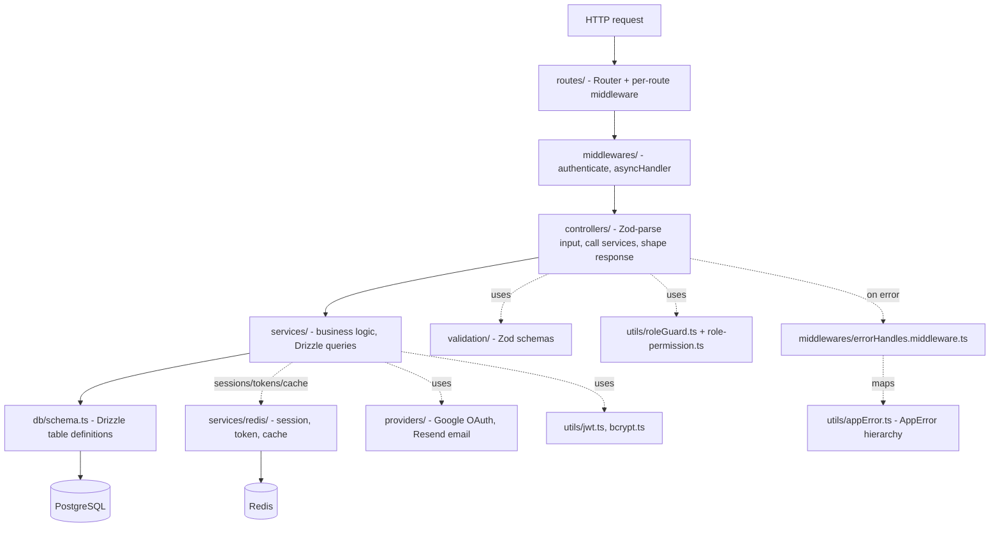

# Backend — Master Architecture

> Part of the [AstriX engineering curriculum](../Architecture.md). This file is the system map for `backend/`: layered structure, the full bootstrap assembly read top to bottom, and a bird's-eye request lifecycle with real code. Each deep dive below goes chapter-deep — landscape of alternatives first, then AstriX's actual implementation — into one slice of it.

AstriX's backend is a single Express + TypeScript service, deployed as one container (see [`docs/infra/`](../infra/) containers file), talking to **PostgreSQL via Drizzle ORM** (relational data — users, workspaces, roles, projects, tasks) and **Redis via `ioredis`** (sessions, single-use tokens, rate-limit counters, cache-aside reads). There is no framework-level DI container, no microservice split, and no repository/DAO abstraction between services and the database driver — it's a classic layered monolith, organized by technical layer (all routes together, all controllers together, all services together) rather than by feature/domain. **That folder-organization choice — layered vs. feature-based vs. hexagonal — is not obvious or universal**, and it's significant enough to be its own chapter: [`01-architecture-patterns-and-project-structure.md`](./01-architecture-patterns-and-project-structure.md) surveys the real alternatives before explaining why AstriX ended up here. This file assumes that choice as a given and maps what sits inside it.

This is the shape the backend has had since a full migration off MongoDB/Mongoose, completed in six phases (documented in [`backend/migrations/PLAN.md`](../../backend/migrations/PLAN.md)); the last of those phases deleted every Mongo-era file from the repo. Where it matters for understanding *why* something is built the way it is, this chapter and the ones under it note the prior Mongo-era behavior explicitly as history — never as how the system behaves today.

---

## 1. Layered architecture



Every layer flows one direction — routes call into middleware, middleware into controllers, controllers into services, services into the database (Postgres via Drizzle, Redis via `ioredis`) — and errors flow back out through one centralized handler rather than being caught piecemeal at each layer.

## 2. Folder map (`backend/src/`)

| Folder | Purpose | Deep dive |
|---|---|---|
| `config/` | Env-derived singletons: app config, HTTP status codes, Swagger setup | [08](./08-database-queries-and-transactions.md), [09](./09-api-design-and-external-providers.md) |
| `db/` | Drizzle setup — `client.ts` (pool + `drizzle()` instance), `schema.ts` (every table, enum, and relation in one file), `seed-roles.ts` (one-off role seeding script) | [07](./07-database-schema-design.md) |
| `redis/` | `client.ts` — the single shared `ioredis` connection | [03](./03-middleware-and-request-pipeline.md), [08](./08-database-queries-and-transactions.md) |
| `routes/` | `Router` definitions — HTTP verb + path → controller, plus per-route rate limiters | [03](./03-middleware-and-request-pipeline.md), [09](./09-api-design-and-external-providers.md) |
| `middlewares/` | `authenticate` (JWT + Redis-session guard), `asyncHandler` (error-forwarding wrapper), `errorHandler` (centralized error mapping) | [02](./02-authentication-and-authorization.md), [03](./03-middleware-and-request-pipeline.md), [04](./04-error-handling-patterns.md) |
| `controllers/` | Request handlers: validate input, authorize, call services, shape the HTTP response | [05](./05-validation-strategies.md), [06](./06-services-and-business-logic-layer.md) |
| `services/` | Business logic and Drizzle query orchestration, including Postgres transactions; `services/redis/` holds the session/token/cache functions | [06](./06-services-and-business-logic-layer.md), [08](./08-database-queries-and-transactions.md) |
| `validation/` | One Zod schema module per domain (`auth`, `project`, `task`, `user`, `workspace`) — UUID-shaped ID schemas, not the old 24-hex-char pattern | [05](./05-validation-strategies.md) |
| `providers/` | External-service adapters: `google.provider.ts` (manual OAuth2), `email.provider.ts` (Resend) | [02](./02-authentication-and-authorization.md), [09](./09-api-design-and-external-providers.md) |
| `utils/` | JWT signing/verification, bcrypt, `AppError` hierarchy, structured logger, Redis-backed rate limiter, role/permission guard, invite-code generation | throughout |
| `enums/` | Shared string enums: roles/permissions, error codes, OAuth providers, task fields | throughout |
| `docs/schemas/` | Swagger/OpenAPI component fragments, imported into `config/swagger.config.ts` | [09](./09-api-design-and-external-providers.md) |
| `@types/` | Ambient Express `Request` augmentation (`user: { id, sessionId }`, `log`) + third-party shims | — |
| `app.ts` | Pure Express app assembly (`buildApp()`) — every middleware and route mount, no `listen()` | §3 below |
| `index.ts` | Process entrypoint — Postgres connectivity check, `app.listen()`, graceful shutdown | §3 below |

There is no `models/` directory. Under Mongoose, one file per collection (`models/user.model.ts`, `models/task.model.ts`, ...) was the natural unit, because each model carried its own schema *and* its own Mongoose-specific behavior (virtuals, instance methods, middleware hooks). Drizzle's table definitions are plain data — a `pgTable(...)` call plus column types — with no attached behavior to hang per-file, so the whole relational schema (seven tables, five enums, two `relations()` blocks) lives in one file, `db/schema.ts`. There's no per-table file to lose track of, and no ambiguity about where a new column goes.

## 3. Bootstrap, in full (`backend/src/app.ts` + `backend/src/index.ts`)

Two files now do what one `index.ts` used to do end to end: `app.ts` exports `buildApp()`, a pure function that assembles and returns a fully-wired Express app with no side effects beyond that — no `listen()`, no process-lifecycle hooks. `index.ts` is the only file that calls `buildApp()`, checks Postgres connectivity, binds the port, and owns graceful shutdown. This split exists specifically so the E2E test suite (Phase 5) can build a real, fully-middleware-and-route-wired app via `buildApp()` and drive it with `supertest` without ever calling `.listen()` or needing a real, reachable server socket.

```ts
// backend/src/app.ts:1-32
import crypto from "crypto";
import express, { Express, Request, Response } from "express";
import cors from "cors";
import cookieParser from "cookie-parser";
import helmet from "helmet";
import pinoHttp from "pino-http";
import { sql } from "drizzle-orm";
import { config } from "./config/app.config";
import { HTTPSTATUS } from "./config/http.config";
import swaggerUi from "swagger-ui-express";
import { swaggerSpec } from "./config/swagger.config";
import { logger } from "./utils/logger";
import { createRateLimiter } from "./utils/rate-limiter";
import { db } from "./db/client";
import { redis } from "./redis/client";

import { errorHandler } from "./middlewares/errorHandles.middleware";

import authRoutes from "./routes/auth.route";
import userRoutes from "./routes/user.route";
import workspaceRoutes from "./routes/workspace.routes";
import projectRoutes from "./routes/project.route";
import taskRoutes from "./routes/task.route";
import memberRoutes from "./routes/member.route";
import { authenticate } from "./middlewares/auth.middleware";

export const buildApp = (): Express => {
  const app = express();
  app.set("trust proxy", 1);
  const BASE_PATH = config.BASE_PATH;
  // ... middleware and routes, §2 of 03-middleware-and-request-pipeline.md
  // has the full ordered walkthrough
  return app;
};
```

The middleware stack itself — `helmet()` → `pinoHttp` request logging → `express.json()` → `cookieParser()` → `cors()` → the global rate limiter → conditional Swagger → routes → 404 handler → `errorHandler` — is the subject of its own chapter, [`03-middleware-and-request-pipeline.md`](./03-middleware-and-request-pipeline.md), which walks every `app.use()` call in registration order. The one piece worth calling out here because it's new relative to the old Mongo app: the health check now actually round-trips to both real backing stores instead of reading an in-memory connection flag.

```ts
// backend/src/app.ts:140-160
app.get("/health", async (req: Request, res: Response) => {
  const [pgOk, redisOk] = await Promise.all([
    db.execute(sql`SELECT 1`).then(() => true).catch(() => false),
    redis.ping().then(() => true).catch(() => false),
  ]);

  const healthy = pgOk && redisOk;

  res.status(healthy ? HTTPSTATUS.OK : HTTPSTATUS.SERVICE_UNAVAILABLE).json({
    status: healthy ? "OK" : "DEGRADED",
    postgres: pgOk ? "connected" : "disconnected",
    redis: redisOk ? "connected" : "disconnected",
    timestamp: new Date().toISOString(),
  });
});
```

Both round trips run in parallel via `Promise.all`, and each is independently caught — a Redis blip alone is enough to flip the check to `DEGRADED` even if Postgres is fine, which matters because sessions (and therefore every authenticated request) live in Redis, not Postgres; an ALB target-group check treating a Redis outage as "healthy" would keep routing traffic to a task where no one can log in or stay logged in.

`index.ts` is the process entrypoint that actually starts the server:

```ts
// backend/src/index.ts, in full
import "dotenv/config";
import { sql } from "drizzle-orm";
import { buildApp } from "./app";
import { config } from "./config/app.config";
import { logger } from "./utils/logger";
import { db, pool } from "./db/client";
import { redis } from "./redis/client";

const app = buildApp();

const startServer = async () => {
  try {
    await db.execute(sql`SELECT 1`);
    logger.info("Connected to Postgres");
  } catch (error) {
    logger.error({ err: error }, "Error connecting to Postgres");
    process.exit(1);
  }

  const server = app.listen(config.PORT, () => {
    logger.info(
      `Server listening on port ${config.PORT} in ${config.NODE_ENV} environment`
    );
  });

  const shutdown = (signal: string) => {
    logger.info(`${signal} received, shutting down gracefully`);

    server.close(async (closeError) => {
      if (closeError) {
        logger.error({ err: closeError }, "Error while closing HTTP server");
      }

      try {
        await pool.end();
        redis.disconnect();
      } catch (closeConnError) {
        logger.error(
          { err: closeConnError },
          "Error while closing Postgres/Redis connections"
        );
      }

      logger.info("Shutdown complete");
      process.exit(closeError ? 1 : 0);
    });

    setTimeout(() => {
      logger.error("Graceful shutdown timed out, forcing exit");
      process.exit(1);
    }, 10_000).unref();
  };

  process.on("SIGTERM", () => shutdown("SIGTERM"));
  process.on("SIGINT", () => shutdown("SIGINT"));
};

startServer().catch((error) => {
  logger.error({ err: error }, "Fatal error during startup");
  process.exit(1);
});

export default app;
```

Three things worth internalizing from this file, because they're easy to get wrong:
1. **Postgres connects before the port opens.** `db.execute(sql\`SELECT 1\`)` is awaited, and a failure calls `process.exit(1)` before `app.listen` ever runs — an ECS health check will never see this task as "up" while it can't reach Postgres, because the task isn't listening yet at all. Redis is deliberately *not* a startup gate: `redis/client.ts`'s own `"error"` listener already logs a connection error non-fatally, on the theory that a transient Redis blip is recoverable and shouldn't crash the whole process the way an unreachable primary datastore should.
2. **Shutdown drains, then closes, in order.** `server.close()`'s callback (in-flight requests drained) runs *before* `pool.end()`/`redis.disconnect()` — a request that's mid-flight when SIGTERM arrives gets to finish its database call rather than having the connection yanked underneath it.
3. **The force-exit timer is `unref()`'d.** If shutdown finishes cleanly well before 10s, that pending `setTimeout` doesn't keep the process alive on its own — `unref()` tells Node it's not a reason to stay running.

## 4. Request lifecycle, at a glance

Full traces (including exact Zod schemas and Drizzle queries) are in [02](./02-authentication-and-authorization.md), [03](./03-middleware-and-request-pipeline.md), [05](./05-validation-strategies.md), and [06](./06-services-and-business-logic-layer.md). The shape is always the same:

```
route match → (rate limiter, if any) → authenticate (if protected) → controller
  → Zod validation → roleGuard (if a workspace-scoped action) → service → Drizzle query → Postgres/Redis
```

Errors at any point — a thrown `AppError` subclass, a Zod `ZodError`, a Postgres error (a unique-constraint violation surfaces as error code `23505`, checked explicitly in a couple of services — see [`member.service.ts`](../../backend/src/services/member.service.ts)), or an unexpected exception — are all funneled by `asyncHandler` (which wraps every controller) into the one `errorHandler` middleware. Full precedence order and the complete `AppError` class hierarchy are in [04-error-handling-patterns.md](./04-error-handling-patterns.md) — this "one funnel in, one funnel out" shape is one of the backend's central design decisions, and it didn't change across the migration: it was never coupled to which database sat underneath it.

## 5. Backend tech stack

| Concern | Choice | Version |
|---|---|---|
| Framework | Express | `^4.21.2` |
| Language | TypeScript | `^5.7.2` |
| Database | PostgreSQL, via `pg` (`node-postgres`) | `^8.23.0` |
| ORM | Drizzle ORM | `^0.45.2` |
| Cache / sessions / rate-limit store | Redis, via `ioredis` | `^6.0.0` |
| Validation | Zod | `^3.24.1` |
| Auth tokens | `jsonwebtoken` | `^9.0.3` |
| Password hashing | `bcrypt` | `^5.1.1` |
| Logging | `pino` + `pino-http` | `^10.3.1` / `^11.0.0` |
| Security headers | `helmet` | `^8.1.0` |
| Rate limiting | `express-rate-limit` + `rate-limit-redis` | `^8.2.1` / `^6.0.1` |
| Email | `resend` | `^6.27.0` |
| API docs | `swagger-jsdoc` + `swagger-ui-express` | `^6.2.8` / `^5.0.1` |
| Test runner | Vitest | `^4.1.11` |
| E2E/HTTP assertions | Supertest | `^7.2.2` |
| Test infra | `testcontainers` (real, disposable Postgres + Redis) | `^11.14.0` |

There is no `mongoose`, `mongodb-memory-server`, or `rate-limit-mongo` anywhere in this table, or anywhere in `backend/package.json` — those were removed as the final step of the migration's cutover phase (see [`backend/migrations/phase-6-cutover-and-cleanup.md`](../../backend/migrations/phase-6-cutover-and-cleanup.md) §6.6), once the Postgres/Redis stack had proven itself and `tsc --noEmit`/`npm run build`/`eslint .` all came back clean of Mongo-driver references.

## 6. Deep dives in this module

| # | File | Covers |
|---|---|---|
| 01 | [`01-architecture-patterns-and-project-structure.md`](./01-architecture-patterns-and-project-structure.md) | Layered vs. feature-based vs. hexagonal/clean project structure — survey, then why AstriX is layered |
| 02 | [`02-authentication-and-authorization.md`](./02-authentication-and-authorization.md) | Auth-strategy landscape, then AstriX's JWT + Redis-backed rotating-session hybrid, Google OAuth + CSRF `state`, RBAC guards |
| 03 | [`03-middleware-and-request-pipeline.md`](./03-middleware-and-request-pipeline.md) | The middleware-chain model, mount order, `helmet`/CORS, Redis-backed rate limiting |
| 04 | [`04-error-handling-patterns.md`](./04-error-handling-patterns.md) | Exceptions vs. Result types vs. centralized handler — survey, then the `AppError` contract in full |
| 05 | [`05-validation-strategies.md`](./05-validation-strategies.md) | Where/how input validation lives — survey, then AstriX's Zod-in-controller boundary |
| 06 | [`06-services-and-business-logic-layer.md`](./06-services-and-business-logic-layer.md) | Transaction-script vs. service-layer vs. DDD — survey, then AstriX's service layer over Drizzle |
| 07 | [`07-database-schema-design.md`](./07-database-schema-design.md) | Embedding vs. referencing — survey, then AstriX's normalized Postgres schema and its foreign keys |
| 08 | [`08-database-queries-and-transactions.md`](./08-database-queries-and-transactions.md) | Query/connection/transaction patterns, indexing, `testcontainers` test strategy |
| 09 | [`09-api-design-and-external-providers.md`](./09-api-design-and-external-providers.md) | REST/OpenAPI conventions, adapter pattern, Resend + Google provider integration |
