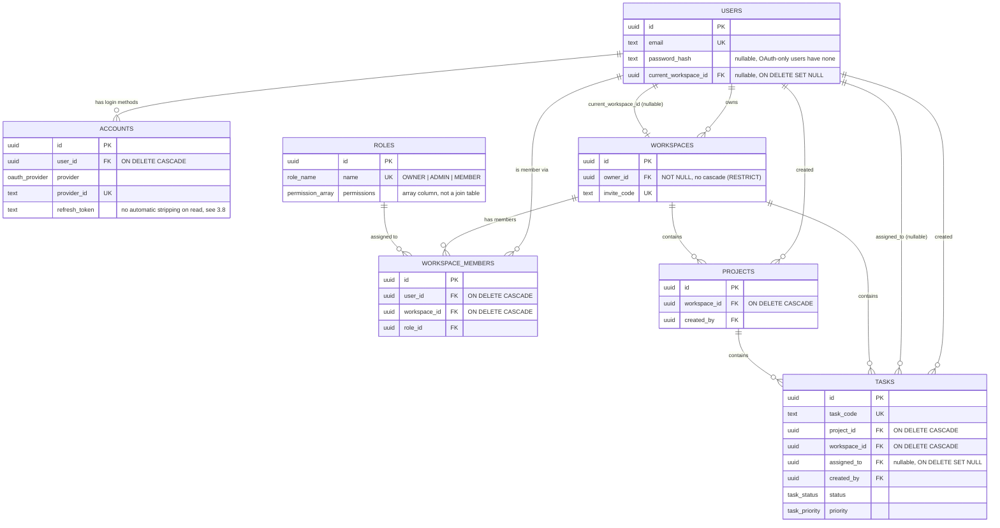

> Part of the [AstriX engineering curriculum](../Architecture.md), under [Backend](./00-master-backend-architecture.md).

# Database Schema Design

Every backend that talks to a database eventually has to answer one question: when two pieces of data are related, where does that relationship live? In a relational database the answer is mostly forced on you — foreign keys and normal forms are the water you swim in; the database itself refuses a write that violates the shape you declared. AstriX runs on PostgreSQL, via Drizzle ORM, and this chapter maps the seven real tables in `backend/src/db/schema.ts` field-by-field, index-by-index, constraint-by-constraint, against the ten Mongoose models this schema replaced during the project's MongoDB → Postgres+Redis migration (`backend/migrations/`). That migration is finished — the Mongoose models, and MongoDB itself, no longer exist in this codebase — but the *shape* of the old models is genuinely useful context for understanding *why* the relational schema was designed the way it was, so this chapter keeps that comparison where it earns its place rather than pretending the schema was designed in a vacuum.

---

## 1. The Landscape

### 1.1 What a relational schema forces you to decide upfront

Unlike a document database, where a collection can silently hold documents of different shapes, a Postgres table has one column set, enforced by the database engine itself — `CREATE TABLE` is a contract the database will not let you violate. That has real consequences for how a schema gets designed:

- **Every relationship is either a foreign key or nothing at all.** There is no middle ground like a document database's "embed a slice of the related row for read convenience" — Postgres has no native concept of one row containing a copy-with-drift of another row's fields. If you want that tradeoff in Postgres, you build it yourself (a materialized view, an application-level cache, a denormalized column kept in sync by a trigger), and you own the staleness problem explicitly rather than inheriting it from the database's document model.
- **Cardinality and ownership have to be decided before the first `INSERT`, not discovered from usage over time.** A one-to-many relationship needs a foreign key on the "many" side; a genuine many-to-many needs a join table. There's no schema-on-read escape hatch.
- **The database enforces referential integrity for free, if you ask for it.** A foreign key with `ON DELETE CASCADE`/`SET NULL`/`RESTRICT` is checked by Postgres itself, atomically, as part of the statement that touches the parent row — not by application code remembering to clean up related rows in the right order.

### 1.2 Normalization, precisely — not just "avoid duplication"

Normalization is a formal hierarchy (1NF, 2NF, 3NF, BCNF...), but the practically useful version for this schema is:

- **1NF**: every column holds a single, atomic value. Postgres does allow array and JSONB columns as a deliberate escape hatch from strict 1NF — this schema uses exactly one array column (`roles.permissions`), for a specific, argued reason (§3.4).
- **2NF/3NF, informally**: every non-key column depends on the whole primary key, and nothing but the primary key. Concretely: if a `task` row stored `projectName` alongside `projectId` "for convenience," that's denormalization — the fix is to keep only the foreign key and `JOIN` to `projects` at read time.

### 1.3 Index theory this schema actually leans on

Postgres's default index type (`CREATE INDEX`) is a B-tree. Two properties of B-trees drive every indexing decision in this schema:

- A B-tree serves `=`, `<`, `<=`, `>`, `>=`, `BETWEEN`, and leftmost `LIKE 'prefix%'` — not `LIKE '%suffix'` or full-text search.
- **Compound index column order is a leftmost-prefix rule.** An index on `(workspace_id, status)` serves lookups on `workspace_id` alone or `workspace_id + status` together, but not `status` alone. This is why `tasks` carries two separate compound indexes rather than one four-column index — the query shapes that actually run (`getAllTasksService`'s workspace+project filter, and its workspace+status filter) don't share a common column order.

An index makes writes marginally slower (every `INSERT`/`UPDATE` also updates every index on the table) to make specific reads much faster — every index in this schema exists because a real query in the service layer filters on exactly that column or column combination, not speculatively.

---

## 2. AstriX's Choice

AstriX's schema is a **normalized relational model**: seven tables (`users`, `workspaces`, `roles`, `workspace_members`, `projects`, `tasks`, `accounts`), every relationship expressed as a foreign key, defined once in `backend/src/db/schema.ts` using Drizzle ORM's `pgTable` builder. Drizzle's schema file is simultaneously the source Drizzle-kit generates SQL migrations from and the source of every query's TypeScript types — there is exactly one place table shape is declared, not a schema file plus a separately-maintained set of hand-written types.

Every one of the ten Mongoose collections this replaced mapped onto either a table (`User`→`users`, `Workspace`→`workspaces`, `Role`→`roles`, `Member`→`workspace_members`, `Project`→`projects`, `Task`→`tasks`, `Account`→`accounts`) or moved to Redis entirely (`Session`, `PasswordResetToken`, `EmailVerificationToken` — all three were TTL-expiring, access-pattern-simple records, and Redis's native key TTL is a better mechanical fit than a Postgres row with an `expires_at` column and no built-in sweep; see [`03-middleware-and-request-pipeline.md`](./03-middleware-and-request-pipeline.md) and the session/token services under `backend/src/services/redis/` for that half of the system — deliberately out of this chapter's scope, since none of it is a Postgres table).

---

## 3. AstriX Implementation

All seven tables live in `backend/src/db/schema.ts`. Every field, enum, index, and foreign key below is read directly from that file — nothing paraphrased.

### 3.1 Enums

Postgres native enums (`CREATE TYPE ... AS ENUM`), not `TEXT` + `CHECK`, back every fixed-value column in this schema:

```ts
export const roleNameEnum = pgEnum("role_name", ["OWNER", "ADMIN", "MEMBER"]);

export const permissionEnum = pgEnum("permission", [
  "CREATE_WORKSPACE", "DELETE_WORKSPACE", "EDIT_WORKSPACE", "MANAGE_WORKSPACE_SETTINGS",
  "ADD_MEMBER", "CHANGE_MEMBER_ROLE", "REMOVE_MEMBER",
  "CREATE_PROJECT", "EDIT_PROJECT", "DELETE_PROJECT",
  "CREATE_TASK", "EDIT_TASK", "DELETE_TASK",
  "VIEW_ONLY",
]);

export const taskStatusEnum = pgEnum("task_status", [
  "BACKLOG", "TODO", "IN_PROGRESS", "IN_REVIEW", "DONE",
]);

export const taskPriorityEnum = pgEnum("task_priority", ["LOW", "MEDIUM", "HIGH"]);

export const oauthProviderEnum = pgEnum("oauth_provider", ["GOOGLE", "GITHUB", "FACEBOOK", "EMAIL"]);
```

Native Postgres enums are stored as 4-byte values internally and self-document valid values in `\d` / `information_schema` — the closest relational equivalent to what the old Mongoose schemas expressed with `enum: Object.values(Roles)`-style field options. The one real tradeoff: adding a new enum value later requires `ALTER TYPE ... ADD VALUE`, a genuine (if minor, in modern Postgres) migration-discipline cost compared to a `TEXT` column — accepted here because every one of these five value sets is small and driven by a hardcoded TypeScript constant (`RolePermissions` in `utils/role-permission.ts`, the `Roles`/task enums in `enums/`), not user input, so churn is rare by construction.

### 3.2 `users`

```ts
export const users = pgTable("users", {
  id: uuid("id").primaryKey().defaultRandom(),
  name: text("name"),
  email: text("email").notNull(),
  passwordHash: text("password_hash"),
  profilePicture: text("profile_picture"),
  isActive: boolean("is_active").notNull().default(true),
  isEmailVerified: boolean("is_email_verified").notNull().default(false),
  lastLogin: timestamp("last_login", { withTimezone: true }),
  currentWorkspaceId: uuid("current_workspace_id").references(
    (): AnyPgColumn => workspaces.id,
    { onDelete: "set null" }
  ),
  createdAt: timestamp("created_at", { withTimezone: true }).notNull().defaultNow(),
  updatedAt: timestamp("updated_at", { withTimezone: true }).notNull().defaultNow(),
}, (t) => ({
  emailIdx: uniqueIndex("users_email_idx").on(t.email),
}));
```

| Column | Type | Nullable | Notes |
|---|---|---|---|
| `id` | `uuid` | no (PK) | `gen_random_uuid()` default |
| `name` | `text` | yes | |
| `email` | `text` | no | unique via `users_email_idx` |
| `password_hash` | `text` | yes | null for OAuth-only accounts |
| `profile_picture` | `text` | yes | |
| `is_active` | `boolean` | no | default `true` |
| `is_email_verified` | `boolean` | no | default `false`, advisory only, never gates login |
| `last_login` | `timestamptz` | yes | |
| `current_workspace_id` | `uuid` | yes | FK → `workspaces.id`, `ON DELETE SET NULL` |
| `created_at` / `updated_at` | `timestamptz` | no | default `now()` |

**Naming convention, stated once here, holding for every table below:** Drizzle column definitions are camelCase TypeScript identifiers (`passwordHash`, `currentWorkspaceId`) mapped to snake_case Postgres column names via each builder's explicit string argument (`text("password_hash")`) — you write idiomatic TypeScript at the call site, the database gets idiomatic SQL naming. This is Drizzle's convention throughout the schema, not a per-table choice.

**Decisions worth understanding against the old model, not just copying:**

- **`password_hash` (was Mongoose's `password`, with `select: true`).** The rename says what the column actually stores. There is no Postgres/Drizzle equivalent of Mongoose's field-level `select: true`/`select: false` — every service that reads `users` explicitly lists the columns it wants (`getUserByIdService` in `backend/src/services/user.service.ts` never includes `passwordHash` in its column list; `verifyUserService` in `auth.service.ts` is one of the few call sites that does, because it needs to compare against it). This is arguably a strict improvement over the old `select: true`/`select: false` split: an explicit column list is visible at every call site in a code review, where a schema-level `select` flag is invisible unless you already know to check the model file.
- **No password-hashing hook.** Mongoose's `pre("save")` middleware hashed `password` automatically whenever it changed. Postgres/Drizzle has no document lifecycle hooks — hashing happens explicitly in the service layer (`hashValue(password)` in `auth.service.ts`'s `registerUserService`, before the `INSERT`) rather than implicitly on save. This is more visible, at the cost of being one more thing a new call site has to remember to do correctly.
- **`TIMESTAMPTZ`, never bare `TIMESTAMP`.** Every timestamp column in this schema is `timestamp(..., { withTimezone: true })`. A bare `TIMESTAMP` stores a naive wall-clock value with no timezone awareness — a real, common Postgres footgun once application, database, and any client aren't all in the same timezone. `TIMESTAMPTZ` stores UTC internally and converts on display, matching the timezone-aware-by-construction behavior JavaScript's `Date` (and therefore Mongoose's `Date` type) already had.
- **`updated_at` has no automatic-update mechanism at the database level.** Mongoose's `{ timestamps: true }` schema option updated `updatedAt` automatically on every `.save()`/update call. This schema has no equivalent trigger — every service that mutates a row and wants `updatedAt` to reflect that sets it explicitly (`updatedAt: new Date()` appears in `updateTaskService`, `updateWorkspaceByIdService`, `updateProfileService`, and others). This is a real, deliberate simplicity tradeoff over adding a Postgres `BEFORE UPDATE` trigger: one line at each write call site versus one trigger function shared across every table — reasonable at this table count, worth revisiting if a future table update path is added and someone forgets the line.
- **The circular reference: `users.current_workspace_id` ↔ `workspaces.owner_id`.** `users.currentWorkspaceId` points at a workspace; every `workspaces.ownerId` points at a user. Neither table can be declared "first" in the file if both FKs are meant to exist at once. The schema resolves this with Drizzle's documented pattern for mutually-referencing tables: `currentWorkspaceId` is declared with a thunk, `.references((): AnyPgColumn => workspaces.id, { onDelete: "set null" })`, evaluated lazily rather than at module-evaluation time, with an explicit `AnyPgColumn` return-type annotation. The annotation isn't cosmetic — TypeScript's inference genuinely cannot resolve the return type of a function referencing a not-yet-declared `const` inside its own initializer (`TS7022`/`TS7024` under `ts-node`'s real type-checker, even though it silently passes under `tsx`'s type-stripping-only compiler), so the annotation is required, not stylistic. Both nullable FK columns exist so a user or workspace row can be inserted with the reference left `NULL` and backfilled once both sides exist — which is exactly what application code does anyway: `registerUserService` creates the user row before the workspace exists, then updates `currentWorkspaceId` once it does, all inside one transaction (§3.9 in [`08-database-queries-and-transactions.md`](./08-database-queries-and-transactions.md)).

### 3.3 `workspaces`

```ts
export const workspaces = pgTable("workspaces", {
  id: uuid("id").primaryKey().defaultRandom(),
  name: text("name").notNull(),
  description: text("description"),
  ownerId: uuid("owner_id").notNull().references((): AnyPgColumn => users.id),
  inviteCode: text("invite_code").notNull(),
  createdAt: timestamp("created_at", { withTimezone: true }).notNull().defaultNow(),
  updatedAt: timestamp("updated_at", { withTimezone: true }).notNull().defaultNow(),
});
```

| Column | Type | Nullable | Notes |
|---|---|---|---|
| `id` | `uuid` | no (PK) | |
| `name` | `text` | no | |
| `description` | `text` | yes | |
| `owner_id` | `uuid` | no | FK → `users.id`, no `ON DELETE` clause |
| `invite_code` | `text` | no | unique in practice (application-generated, checked at lookup time) |
| `created_at` / `updated_at` | `timestamptz` | no | default `now()` |

**`owner_id`'s FK has no `ON DELETE` clause**, which defaults to Postgres's `NO ACTION` (behaving like `RESTRICT` for an immediate-mode constraint): **Postgres will refuse to delete a user who still owns a workspace.** This is a deliberate integrity rule, not an oversight — it forces the application to explicitly transfer ownership or delete the workspace first, which `deleteAccountService` in `backend/src/services/user.service.ts` already does by hand (it checks for owned workspaces and throws a `BadRequestException` before ever attempting the delete), but the constraint now makes it *impossible* to skip that check via some future code path that forgets to. The old Mongoose `Workspace.owner` field had no such enforcement — a `User.deleteOne()` call bypassing the service layer's own check (a migration script, a one-off admin query) could have silently orphaned a workspace; the FK closes that gap at the database layer regardless of which code path issues the delete.

### 3.4 `roles`

```ts
export const roles = pgTable("roles", {
  id: uuid("id").primaryKey().defaultRandom(),
  name: roleNameEnum("name").notNull(),
  permissions: permissionEnum("permissions").array().notNull().default([]),
  createdAt: timestamp("created_at", { withTimezone: true }).notNull().defaultNow(),
  updatedAt: timestamp("updated_at", { withTimezone: true }).notNull().defaultNow(),
}, (t) => ({
  nameIdx: uniqueIndex("roles_name_idx").on(t.name),
}));
```

| Column | Type | Nullable | Notes |
|---|---|---|---|
| `id` | `uuid` | no (PK) | |
| `name` | `role_name` enum | no | unique via `roles_name_idx` |
| `permissions` | `permission[]` | no | default `{}` |
| `created_at` / `updated_at` | `timestamptz` | no | |

**Why `permission[]` (a native Postgres array column) instead of a `role_permissions` join table** — this is a genuine modeling decision, not a default reached for casually, and it's worth stating the argument precisely because it's the one place this schema deliberately steps outside strict 1NF. A join table would be the "textbook normalized" answer for a many-to-many relationship between roles and permissions. But this data has three properties that make the array-column escape hatch the better call: the permission set per role rarely changes (it's driven by a hardcoded `RolePermissions` map in `utils/role-permission.ts`, not user input); nothing in the application ever needs to query "which roles have permission X" — permission checks only ever run in the other direction (given a role, what can it do, checked as `permissions.includes(requiredPermission)` after fetching one role row); and normalizing it into a join table would model for a query pattern (`WHERE permission = X`) that doesn't exist anywhere in the codebase. `workspace_members` (§3.5) is the genuine many-to-many in this schema, and it *is* a real join table — the contrast is the point: reach for a join table when bidirectional querying is real, reach for an array column when it isn't and the array is small and low-churn.

The old Mongoose `Role.permissions` was `[String]` with an `enum` field-option — an array of plain scalar strings, not a set of references to any `Permission` collection, because no such collection ever existed. `permission[]` is the direct, honest port of that same shape into Postgres, with the database now also enforcing (via the `permission` enum type) that every array element is one of the fourteen valid permission strings — something Mongoose's `enum` option checked at the application layer, MongoDB itself never did.

### 3.5 `workspace_members` — the one genuine many-to-many

```ts
export const workspaceMembers = pgTable("workspace_members", {
  id: uuid("id").primaryKey().defaultRandom(),
  userId: uuid("user_id").notNull().references(() => users.id, { onDelete: "cascade" }),
  workspaceId: uuid("workspace_id").notNull().references(() => workspaces.id, { onDelete: "cascade" }),
  roleId: uuid("role_id").notNull().references(() => roles.id),
  joinedAt: timestamp("joined_at", { withTimezone: true }).notNull().defaultNow(),
  createdAt: timestamp("created_at", { withTimezone: true }).notNull().defaultNow(),
  updatedAt: timestamp("updated_at", { withTimezone: true }).notNull().defaultNow(),
}, (t) => ({
  userWorkspaceUnique: uniqueIndex("workspace_members_user_workspace_unique").on(t.userId, t.workspaceId),
  workspaceIdx: index("workspace_members_workspace_id_idx").on(t.workspaceId),
}));
```

| Column | Type | Nullable | Notes |
|---|---|---|---|
| `id` | `uuid` | no (PK) | |
| `user_id` | `uuid` | no | FK → `users.id`, `ON DELETE CASCADE` |
| `workspace_id` | `uuid` | no | FK → `workspaces.id`, `ON DELETE CASCADE` |
| `role_id` | `uuid` | no | FK → `roles.id`, no cascade |
| `joined_at` | `timestamptz` | no | default `now()` |
| `created_at` / `updated_at` | `timestamptz` | no | |

Two indexes back two distinct real query shapes: `workspace_members_user_workspace_unique` — a **named, compound unique constraint** on `(user_id, workspace_id)` — is both the integrity rule ("a user can only hold one membership per workspace") and, because it's a real Postgres constraint rather than just an index, the target of an `ON CONFLICT (user_id, workspace_id) DO NOTHING`-shaped upsert if a future join-workspace path wants one; `workspace_members_workspace_id_idx` backs "list all members of this workspace," the read `getWorkspaceMembersService` issues on every workspace-members-page load.

This directly replaces the old Mongoose `Member` collection's `{ userId: 1, workspaceId: 1 }` compound unique index — same integrity rule, same reasoning, now enforced as a named SQL constraint instead of a Mongoose schema index option. `joinWorkspaceByInviteService` in `backend/src/services/member.service.ts` still does an explicit pre-check-then-insert (not a raw `ON CONFLICT DO NOTHING`), but catches Postgres's `23505` unique-violation error code as the actual race guard against a concurrent duplicate join — the same reliance on the database-level constraint as the ultimate backstop that the old Mongoose code had, just surfaced as a Postgres error code instead of a MongoDB `E11000`.

**Both FKs cascade (`ON DELETE CASCADE`)**: deleting a user removes their memberships everywhere; deleting a workspace removes every membership in it. This directly replaces manual cleanup code the old `deleteWorkspaceService`/`deleteAccountService` had to perform by hand (`MemberModel.deleteMany({...})`) — Postgres now does it atomically, as part of the same statement that deletes the parent row, with no possibility of "deleted the workspace but forgot to delete its members," a bug class that was structurally possible in the old code any time a new delete path was added and its author forgot the manual cleanup call.

### 3.6 `projects`

```ts
export const projects = pgTable("projects", {
  id: uuid("id").primaryKey().defaultRandom(),
  name: text("name").notNull(),
  description: text("description"),
  emoji: text("emoji").notNull().default("📊"),
  workspaceId: uuid("workspace_id").notNull().references(() => workspaces.id, { onDelete: "cascade" }),
  createdBy: uuid("created_by").notNull().references(() => users.id),
  createdAt: timestamp("created_at", { withTimezone: true }).notNull().defaultNow(),
  updatedAt: timestamp("updated_at", { withTimezone: true }).notNull().defaultNow(),
}, (t) => ({
  workspaceIdx: index("projects_workspace_id_idx").on(t.workspaceId),
}));
```

| Column | Type | Nullable | Notes |
|---|---|---|---|
| `id` | `uuid` | no (PK) | |
| `name` | `text` | no | |
| `description` | `text` | yes | |
| `emoji` | `text` | no | default `"📊"` |
| `workspace_id` | `uuid` | no | FK → `workspaces.id`, `ON DELETE CASCADE` |
| `created_by` | `uuid` | no | FK → `users.id`, no cascade |
| `created_at` / `updated_at` | `timestamptz` | no | |

One index, `projects_workspace_id_idx`, backs `getProjectsInWorkspaceService`'s workspace-scoped, paginated listing — a direct port of the old `Project` model's `projectSchema.index({ workspace: 1 })`, same query shape, same B-tree index, just SQL syntax. `workspace_id ON DELETE CASCADE` means deleting a workspace removes its projects automatically; `created_by` deliberately does not cascade (deleting a user doesn't retroactively delete every project they created — a project's ownership history stays intact even if its creator's account is later removed via the workspace-transfer path, though in practice `deleteAccountService`'s owned-workspace check means this case is rare in the current flows).

### 3.7 `tasks`

```ts
export const tasks = pgTable("tasks", {
  id: uuid("id").primaryKey().defaultRandom(),
  taskCode: text("task_code").notNull(),
  title: text("title").notNull(),
  description: text("description"),
  projectId: uuid("project_id").notNull().references(() => projects.id, { onDelete: "cascade" }),
  workspaceId: uuid("workspace_id").notNull().references(() => workspaces.id, { onDelete: "cascade" }),
  status: taskStatusEnum("status").notNull().default("TODO"),
  priority: taskPriorityEnum("priority").notNull().default("MEDIUM"),
  assignedTo: uuid("assigned_to").references(() => users.id, { onDelete: "set null" }),
  createdBy: uuid("created_by").notNull().references(() => users.id),
  dueDate: timestamp("due_date", { withTimezone: true }),
  createdAt: timestamp("created_at", { withTimezone: true }).notNull().defaultNow(),
  updatedAt: timestamp("updated_at", { withTimezone: true }).notNull().defaultNow(),
}, (t) => ({
  workspaceProjectIdx: index("tasks_workspace_project_idx").on(t.workspaceId, t.projectId),
  workspaceStatusIdx: index("tasks_workspace_status_idx").on(t.workspaceId, t.status),
  assignedToIdx: index("tasks_assigned_to_idx").on(t.assignedTo),
}));
```

| Column | Type | Nullable | Notes |
|---|---|---|---|
| `id` | `uuid` | no (PK) | |
| `task_code` | `text` | no | unique in practice, application-generated |
| `title` | `text` | no | |
| `description` | `text` | yes | |
| `project_id` | `uuid` | no | FK → `projects.id`, `ON DELETE CASCADE` |
| `workspace_id` | `uuid` | no | FK → `workspaces.id`, `ON DELETE CASCADE` |
| `status` | `task_status` enum | no | default `"TODO"` — `BACKLOG`\|`TODO`\|`IN_PROGRESS`\|`IN_REVIEW`\|`DONE` |
| `priority` | `task_priority` enum | no | default `"MEDIUM"` — `LOW`\|`MEDIUM`\|`HIGH` |
| `assigned_to` | `uuid` | yes | FK → `users.id`, `ON DELETE SET NULL` |
| `created_by` | `uuid` | no | FK → `users.id`, no cascade |
| `due_date` | `timestamptz` | yes | |
| `created_at` / `updated_at` | `timestamptz` | no | |

`tasks` is the most heavily-referenced-out table in the schema — it points at `projects`, `workspaces`, and two separate `users` rows (`assignedTo`, nullable, and `createdBy`, required). `task_code` stays **application-generated**, same as the old model's `generateTaskCode` default function — Postgres has no direct equivalent to a Mongoose schema-level `default: someFunction`, so unique task-code generation is explicit code in the insert path (`createTaskService` in `backend/src/services/task.service.ts` takes `taskCode` as a parameter rather than computing a database-side default).

Three indexes back three real, distinct list-query shapes `getAllTasksService` issues, all direct ports of the old Task model's three indexes:

- `tasks_workspace_project_idx` on `(workspace_id, project_id)` — filtering a workspace's tasks by project.
- `tasks_workspace_status_idx` on `(workspace_id, status)` — filtering a workspace's tasks by status (board columns).
- `tasks_assigned_to_idx` on `assigned_to` alone — "my tasks" style queries.

`assigned_to ... ON DELETE SET NULL` matches the field's nullable semantics exactly: removing a user from a workspace, or deleting their account, unassigns their tasks rather than deleting task history — the same "unassign, don't delete" behavior `removeMemberFromWorkspaceService` and `deleteAccountService` already implement explicitly in the service layer for the case where the FK's own automatic behavior isn't the whole story (a member being *removed from a workspace* without their account being deleted at all still needs explicit unassignment, since the FK-driven `SET NULL` only fires on an actual `DELETE FROM users`, not on a `workspace_members` row disappearing).

### 3.8 `accounts` — OAuth and email/password login identities

```ts
export const accounts = pgTable("accounts", {
  id: uuid("id").primaryKey().defaultRandom(),
  userId: uuid("user_id").notNull().references(() => users.id, { onDelete: "cascade" }),
  provider: oauthProviderEnum("provider").notNull(),
  providerId: text("provider_id").notNull(),
  refreshToken: text("refresh_token"),
  tokenExpiry: timestamp("token_expiry", { withTimezone: true }),
  createdAt: timestamp("created_at", { withTimezone: true }).notNull().defaultNow(),
});
```

| Column | Type | Nullable | Notes |
|---|---|---|---|
| `id` | `uuid` | no (PK) | |
| `user_id` | `uuid` | no | FK → `users.id`, `ON DELETE CASCADE` |
| `provider` | `oauth_provider` enum | no | `GOOGLE`\|`GITHUB`\|`FACEBOOK`\|`EMAIL` |
| `provider_id` | `text` | no | unique in practice — a Google `sub`, or the raw email for the `EMAIL` provider |
| `refresh_token` | `text` | yes | |
| `token_expiry` | `timestamptz` | yes | |
| `created_at` | `timestamptz` | no | |

One user can have multiple `accounts` rows (email/password plus a linked Google identity, for instance) — the classic "one identity, many login methods" shape, carried over unchanged from the old `Account` model. One real, deliberate loss worth naming: the old Mongoose schema had a `toJSON.transform` that stripped `refreshToken` from every serialized response automatically, applied uniformly regardless of which code path serialized the document. There is no schema-level equivalent for a Drizzle-selected row — a plain `db.select().from(accounts)` returns every column, `refreshToken` included, and it is entirely the calling service's responsibility to exclude it from any response-shaping code, the same explicit-column-list discipline as `users.passwordHash` (§3.2). No current service actually returns raw `accounts` rows to a client (`findAccountByProviderService` and its callers stay internal to the auth flow), but this is worth flagging as a real, structural gap relative to the old model's automatic protection rather than assuming it away.

### 3.9 Relations — Drizzle's typed join API

```ts
export const tasksRelations = relations(tasks, ({ one }) => ({
  project: one(projects, { fields: [tasks.projectId], references: [projects.id] }),
  assignee: one(users, { fields: [tasks.assignedTo], references: [users.id] }),
}));

export const workspaceMembersRelations = relations(workspaceMembers, ({ one }) => ({
  user: one(users, { fields: [workspaceMembers.userId], references: [users.id] }),
  role: one(roles, { fields: [workspaceMembers.roleId], references: [roles.id] }),
}));
```

These `relations()` calls declare, at the schema level, which foreign keys Drizzle's relational query API (`db.query.tasks.findMany({ with: { project: true } })`) is allowed to traverse — they generate no SQL DDL on their own (no new column, no new constraint; the actual foreign keys are the ones declared on the table definitions above). The current service layer (covered in full in [`08-database-queries-and-transactions.md`](./08-database-queries-and-transactions.md)) uses hand-written `.leftJoin()`/`.innerJoin()` calls rather than the relational query API's `with` syntax for every real query in the codebase — the `relations()` declarations exist and are correct, but are not the actual join mechanism currently in use anywhere in `backend/src/services/`.

---

## 4. Entity-Relationship Diagram

Drawn directly from the foreign keys and indexes actually present in `backend/src/db/schema.ts`.



`WORKSPACE_MEMBERS.role_id` is the one edge the diagram compresses: it references the small, near-static `ROLES` table (three rows total, one per `role_name` value, seeded once by `backend/src/db/seed-roles.ts`) — not a per-membership permission set. Every member with role `ADMIN` shares the exact same `roles` row and its `permissions` array; changing what `ADMIN` can do means updating one row, not touching every membership.

---

## 5. Request/Data Flow: Workspace → Member → Role → User

The real query behind "list a workspace's members with each member's name, email, and role attached" — `getWorkspaceMembersService` in `backend/src/services/workspace.service.ts`:

```ts
export const getWorkspaceMembersService = async (workspaceId: string) => {
  const members = await db
    .select({
      id: workspaceMembers.id,
      joinedAt: workspaceMembers.joinedAt,
      user: {
        id: users.id,
        name: users.name,
        email: users.email,
        profilePicture: users.profilePicture,
      },
      role: { id: roles.id, name: roles.name },
    })
    .from(workspaceMembers)
    .innerJoin(users, eq(workspaceMembers.userId, users.id))
    .innerJoin(roles, eq(workspaceMembers.roleId, roles.id))
    .where(eq(workspaceMembers.workspaceId, workspaceId));

  return { members };
};
```

1. **Entry point.** An authenticated `GET /api/workspace/members/:id` request reaches this service already carrying a `workspaceId` route param and a permission-checked `req.user` (see [`02-authentication-and-authorization.md`](./02-authentication-and-authorization.md)).
2. **One query, one round trip, two joins pushed to Postgres.** This is the single most important structural difference from the old document-database version of this same read: the old Mongoose implementation issued `Member.find({ workspaceId }).populate("userId", ...).populate("role", ...)` — one query against `Member`, plus one additional query per `.populate()` call (effectively a `User.find({ _id: { $in: [...] } })` and a `Role.find({ _id: { $in: [...] } })`), stitched together in application memory by Mongoose. The Drizzle version above is **one SQL statement**: `workspace_members` joined to `users` and to `roles`, both joins evaluated server-side by Postgres's query planner in a single pass.
3. **`innerJoin`, correctly, for both joins here** — every `workspace_members` row is guaranteed (by the `NOT NULL` FK columns) to have a real `users` row and a real `roles` row on the other end, so an inner join can never silently drop a member the way it would if either FK were nullable. Contrast this with `getAllTasksService`'s joins to `users`/`projects` (§2.6 in [`08-database-queries-and-transactions.md`](./08-database-queries-and-transactions.md)), where `assignedTo` genuinely is nullable and an `innerJoin` would be a real bug.
4. **Response shaping.** The nested `user`/`role` objects in the `.select()` projection are exactly what the response needs — no separate mapping step, and no `password_hash`/`refresh_token`-shaped field is ever included in the projection to begin with, since Drizzle's typed `.select()` only returns the columns explicitly listed.
5. **Authorization, the same edge, walked separately.** Before this service runs at all, the permission-checking middleware (`roleGuard`, [file 02](./02-authentication-and-authorization.md)) independently re-derives the *requesting* user's own `workspace_members` row for this workspace via `getMemberRoleInWorkspace` in `backend/src/services/member.service.ts`, joins to `roles`, and checks the permission array — a second `workspace_members`→`roles` join, for the requester, entirely separate from the members list being fetched here. That's the same duplication the old Mongoose version had (one `Member`→`Role` population for auth, one for the response payload) — normalizing `role` as a genuine foreign key rather than denormalizing the permission set onto the JWT or the membership row itself is the direct cause, in both the old and new schema.

---

## 6. Design Decisions & Tradeoffs

**Why every relationship in this schema is a foreign key, never a duplicated slice.** Every parent/child edge here — `workspaces`→`projects`, `projects`→`tasks`, `workspaces`→`workspace_members` — has unbounded growth on the child side and each child row is independently addressable, updatable, and queryable on its own (a single task is edited far more often than its parent project). A relational schema doesn't offer a "duplicate a slice for read convenience" option the way a document database does — you either add a foreign key and `JOIN`, or you build denormalization yourself with an explicit staleness story (a materialized view, a cache with invalidation). This schema never does the latter for any relationship; every read that needs data from more than one table issues a `JOIN` at read time (§8 in [`08-database-queries-and-transactions.md`](./08-database-queries-and-transactions.md) covers exactly how, and the one correctness trap — `leftJoin` vs. `innerJoin` — those joins have to get right).

**What the old document-based version of this data actually looked like, and why the relational version isn't a regression.** The pre-migration schema (`backend/migrations/phase-1-schema-design-and-postgres-fundamentals.md` §1.2 records this in detail) was already, itself, reference-based rather than embedding-heavy — every one of the ten old Mongoose models was its own top-level collection, linked by `ObjectId`, resolved via `.populate()`. The client-side `TaskType`'s embedded-looking `project: { _id, emoji, name }` shape was a **read-shape** built by `.populate()` at query time, not actual duplicated storage — the Mongo documents themselves stored only a `project: ObjectId`. That matters here because it means the relational schema isn't recovering normalization that Mongo had thrown away; it's preserving normalization Mongo already had, while gaining something Mongo's document model couldn't offer at all: a database-enforced contract (the FK, the `ON DELETE` behavior) instead of an implicit convention that only held as long as every write path remembered to honor it by hand.

**`ON DELETE CASCADE` vs. `RESTRICT` vs. `SET NULL` — three different choices for three different relationships, on purpose.** `workspace_members`, `projects`, and `tasks` all cascade off `workspaces.id` — a workspace being deleted is a genuine "this whole subtree goes away" operation, and the old code already deleted all three by hand inside a transaction (`deleteWorkspaceService`); Postgres now does it atomically as a side effect of one `DELETE FROM workspaces` statement. `workspaces.owner_id` deliberately does **not** cascade off `users.id` — the opposite choice, because silently deleting a workspace (and everything in it) as a side effect of deleting one user account, with other members potentially still active in that workspace, is exactly the kind of surprising blast radius a relational schema's default-`RESTRICT` behavior exists to prevent; the application is forced to make that decision explicitly (`deleteAccountService`'s "delete or transfer ownership first" check). `tasks.assigned_to` and `users.current_workspace_id` both use `SET NULL` — a third choice again, because both are genuinely optional, UI-convenience-shaped pointers where losing the reference should degrade gracefully (an unassigned task, a user with no "current" workspace) rather than either cascading (which would be far too destructive — deleting a user shouldn't delete every task they were ever assigned to) or restricting (which would make normal account deletion impossible the moment anyone had ever been assigned a task).

**The one place this schema intentionally isn't in strict 1NF.** `roles.permissions` as a `permission[]` array column is the schema's one deliberate escape hatch, argued in full in §3.4 — small, low-churn, no bidirectional-query need. It is not evidence of inconsistent normalization elsewhere; every other multi-valued relationship in the domain (`workspaces`↔`users` via `workspace_members`, most obviously) is a real join table specifically because it *does* need bidirectional querying, which is the actual test this schema applies consistently.

---

## 7. Security Considerations

**Password hashes: one explicit column-exclusion mechanism, not three.** The old model had three different manual mechanisms across the codebase for keeping `password` out of responses (`.select("-password")`, a projection object, and a `.omitPassword()` instance method — see the migration's own audit of this in `backend/migrations/phase-1-schema-design-and-postgres-fundamentals.md`). The current schema has no field-level `select` concept at all — every service that reads `users` writes out its column list explicitly, and `passwordHash` simply isn't in it unless the call site specifically needs to compare against it (`verifyUserService`, `changePasswordService`). This is more uniform than the old three-mechanism split, but it inherits the same underlying property: it's a call-site discipline, not something the schema itself can enforce the way a `NOT NULL` constraint enforces presence. A future service function that writes `db.select().from(users)` with no column list at all would return `passwordHash` in full — nothing in the schema stops that.

**`accounts.refresh_token` has no automatic stripping (§3.8).** The old model's `toJSON.transform` applied uniformly to every serialization of an `Account` document; the current schema has no equivalent, and this is a genuine, if currently low-risk (no service returns raw `accounts` rows to a client today), regression worth tracking rather than silently carrying forward as "fine because nothing hits it yet."

**Unique constraints and error-message leakage.** `users.email`, `workspaces.invite_code`, `roles.name`, `workspace_members(user_id, workspace_id)`, and `accounts.provider_id` all carry unique constraints — a duplicate-value write against any of them fails at the database layer with Postgres error code `23505` before any application-level validation gets a chance to reject it more gracefully. `joinWorkspaceByInviteService` (`backend/src/services/member.service.ts`) explicitly catches `23505` and maps it to a clean `BadRequestException`; how the rest of the error-handling middleware maps a raw `23505` it doesn't explicitly catch — and specifically whether the offending value (an email address, in the worst case) ends up echoed back in an error message — is [`04-error-handling-patterns.md`](./04-error-handling-patterns.md)'s scope, not re-litigated here.

---

## 8. Best Practice Check

- **UUID primary keys via `gen_random_uuid()`**, not serial/bigint auto-increment, on every table. This matches current (2026) practice for a schema where IDs may need to be generated client-side or across services eventually, and it's a straightforward carryover from the old model's `ObjectId` primary keys — the migration didn't have to choose between "sequential integer IDs" and "opaque IDs" as a tradeoff, since UUIDs were already the existing mental model.
- **Native enums over `TEXT` + `CHECK`.** Matches current practice for small, code-controlled value sets (§3.1) — the ALTER TYPE migration cost is a real, known tradeoff, accepted deliberately rather than overlooked.
- **Explicit, named indexes matching real query shapes**, not indexing every column defensively. Every index in this schema traces to an actual `WHERE`/`JOIN` clause in the service layer — verified directly against `backend/src/services/*.ts`, not asserted from the schema file alone.
- **Where this schema still carries a gap forward from the old model, honestly:** no automatic `updated_at` trigger (§3.2) and no automatic sensitive-field stripping on `accounts.refresh_token` (§3.8) are both real, named absences — reasonable at this table count and this data-sensitivity level, but worth revisiting if either becomes a live incident rather than a theoretical gap.
- **Drizzle-kit-generated migrations are the actual migration mechanism now**, replacing the old codebase's total absence of a schema-versioning story. `backend/src/db/migrations/0000_whole_microchip.sql`, `0001_overrated_tomorrow_man.sql`, and `0002_youthful_firestar.sql` are the three real, applied migrations — plain, readable SQL files generated from `schema.ts` by `drizzle-kit generate`, tracked in `backend/src/db/migrations/meta/_journal.json`. This is a genuine, structural improvement over the old model, which the migration's own schema-design notes flagged explicitly as having no migration framework, no `schemaVersion` field, and no reshaping strategy for existing documents at all.

---

## 9. Debug Drill

**Scenario:** a query joining two tables is returning fewer rows than expected — some rows that should be present are silently missing, and nothing threw an error.

1. **Check whether the join is an `innerJoin` where it should be a `leftJoin`.** This is the single most common cause in this codebase specifically, and it's a *correctness* bug, not a performance one: an `innerJoin` against a column that can be `NULL` on one side (`tasks.assignedTo`, `tasks.projectId` in a hypothetical future nullable-project design) silently drops every row where that column is null, rather than erroring. `getAllTasksService`'s `leftJoin(users, eq(tasks.assignedTo, users.id))` exists specifically because an `innerJoin` there would make every unassigned task vanish from list results entirely — see §2.6/§6 in [`08-database-queries-and-transactions.md`](./08-database-queries-and-transactions.md) for the full worked example and its test.
2. **Confirm the FK's `ON DELETE` behavior matches what you expect for that column.** A row that "should" be there but isn't might have been legitimately removed by a cascade — check whether the parent row was deleted, and whether the child's FK was declared `CASCADE` (row gone), `SET NULL` (row present, reference cleared — check for an unexpected `NULL`), or should have been `RESTRICT` (the delete should never have succeeded at all; if it did, the FK is missing or misconfigured).
3. **Check the `WHERE` clause's condition list, not just the join.** `getAllTasksService` builds its `conditions` array incrementally from optional filters (`filters.status?.length`, `filters.keyword`, etc.) — a filter that's present but evaluates to an empty array/string can silently produce a `WHERE` clause that excludes everything, which reads identically to "the join is wrong" from the caller's side.
4. **Run `EXPLAIN ANALYZE` on the actual query, not a paraphrase of it.** Confirm which indexes the planner actually chose — a query that "should" use `tasks_workspace_status_idx` but instead does a full sequential scan isn't a correctness bug on its own, but it's often the fastest way to notice that the `WHERE` clause isn't shaped the way you assumed it was (a filter condition that got compiled into a `sql` template literal slightly differently than intended, for instance).

**A related, equally common scenario:** a write fails with a unique-constraint violation you didn't expect. First check whether the constraint is compound (`workspace_members_user_workspace_unique`, on `(user_id, workspace_id)` together) rather than single-column — a compound unique constraint is violated by the *combination*, and Postgres's `23505` error payload includes the actual `Key (...)=(...) already exists` detail naming exactly which columns and values collided, which is faster to read than re-deriving it from the schema file.

---

Static schema shape stops here — how these tables actually get queried (the `leftJoin`-vs-`innerJoin` correctness lesson in full, the `FILTER`-based analytics rewrite, `db.transaction()` usage, and connection pooling) is [`08-database-queries-and-transactions.md`](./08-database-queries-and-transactions.md), which owns that scope deliberately to avoid duplicating it here.
