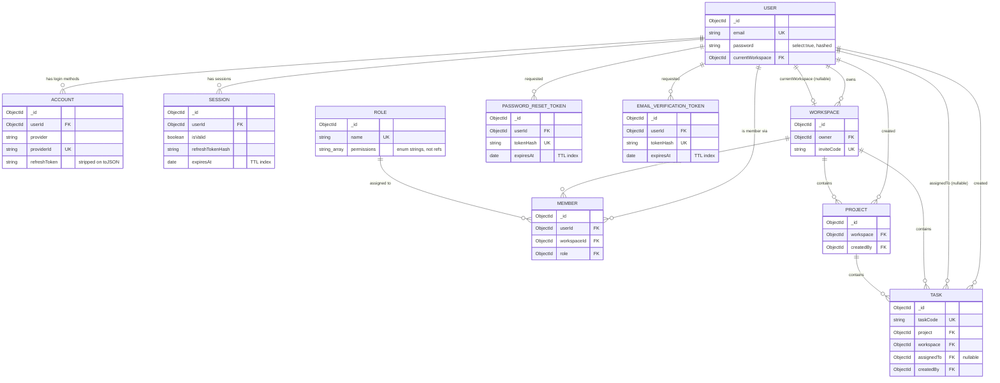

> Part of the [AstriX engineering curriculum](../Architecture.md), under [Backend](./00-master-backend-architecture.md).

# Database Schema Design

Every backend that talks to a database eventually has to answer one question: when two pieces of data are related, where does that relationship live? In a relational database the answer is mostly forced on you — foreign keys and normal forms are the water you swim in. In a document database like MongoDB, the answer is a design decision made fresh for every relationship, and getting it wrong doesn't throw a schema error — it just quietly costs you either extra round trips or duplicated, driftable data years later. This chapter surveys how that decision gets made in general, then maps AstriX's 10 Mongoose models field-by-field, index-by-index, hook-by-hook, to see exactly which way AstriX leaned and whether it leaned consistently.

---

## 1. The Landscape

MongoDB stores JSON-like documents (BSON) grouped into collections, and — critically — it does not enforce a shape on those documents at the database engine level. Any two documents in the same collection can technically have completely different fields. That single fact is the root of every design choice in this section: the database itself will not stop you from embedding, referencing, or doing both inconsistently. The schema has to be enforced somewhere else, or not at all.

### (a) Heavy embedding

Related data is nested directly as subdocuments *inside* the parent document, so a single `findOne` returns the whole graph in one read.

```js
// A blog post with embedded comments - one document, one query
{
  _id: ObjectId("..."),
  title: "Why MongoDB?",
  body: "...",
  comments: [
    { author: "alice", text: "Great post!", postedAt: ISODate("...") },
    { author: "bob", text: "Disagree.", postedAt: ISODate("...") }
  ]
}
```

This is the pattern MongoDB's own marketing leans on hardest, and for read-heavy, rarely-updated-independently data it's genuinely excellent: one round trip, no join, the whole aggregate loads atomically. The costs are structural, not stylistic. MongoDB documents have a **hard 16MB size cap** — an array of comments that grows without bound (a popular post, an active thread) can hit that ceiling. And because the embedded copy is the *only* copy, if the same real-world entity needs to be embedded in more than one place (say, a user's name shown on every comment they've ever made), updating that entity means finding and rewriting every embedded copy — the classic **update anomaly** normalization was invented to avoid.

### (b) Heavy referencing

Every relationship is instead a separate collection, linked by an `ObjectId`, and reassembled on read via a join-like operation — in Mongoose, `.populate()`.

```js
// Two collections, linked by ObjectId
// posts collection
{ _id: ObjectId("p1"), title: "Why MongoDB?", body: "..." }
// comments collection
{ _id: ObjectId("c1"), postId: ObjectId("p1"), author: "alice", text: "Great post!" }
```

```js
// Mongoose read - a real .populate() call, not from AstriX, illustrative only
const post = await Post.findById(postId).populate("comments");
```

This is much closer to relational normalization: one source of truth per entity, no duplication, updates are a single-document write. The cost is the mirror image of embedding's benefit — reading the full graph now costs multiple round trips (or a `$lookup` aggregation stage doing the join server-side), and there is no cross-collection foreign-key *enforcement* the way a relational database would give you for free; a dangling reference (the referenced document was deleted) is silently possible unless the application layer guards against it.

### (c) Hybrid / denormalized-with-duplication ("Extended Reference" / "Subset" pattern)

A deliberate middle ground: keep the relationship as a reference, but duplicate a *small, rarely-changing slice* of the related document alongside it, specifically to avoid a join on a hot read path.

```js
// comments collection - author is referenced AND a slice is duplicated
{
  _id: ObjectId("c1"),
  postId: ObjectId("p1"),
  authorId: ObjectId("u1"),
  authorDisplayName: "alice",   // duplicated - avoids a User lookup per comment render
  authorAvatarUrl: "https://...",
  text: "Great post!"
}
```

This is a named pattern in MongoDB's own schema-design-pattern literature (sometimes called the **Extended Reference pattern** or the **Subset pattern**, depending on how much of the related document is duplicated). The tradeoff is explicit and has to be accepted consciously: the duplicated slice can go **stale** — if `alice` changes her display name, every comment she's ever posted now shows the old name until something re-syncs it (a background job, a write-time fan-out, or just "we accept staleness because display names rarely change and nobody notices for a day"). This is the right tool exactly when the duplicated data changes rarely and the join it avoids is on a genuinely hot path — not a default to reach for casually.

### (d) Schema-on-read vs. schema-on-write

This is a distinction worth being precise about, because it's easy to collapse into "MongoDB is schemaless" and stop thinking. **MongoDB the database is schema-on-read at the engine level** — it will accept a document with any shape into a collection; validation, if any, has to be either bolted on via MongoDB's own (optional, rarely used in practice) `$jsonSchema` collection validators, or — far more commonly in the Node ecosystem — enforced one layer up, in the application, before the document is ever sent to the driver. **Mongoose is that application-level layer.** A Mongoose `Schema` declares required fields, types, enums, defaults, and uniqueness constraints, and Mongoose validates against that declaration *before* issuing the write. So "this codebase uses MongoDB" does not imply "this codebase has no schema" — it means the schema enforcement moved from the database engine to the ODM. That has a real consequence: the schema is only as strong as Mongoose's validation path. A raw `db.collection.insertOne()` call bypassing Mongoose entirely (a migration script, a one-off admin query) can still write a document that violates the Mongoose schema, because the database itself never checked.

---

## 2. AstriX's Choice

AstriX is **predominantly reference-based**: every one of its 10 models is registered as its own top-level Mongoose collection, and every relationship between them is an `ObjectId` with a `ref`, resolved via `.populate()` or a second query rather than embedding. Mongoose provides application-level schema-on-write validation on top of MongoDB's naturally schema-on-read engine — required fields, enums, uniqueness, and defaults are all declared in the ten schema files under `backend/src/models/` and enforced before any document is written.

That claim was checked, not assumed, against all ten files read in full below: **there are zero embedded subdocuments anywhere in the ten AstriX models.** No array of subdocuments, no nested object schema, nothing that would show up as pattern (a) from the landscape above. Every one-to-many and many-to-many relationship in the domain — a workspace's members, a project's tasks, a role's permissions-as-strings (not permission *documents*, see §3.6) — is modeled as a separate collection referencing back by `ObjectId`, or, in the one many-to-many case (`Member`), as its own join-table-shaped collection. This is a consistent architectural choice, not an accident of a few files happening to look that way.

---

## 3. AstriX Implementation

All ten models live in `backend/src/models/`. Each is covered in full below — every field, every index, every hook and method actually present in the file.

### 3.1 `User` — the identity root

`User` is the most-referenced model in the system: `Account`, `Session`, `Member`, `Project`, `Task`, `PasswordResetToken`, and `EmailVerificationToken` all point back to it.

```ts
// backend/src/models/user.model.ts:1-73
import mongoose, { Document, Schema } from "mongoose";
import { compareValue, hashValue } from "../utils/bcrypt";

export interface UserDocument extends Document {
  name: string;
  email: string;
  password?: string;
  profilePicture: string | null;
  isActive: boolean;
  // Advisory only - never gates login (see PLAN.md §3). Set true immediately
  // for OAuth signups whose provider already confirmed the email.
  isEmailVerified: boolean;
  lastLogin: Date | null;
  createdAt: Date;
  updatedAt: Date;
  currentWorkspace: mongoose.Types.ObjectId | null;
  comparePassword(value: string): Promise<boolean>;
  omitPassword(): Omit<UserDocument, "password">;
}

const userSchema = new Schema<UserDocument>(
  {
    name: {
      type: String,
      required: false,
      trim: true,
    },
    email: {
      type: String,
      required: true,
      unique: true,
      trim: true,
      lowercase: true,
    },
    password: { type: String, select: true },
    profilePicture: {
      type: String,
      default: null,
    },
    currentWorkspace: {
      type: mongoose.Schema.Types.ObjectId,
      ref: "Workspace",
    },
    isActive: { type: Boolean, default: true },
    isEmailVerified: { type: Boolean, default: false },
    lastLogin: { type: Date, default: null },
  },
  {
    timestamps: true,
  }
);

userSchema.pre("save", async function (next) {
  if (this.isModified("password")) {
    if (this.password) {
      this.password = await hashValue(this.password);
    }
  }
  next();
});

userSchema.methods.omitPassword = function (): Omit<UserDocument, "password"> {
  const userObject = this.toObject();
  delete userObject.password;
  return userObject;
};

userSchema.methods.comparePassword = async function (value: string) {
  return compareValue(value, this.password);
};

const UserModel = mongoose.model<UserDocument>("User", userSchema);
export default UserModel;
```

Notable points, all verified against the file above:
- **`password` is optional and not marked `select: false`.** OAuth-only users have no password at all (`password?: string`), and — a detail worth flagging now and returning to in §6 — the schema option is `select: true`, meaning a plain `UserModel.findById(...)` **returns the password hash by default**, unlike the common Mongoose convention of `select: false` on sensitive fields.
- **The password-hashing hook** runs on every `save()` where `password` was modified — not on `updateOne`/`findOneAndUpdate`, which bypass document middleware entirely (relevant if any future code path ever updates a password via those instead of loading-then-saving the document).
- **`currentWorkspace`** is a nullable `ObjectId` reference to `Workspace` — the *only* field on `User` that points somewhere else; everything else on `User` is scalar.
- Two instance methods exist: `comparePassword` (bcrypt compare, delegated to `utils/bcrypt.ts`) and `omitPassword` (a manual, load-then-strip pattern — see §6 for why this matters).

### 3.2 `Workspace` — the tenancy boundary

```ts
// backend/src/models/workspace.model.ts:1-45
import mongoose, { Document, Schema } from "mongoose";
import { generateInviteCode } from "../utils/uuid";

export interface WorkspaceDocument extends Document {
  name: string;
  description: string;
  owner: mongoose.Types.ObjectId;
  inviteCode: string;
  createdAt: string;
  updatedAt: string;
  resetInviteCode(): void;
}

const workspaceSchema = new Schema<WorkspaceDocument>(
  {
    name: { type: String, required: true, trim: true },
    description: { type: String, required: false },
    owner: {
      type: mongoose.Schema.Types.ObjectId,
      ref: "User", // Reference to User model (the workspace creator)
      required: true,
    },
    inviteCode: {
      type: String,
      required: true,
      unique: true,
      default: generateInviteCode,
    },
  },
  {
    timestamps: true,
  }
);

workspaceSchema.methods.resetInviteCode = function () {
  this.inviteCode = generateInviteCode();
};

const WorkspaceModel = mongoose.model<WorkspaceDocument>(
  "Workspace",
  workspaceSchema
);

export default WorkspaceModel;
```

`owner` is a single `ObjectId` reference to `User` — a workspace has exactly one owner (membership for everyone else, owner included, is tracked separately by `Member`, §3.3). `inviteCode` is `unique` and auto-generated at creation via `generateInviteCode()`; `resetInviteCode()` is an instance method that mutates the in-memory document (the caller is still responsible for calling `.save()` — this method does not persist on its own, it only reassigns the field).

### 3.3 `Member` — the Workspace↔User↔Role join

This is the one genuinely many-to-many relationship in the schema: a `User` can belong to many `Workspace`s, a `Workspace` has many `User`s, and `Member` is the join collection that also carries the per-membership `Role`.

```ts
// backend/src/models/member.model.ts:1-45
import mongoose, { Document, Schema } from "mongoose";
import { RoleDocument } from "./roles-permission.model";

export interface MemberDocument extends Document {
  userId: mongoose.Types.ObjectId;
  workspaceId: mongoose.Types.ObjectId;
  role: RoleDocument;
  joinedAt: Date;
}

const memberSchema = new Schema<MemberDocument>(
  {
    userId: {
      type: Schema.Types.ObjectId,
      ref: "User",
      required: true,
    },
    workspaceId: {
      type: Schema.Types.ObjectId,
      ref: "Workspace",
      required: true,
    },
    role: {
      type: Schema.Types.ObjectId,
      ref: "Role",
      required: true,
    },
    joinedAt: {
      type: Date,
      default: Date.now,
    },
  },
  {
    timestamps: true,
  }
);

// A user can only hold one membership per workspace. Without this, a race
// between two concurrent "join workspace" requests (check-then-insert, no
// natural atomicity) can create duplicate Member rows for the same pair.
memberSchema.index({ userId: 1, workspaceId: 1 }, { unique: true });

const MemberModel = mongoose.model<MemberDocument>("Member", memberSchema);
export default MemberModel;
```

Three `ObjectId` references live on this one document (`userId` → `User`, `workspaceId` → `Workspace`, `role` → `Role`), which is exactly the shape of a classic relational join table translated into document form — nothing embedded, every edge is a reference. The compound unique index `{ userId: 1, workspaceId: 1 }` is the data-integrity backstop: it's what actually prevents a user from acquiring two memberships (possibly with two different roles) in the same workspace under concurrent requests, since Mongoose-level `findOne`-then-`create` application logic can't be atomic on its own.

### 3.4 `Role` — permissions as an embedded array of strings, not subdocuments

```ts
// backend/src/models/roles-permission.model.ts:1-38
import mongoose, { Schema, Document } from "mongoose";
import {
  Permissions,
  PermissionType,
  Roles,
  RoleType,
} from "../enums/role.enum";
import { RolePermissions } from "../utils/role-permission";

export interface RoleDocument extends Document {
  name: RoleType;
  permissions: Array<PermissionType>;
}

const roleSchema = new Schema<RoleDocument>(
  {
    name: {
      type: String,
      enum: Object.values(Roles),
      required: true,
      unique: true,
    },
    permissions: {
      type: [String],
      enum: Object.values(Permissions),
      required: true,
      default: function (this: RoleDocument) {
        return RolePermissions[this.name];
      },
    },
  },
  {
    timestamps: true,
  }
);

const RoleModel = mongoose.model<RoleDocument>("Role", roleSchema);
export default RoleModel;
```

This is worth calling out precisely because it's the closest thing in AstriX to an embedding decision, and it's easy to misclassify. `permissions` is `[String]` — an **array of plain enum strings**, not an array of subdocuments and not a set of references to some hypothetical `Permission` collection. There is no `Permission` model at all; `Permissions` (capitalized enum object, in `enums/role.enum.ts`) is a compile-time TypeScript constant, and `RolePermissions` (in `utils/role-permission.ts`) is a plain object mapping each `RoleType` to its default `PermissionType[]`:

```ts
// backend/src/utils/role-permission.ts:1-8 (excerpt)
import { Permissions, PermissionType, RoleType } from "../enums/role.enum";

export const RolePermissions: Record<RoleType, Array<PermissionType>> = {
  OWNER: [
    Permissions.CREATE_WORKSPACE,
    Permissions.EDIT_WORKSPACE,
    Permissions.DELETE_WORKSPACE,
    Permissions.MANAGE_WORKSPACE_SETTINGS,
    // ... ADD_MEMBER, CHANGE_MEMBER_ROLE, REMOVE_MEMBER, CREATE_PROJECT,
    // EDIT_PROJECT, DELETE_PROJECT, CREATE_TASK, EDIT_TASK, DELETE_TASK,
    // VIEW_ONLY
  ],
  // ADMIN and MEMBER get smaller, hand-authored subsets
};
```

So "permissions" in AstriX are not a modeled entity at all — they're an enum whose values happen to be stored, per role, as a string array on the `Role` document, with `RolePermissions` supplying the default set at document-creation time via a Mongoose `default` function that closes over `this.name`. `name` itself is `unique` — there is exactly one `Role` document per `RoleType` (`OWNER`, `ADMIN`, `MEMBER`) in the whole database, seeded once (see `seeders/`) and referenced by every `Member`.

### 3.5 `Project`

```ts
// backend/src/models/project.model.ts:1-47
import mongoose, { Document, Schema } from "mongoose";

export interface ProjectDocument extends Document {
  name: string;
  description: string | null; // Optional description for the project
  emoji: string;
  workspace: mongoose.Types.ObjectId;
  createdBy: mongoose.Types.ObjectId;
  createdAt: Date;
  updatedAt: Date;
}

const projectSchema = new Schema<ProjectDocument>(
  {
    name: {
      type: String,
      required: true,
      trim: true,
    },
    emoji: {
      type: String,
      required: false,
      trim: true,
      default: "📊",
    },
    description: { type: String, required: false },
    workspace: {
      type: Schema.Types.ObjectId,
      ref: "Workspace",
      required: true,
    },
    createdBy: {
      type: Schema.Types.ObjectId,
      ref: "User",
      required: true,
    },
  },
  {
    timestamps: true,
  }
);

// getProjectsInWorkspaceService lists/paginates by workspace on every call.
projectSchema.index({ workspace: 1 });

const ProjectModel = mongoose.model<ProjectDocument>("Project", projectSchema);
export default ProjectModel;
```

Two references (`workspace`, `createdBy`), both required, both plain `ObjectId`s — no embedding of tasks inside the project document, which is the choice that most directly prevents the 16MB document-size ceiling from ever becoming a real concern here: a project with thousands of tasks stays a small, fixed-size document regardless of how many `Task` documents reference it. The single-field index on `workspace` exists specifically because workspace-scoped project listing is the dominant read pattern (see the inline comment in the source).

### 3.6 `Task`

```ts
// backend/src/models/task.model.ts:1-91
import mongoose, { Document, Schema } from "mongoose";
import {
  TaskPriorityEnum,
  TaskPriorityEnumType,
  TaskStatusEnum,
  TaskStatusEnumType,
} from "../enums/task.enum";
import { generateTaskCode } from "../utils/uuid";

export interface TaskDocument extends Document {
  taskCode: string;
  title: string;
  description: string | null;
  project: mongoose.Types.ObjectId;
  workspace: mongoose.Types.ObjectId;
  status: TaskStatusEnumType;
  priority: TaskPriorityEnumType;
  assignedTo: mongoose.Types.ObjectId | null;
  createdBy: mongoose.Types.ObjectId;
  dueDate: Date | null;
  createdAt: Date;
  updatedAt: Date;
}

const taskSchema = new Schema<TaskDocument>(
  {
    taskCode: {
      type: String,
      unique: true,
      default: generateTaskCode,
    },
    title: {
      type: String,
      required: true,
      trim: true,
    },
    description: {
      type: String,
      trim: true,
      default: null,
    },
    project: {
      type: Schema.Types.ObjectId,
      ref: "Project",
      required: true,
    },
    workspace: {
      type: Schema.Types.ObjectId,
      ref: "Workspace",
      required: true,
    },
    status: {
      type: String,
      enum: Object.values(TaskStatusEnum),
      default: TaskStatusEnum.TODO,
    },
    priority: {
      type: String,
      enum: Object.values(TaskPriorityEnum),
      default: TaskPriorityEnum.MEDIUM,
    },
    assignedTo: {
      type: Schema.Types.ObjectId,
      ref: "User",
      default: null,
    },
    createdBy: {
      type: Schema.Types.ObjectId,
      ref: "User",
      required: true,
    },
    dueDate: {
      type: Date,
      default: null,
    },
  },
  {
    timestamps: true,
  }
);

// getAllTasksService filters by workspace+project, workspace+status, and
// assignedTo on every list call - none of these were indexed before.
taskSchema.index({ workspace: 1, project: 1 });
taskSchema.index({ workspace: 1, status: 1 });
taskSchema.index({ assignedTo: 1 });

const TaskModel = mongoose.model<TaskDocument>("Task", taskSchema);

export default TaskModel;
```

`Task` is the most heavily referenced-*out* model — it points to `Project`, `Workspace`, and two separate `User` references (`assignedTo`, nullable, and `createdBy`, required). There is no embedded subtasks array and no embedded comments array on `Task` — anywhere those concepts might eventually live, they don't exist yet in this schema; flagging that explicitly rather than assuming, since the task prompt specifically asked to check. Three indexes back the three real list-query shapes the application issues (workspace+project, workspace+status, assignedTo-alone) — this is denormalized *indexing* (three separate indexes covering overlapping query shapes), not denormalized *data*, and is a completely ordinary, expected pattern, distinct from the duplication tradeoff described in landscape item (c).

### 3.7 `Account` — one row per linked login method

```ts
// backend/src/models/account.model.ts:1-45
import mongoose, { Document, Schema } from "mongoose";
import { ProviderEnum, ProviderEnumType } from "../enums/account-provider.enum";

export interface AccountDocument extends Document {
  provider: ProviderEnumType;
  providerId: string; // Store the email, googleId, facebookId as the providerId
  userId: mongoose.Types.ObjectId;
  refreshToken: string | null;
  tokenExpiry: Date | null;
  createdAt: Date;
}

const accountSchema = new Schema<AccountDocument>(
  {
    userId: {
      type: Schema.Types.ObjectId,
      ref: "User",
      required: true,
    },
    provider: {
      type: String,
      enum: Object.values(ProviderEnum),
      required: true,
    },
    providerId: {
      type: String,
      required: true,
      unique: true,
    },
    refreshToken: { type: String, default: null },
    tokenExpiry: { type: Date, default: null },
  },
  {
    timestamps: true,
    toJSON: {
      transform(doc, ret) {
        delete (ret as Record<string, unknown>).refreshToken;
      },
    },
  }
);

const AccountModel = mongoose.model<AccountDocument>("Account", accountSchema);
export default AccountModel;
```

`Account` is the classic "one user, many login providers" shape — a single `User` can have multiple `Account` documents (email/password, Google, GitHub, Facebook — the four values of `ProviderEnum`), each referencing the same `userId`. `providerId` is globally `unique` across the whole collection, not scoped per-provider — that's a deliberate constraint, since a given provider's identifier (a Google `sub`, a raw email string for the `EMAIL` provider) is expected to be globally unique by construction regardless of which provider issued it. Note there is **no schema-level `discriminator`** here for the different providers — `provider` is a plain enum string field on one flat schema, not a Mongoose discriminator hierarchy (see §7 for whether that's a gap). A `toJSON.transform` strips `refreshToken` from any JSON serialization of this document — the schema-level analogue of `User.omitPassword()`, but automatic (applied on every `.toJSON()`/every `res.json()` of this document) rather than requiring a manual call at each use site — a meaningfully safer pattern than `User`'s, examined further in §6.

### 3.8 `Session` — refresh-token storage with a TTL index

```ts
// backend/src/models/session.model.ts:1-76
// backend/src/models/session.model.ts
// ============================================
// SESSION MODEL - Stores Refresh Tokens
// ============================================

/**
 * WHY STORE REFRESH TOKENS IN DATABASE?
 *
 * 1. REVOCATION: Can invalidate specific sessions (logout from one device)
 * 2. LOGOUT ALL: Can invalidate all user sessions (logout everywhere)
 * 3. SECURITY: If refresh token is compromised, can delete it
 * 4. AUDIT: Can see all active sessions for a user
 * 5. DEVICE MANAGEMENT: "Manage your devices" feature
 */

import mongoose, { Document, Schema } from "mongoose";

export interface SessionDocument extends Document {
  userId: mongoose.Types.ObjectId;
  userAgent?: string;
  ipAddress?: string;
  isValid: boolean; // Can be set to false to revoke
  // SHA-256 of the refresh token this session is CURRENTLY bound to. Rotated
  // on every successful /auth/refresh, so a previously issued (already
  // rotated away) refresh token can be recognised as a replay rather than
  // silently accepted. Only the hash is stored - same discipline as the
  // password-reset and email-verification tokens.
  refreshTokenHash?: string;
  expiresAt: Date;
  createdAt: Date;
  updatedAt: Date;
}

const sessionSchema = new Schema<SessionDocument>(
  {
    userId: {
      type: mongoose.Schema.Types.ObjectId,
      ref: "User",
      required: true,
      index: true, // Index for fast lookup by user
    },
    userAgent: {
      type: String,
      default: null,
    },
    ipAddress: {
      type: String,
      default: null,
    },
    isValid: {
      type: Boolean,
      default: true,
      index: true, // Index for fast filtering of valid sessions
    },
    refreshTokenHash: {
      type: String,
      default: null,
    },
    expiresAt: {
      type: Date,
      required: true,
      index: { expireAfterSeconds: 0 }, // TTL index - MongoDB auto-deletes expired docs
    },
  },
  {
    timestamps: true,
  }
);

// Compound index for efficient queries
sessionSchema.index({ userId: 1, isValid: 1 });

const SessionModel = mongoose.model<SessionDocument>("Session", sessionSchema);

export default SessionModel;
```

`Session` never stores the raw refresh token — only `refreshTokenHash` (a SHA-256 digest, per the inline comment), rotated on every `/auth/refresh` call so a previously-issued, already-rotated-away token is detectable as a replay rather than silently honored. It carries **four indexes total**: single-field `userId`, single-field `isValid`, a compound `{ userId: 1, isValid: 1 }` (the shape "find this user's currently-valid sessions" actually queries by), and the TTL index on `expiresAt` — see §5 for what that last one buys for free.

### 3.9 `PasswordResetToken` and 3.10 `EmailVerificationToken` — identical shape, same discipline

These two are structurally the same model duplicated for two different flows, both hash-only, both TTL-expiring:

```ts
// backend/src/models/passwordResetToken.model.ts:1-46
import mongoose, { Document, Schema } from "mongoose";

/**
 * Stores a HASH of the reset token, never the raw value - the raw token
 * only ever exists in the email link and in memory during the request that
 * issued it. If this collection leaked, the hashes alone aren't usable to
 * reset anyone's password.
 */
export interface PasswordResetTokenDocument extends Document {
  userId: mongoose.Types.ObjectId;
  tokenHash: string;
  expiresAt: Date;
  createdAt: Date;
}

const passwordResetTokenSchema = new Schema<PasswordResetTokenDocument>(
  {
    userId: {
      type: mongoose.Schema.Types.ObjectId,
      ref: "User",
      required: true,
      index: true,
    },
    tokenHash: {
      type: String,
      required: true,
      unique: true,
    },
    expiresAt: {
      type: Date,
      required: true,
      index: { expireAfterSeconds: 0 }, // TTL index - MongoDB auto-deletes expired docs
    },
  },
  {
    timestamps: true,
  }
);

const PasswordResetTokenModel = mongoose.model<PasswordResetTokenDocument>(
  "PasswordResetToken",
  passwordResetTokenSchema
);

export default PasswordResetTokenModel;
```

```ts
// backend/src/models/emailVerificationToken.model.ts:1-45
import mongoose, { Document, Schema } from "mongoose";

/**
 * Same shape and rationale as passwordResetToken.model.ts: only a HASH of
 * the token is ever persisted, never the raw value.
 */
export interface EmailVerificationTokenDocument extends Document {
  userId: mongoose.Types.ObjectId;
  tokenHash: string;
  expiresAt: Date;
  createdAt: Date;
}

const emailVerificationTokenSchema = new Schema<EmailVerificationTokenDocument>(
  {
    userId: {
      type: mongoose.Schema.Types.ObjectId,
      ref: "User",
      required: true,
      index: true,
    },
    tokenHash: {
      type: String,
      required: true,
      unique: true,
    },
    expiresAt: {
      type: Date,
      required: true,
      index: { expireAfterSeconds: 0 }, // TTL index - MongoDB auto-deletes expired docs
    },
  },
  {
    timestamps: true,
  }
);

const EmailVerificationTokenModel =
  mongoose.model<EmailVerificationTokenDocument>(
    "EmailVerificationToken",
    emailVerificationTokenSchema
  );

export default EmailVerificationTokenModel;
```

Each carries a single-field index on `userId` (fast "does this user have a pending token" lookup), a `unique` constraint on `tokenHash` (a hash collision, or reissuing the identical hash, is rejected at the database level rather than only in application logic), and the same TTL pattern as `Session`. AstriX chose to model these as **two separate collections with identical shape** rather than one generic `Token` collection with a `type` discriminator field — a reasonable, if slightly repetitive, choice; a `type`-discriminated single collection would have meant every future field only relevant to one flow (e.g. a future "one-time-use consumed-at timestamp") ends up nullable on the other flow's documents too.

---

## 4. Entity-Relationship Diagram

Drawn directly from the `ref` targets and indexes actually present in the ten files above — no idealized or inferred relationships beyond what's written in the schemas.



`MEMBER.role` deserves a callout the diagram compresses: it is an `ObjectId` referencing the small, near-static `ROLE` collection (three documents total, one per `RoleType`) — not an embedded permission set per membership. Every member with role `ADMIN` shares the exact same `Role` document and its `permissions` array; changing what `ADMIN` can do means updating one `Role` document, not touching every `Member`.

---

## 5. Request/Data Flow: Workspace → Member → Role → User

A concrete, three-way-referenced trace: **listing a workspace's members with each member's name, email, and role permissions attached** — a real read that has to walk `Member` → `User` and `Member` → `Role` simultaneously, both being references off the same parent (`Workspace`).

1. **Entry point.** A `GET` to a workspace-scoped members endpoint arrives already carrying an authenticated `req.user` (see [02](./02-authentication-and-authorization.md)) and a `workspaceId` route param.
2. **Membership query, not a `Workspace` field lookup.** Because `Member` — not `Workspace` — is the collection that owns the workspace↔user edges, the service layer queries `Member` by `workspaceId`, not by expanding an embedded array on the `Workspace` document (there is none):
   ```ts
   // illustrative shape of the actual pattern used across member.service.ts —
   // the two populated fields are exactly the two ObjectId refs on MemberDocument
   const members = await MemberModel.find({ workspaceId })
     .populate("userId", "name email profilePicture")
     .populate("role", "name permissions");
   ```
3. **Two `.populate()` calls, two joins, one round trip from the application's perspective.** `.populate("userId", ...)` resolves each `Member.userId` `ObjectId` against the `User` collection and replaces it in-memory with the selected fields (`name email profilePicture` — notably *not* `password`, which is how this particular read path avoids the `select: true` default entirely: an explicit field-selection string on `.populate()` acts the same as `.select()` would). `.populate("role", ...)` does the same against the tiny `Role` collection.
4. **Under the hood**, Mongoose issues this as the original `Member.find()` query plus one additional query per populated path (effectively `User.find({ _id: { $in: [...] } })` and `Role.find({ _id: { $in: [...] } })`), not a single server-side aggregation — this is the referencing tradeoff from §1(b) made concrete: three logical collections, up to three round trips to answer one read, versus one round trip an embedded design would have cost.
5. **Response shaping.** The controller returns the populated `Member` array as-is or maps it into a flatter DTO shape; because `.populate("role", "name permissions")` already excludes any fields not requested, the response naturally carries `role.name` and `role.permissions` without a separate `Role` fetch in the controller.
6. **Authorization check, same three models, opposite direction.** Before this endpoint even reaches step 2, [`roleGuard`](./02-authentication-and-authorization.md) independently re-derives the requesting user's own `Member` row for this `workspaceId`, populates *its* `role`, and checks `permissions.includes(requiredPermission)` — the identical `Member`→`Role` reference walked a second time, for the *requester*, entirely separately from the *listed* members being fetched in step 2. That duplication (two separate `Member`→`Role` populations per request, one for auth, one for the response payload) is the direct cost of `Role` being a reference rather than, say, a permission set denormalized directly onto the JWT or the `Member` document at issuance time.

---

## 6. Design Decisions & Tradeoffs

**Why referencing over embedding, for the relationships AstriX actually has.** Every parent/child relationship in this domain — `Workspace`→`Project`, `Project`→`Task`, `Workspace`→`Member` — is unbounded-growth on the child side (a workspace can accumulate an arbitrary number of projects and tasks over its lifetime) and each child is independently addressable, updatable, and queryable on its own (a single task gets edited far more often than its parent project). Both of those properties point straight at referencing: embedding an unbounded, independently-mutated array inside a parent document is exactly the shape that runs into the 16MB ceiling and the "rewrite the whole parent to change one child" cost described in §1(a). Nothing in the ten schemas suggests this was accidental — every reference is explicit, typed, and paired with a `ref` string, and the one place a genuine array of scalars appears (`Role.permissions`) is a small, fixed-cardinality set of enum strings, not a growth-prone collection of independent entities, so it doesn't carry the same risk.

**What a differently-modeled version of this domain would look like.** A schema leaning on embedding for the same problem might put a capped, recent-activity `tasks: [{ title, status, ... }]` array directly on `Project` for a fast "project overview" read, accepting that the full task history has to live elsewhere once it outgrows the cap — a real pattern (the "Outlier" or "Bucket" pattern in MongoDB's own terminology) but one that adds a second source of truth to keep consistent. AstriX gave up the single-query project-overview read in exchange for never having to reconcile two copies of task data, and in exchange for tasks being trivially and independently indexable (the three indexes in §3.6 wouldn't be nearly as effective, or would need to be reshaped entirely, against an embedded array).

**The `Session` TTL index solves a recurring-job problem for free.** Without `expiresAt: { index: { expireAfterSeconds: 0 } }`, an expired session document would sit in the collection forever unless something actively deleted it — which in most systems means writing, deploying, and monitoring a cron job (or a scheduled Lambda, or a `setInterval` in-process) whose entire job is "delete rows where `expiresAt < now`." MongoDB's TTL index moves that responsibility into the database engine itself: a background thread sweeps TTL-indexed collections roughly once a minute and deletes documents whose indexed date field has passed, no application code involved. `PasswordResetToken` and `EmailVerificationToken` get the identical benefit for the identical reason — all three collections are self-cleaning, and none of the three needed a bespoke cleanup job written for them.

---

## 7. Security Considerations

**Password hashes: two different real mechanisms found, not one.** The `User` schema sets `password: { type: String, select: true }` — explicitly *not* `select: false`. That means the common Mongoose convention of "sensitive fields are excluded from queries by default and must be explicitly re-`select`ed to see them" does **not** apply here; a bare `UserModel.findById(id)` returns the password hash unless the caller remembers to strip it. Checking how call sites actually handle this (rather than assuming) turned up three distinct patterns in use across the backend:
- `services/user.service.ts` → `getCurrentUserService`: query-level exclusion via `.select("-password")`.
- `services/auth.service.ts` → the "get authenticated user" helper: query-level exclusion via a projection object, `UserModel.findById(userId, { password: false })`.
- `services/user.service.ts` → `updateProfileService`, and `services/auth.service.ts`'s post-login/register paths: **document-level** exclusion via the `omitPassword()` instance method (`user.omitPassword()`), which loads the full document (password hash included, in memory, however briefly) and only strips it when explicitly called before the response is shaped.

None of these is wrong on its own, but three different manual mechanisms doing the same job is a real gap, not a false alarm: `select: false` at the schema level would make "leaves out the password by default" the property that holds *everywhere automatically*, including at any future call site nobody has written yet, rather than a property that holds only at the call sites someone remembered to add `.select("-password")` or `.omitPassword()` to. This is the single most actionable schema-level observation in this file.

**`Account.refreshToken` uses the safer of the two patterns.** Its `toJSON.transform` (§3.7) strips `refreshToken` automatically on every serialization — a class of protection the manual-`omitPassword()` half of `User`'s approach doesn't have, since a `transform` applies uniformly regardless of whether the code calling it remembers to do anything special. `Session.refreshTokenHash` has no such transform, but it is already a one-way hash rather than a usable secret, so its exposure risk is categorically smaller than a raw `refreshToken` or a password hash would be — though it's still not something a client response should ever need to see, and nothing in the schema itself prevents it from being serialized if a controller ever returned a raw `Session` document.

**PII and error-message leakage.** `User.email`, `Workspace.inviteCode`, `Account.providerId`, `Role.name`, and `Task.taskCode` all carry `unique` constraints — a duplicate-key write against any of them fails at the database layer with a Mongo `E11000` error before the application's own validation gets a chance to reject it more gracefully. How that raw driver error gets turned into an HTTP response — and specifically whether the offending value (an email address, in the worst case) ends up echoed back in an error message — is the concern of [`04-error-handling-patterns.md`](./04-error-handling-patterns.md)'s handling of Mongoose `CastError`/duplicate-key mapping, not re-litigated here; the schema-level fact worth carrying forward is simply that five separate fields across four models are capable of triggering that code path, `User.email` being the one whose value is itself PII.

---

## 8. Best Practice Check (2026)

- **`.lean()` for read-heavy queries.** A repository-wide search for `.lean(` across `backend/src` returns zero matches. Every Mongoose query in this codebase returns full hydrated Mongoose documents — complete with the change-tracking machinery, getters/setters, and instance methods that come with a Mongoose `Document` — even for pure read paths that only ever serialize the result to JSON and never call `.save()` on it. Current (2026) Mongoose guidance is to attach `.lean()` to any query whose result is read-only, which returns plain JavaScript objects instead and is meaningfully cheaper for large result sets (no document wrapping, no virtuals/getters overhead) — a real, if minor, gap here, and one that's easy to introduce incrementally since it's a per-query opt-in with no schema changes required.
- **Schema versioning / migration strategy.** There is no `__v`-based manual migration tooling, no `migrate-mongo`/`umzug`-style migration runner, and no versioned-schema pattern (e.g. a `schemaVersion` field with per-version upgrade logic) anywhere in the ten models or the `seeders/` folder. Mongoose's own auto-managed `__v` (`versionKey`) exists on every document by default for optimistic-concurrency purposes, but that is not a migration strategy — it doesn't help reshape existing documents when a field is renamed or a type changes. This is a named absence, not an oversight to paper over: for a codebase at this stage, "no migration framework yet, schema changes are additive-only by convention" is a defensible-for-now position, but it's the kind of gap that becomes expensive to retrofit once the collections hold meaningful production data and a genuinely breaking field change is needed.
- **Discriminators for polymorphic models.** `Account` is the one model in this domain that's a textbook candidate for a Mongoose discriminator — four `ProviderEnum` values, and at least conceivably provider-specific fields down the line (a Google-specific `googleWorkspaceDomain`, say). AstriX does not use a discriminator; `Account` is one flat schema with a `provider` enum string field and the same field set for every provider. For the current, small, uniform field set this is a perfectly reasonable, simpler choice — discriminators earn their complexity once different provider types genuinely need different fields, which none currently do here — so this reads as "matches practice for the actual requirement," not a gap.
- **Where AstriX matches current practice cleanly:** consistent `timestamps: true` on every one of the ten schemas (no model hand-rolls `createdAt`/`updatedAt`), deliberate hash-only storage for every token-like secret (`Session`, `PasswordResetToken`, `EmailVerificationToken` all store a hash, never a raw secret), and correct, workload-driven compound/TTL indexing rather than indexing everything indiscriminately.

---

## 9. Debug Drill

**Scenario:** a `.populate()`d query is returning `null` (or silently omitting the populated field) for some documents but not others, and nothing threw an error.

Work through it in this order, and the reasoning generalizes to any Mongoose codebase, not just this one:

1. **Confirm the `ref` string matches a registered model name exactly.** `.populate("role")` only works if some file has actually executed `mongoose.model("Role", roleSchema)` — a typo'd `ref: "Roles"` (plural) on the schema, or a model file that's never imported anywhere so it never registers, produces silent `null` populates, not an error, because Mongoose can't know the ref was supposed to point anywhere real.
2. **Check for orphaned/dangling references first**, since document databases (unlike relational ones) have no foreign-key constraint stopping this: if the referenced document was deleted — a `User` removed while a `Task.assignedTo` still points at their old `_id`, for instance — `.populate()` doesn't error, it just resolves that field to `null`. Query the raw `ObjectId` value directly against the target collection (`db.users.findOne({ _id: theId })`) to confirm the referenced document still exists before assuming the populate logic itself is broken.
3. **Check whether the field was excluded by a projection somewhere in the chain.** A `.select("-someField")` or a restrictive projection object earlier in the same query chain can suppress the very field being populated, or the fields requested inside `.populate(path, selectString)` — this looks identical to "populate is broken" but is actually "populate is working, but you told it not to return that field."
4. **Check `strictPopulate`.** Modern Mongoose throws (rather than silently no-ops) when you `.populate()` a path not declared as a `ref` in the schema — if you're instead getting a silent no-op, confirm the field genuinely has a `ref` in its schema definition rather than just holding an `ObjectId`-shaped value that happens to look like a reference.
5. **For "some documents affected, not all," diff one affected document against one unaffected one field-by-field** — including checking whether the reference field is actually an `ObjectId` type versus, on the affected documents specifically, a raw string that was written by some older code path or a manual `db.collection.insertOne()` that bypassed Mongoose validation entirely (see §1(d) — schema-on-write only holds for writes that actually go through the ODM).

**A related, equally common scenario:** a write fails with a unique-index violation you didn't expect. First check whether the index is a *compound* unique index (like `Member`'s `{ userId: 1, workspaceId: 1 }`) rather than a single-field one — a compound unique constraint is violated by the *combination*, and reading the raw Mongo `E11000` error message's `keyPattern`/`keyValue` payload (not just the generic "duplicate key" text) tells you exactly which field combination collided, rather than guessing from the field list in the schema.

---

Static schema shape stops here — how these models actually get queried (population strategies at scale, transactions across multiple of the collections above, connection pooling, and the `mongodb-memory-server` test setup) is [`08-database-queries-and-transactions.md`](./08-database-queries-and-transactions.md), which owns that scope deliberately to avoid duplicating it here.
