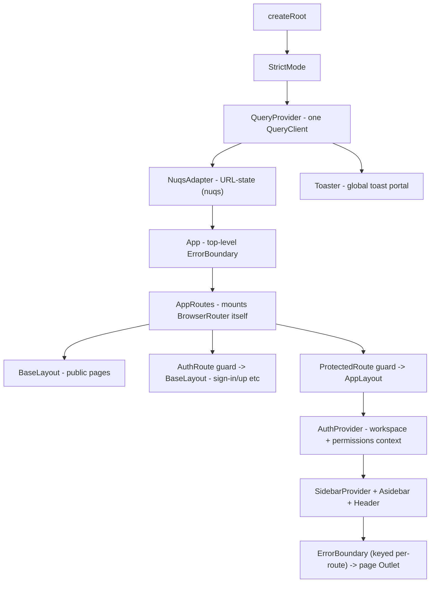
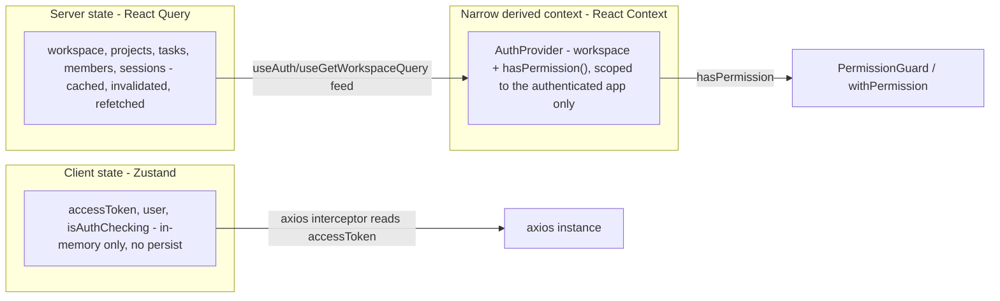

# Frontend — Master Architecture

> Part of the [AstriX engineering curriculum](../Architecture.md). This file is the system map for `client/`: provider nesting read top to bottom, the routing table, a bird's-eye view of the three-way state split, and the tech stack. Each deep dive below goes chapter-deep — landscape of alternatives first, then AstriX's actual implementation — into one slice of it.

AstriX's frontend is a single React 18 + TypeScript SPA, built by Vite, talking to the Express API over REST (see [`docs/Architecture.md`](../Architecture.md) §2 for the deployed topology — CloudFront/S3 for static assets, a direct-to-ALB path for `/api/*`, never proxied through the CDN). There is no server-side rendering, no meta-framework (no Next.js/Remix), and no framework-level routing convention — routes are hand-declared as data, not inferred from the filesystem. Like the backend, the frontend is organized by **technical layer** (`page/`, `components/`, `hooks/`, `lib/`, `store/`, `context/`) rather than by feature/domain — that folder-organization choice, and the composition patterns layered on top of it, is significant enough to be its own chapter: [`01-project-structure-and-component-patterns.md`](./01-project-structure-and-component-patterns.md). This file assumes that choice as a given and maps what sits inside it.

---

## 1. Component tree and provider nesting

Every provider a screen might need is mounted exactly once, as high as it needs to be and no higher. Two files establish the whole tree:

```tsx
// client/src/main.tsx:1-19
import { StrictMode } from "react";
import { createRoot } from "react-dom/client";
import { NuqsAdapter } from "nuqs/adapters/react";

import "./index.css";
import App from "./App.tsx";
import QueryProvider from "./context/query-provider.tsx";
import { Toaster } from "./components/ui/toaster.tsx";

createRoot(document.getElementById("root")!).render(
  <StrictMode>
    <QueryProvider>
      <NuqsAdapter>
        <App />
      </NuqsAdapter>
      <Toaster />
    </QueryProvider>
  </StrictMode>
);
```

```tsx
// client/src/App.tsx:1-13
import AppRoutes from "./routes";
import ErrorBoundary from "./components/error-boundary";

function App() {
  return (
    <ErrorBoundary>
      <AppRoutes />
    </ErrorBoundary>
  );
}

export default App;
```



Two things worth internalizing from this shape, because they're easy to get backwards when sketching a React app from scratch:

1. **`QueryProvider` sits above the router**, not inside it — React Query's cache must survive route changes (a query fetched on one page should still be warm if the user navigates back to it), so it has to live above whatever component tree gets torn down and remounted by routing.
2. **There is no global `AuthProvider`.** It's mounted only inside `AppLayout` (`client/src/layout/app.layout.tsx:15`, shown in §3 below) — i.e., only once a user is already known to be authenticated (`ProtectedRoute` already let them through). Public pages (the landing page, sign-in, legal pages) never pay for workspace/permission-context setup they have no use for. "Am I logged in at all" is answered earlier and more cheaply, by a direct `useAuth()` call inside the route guards themselves (§3) — the heavier, workspace-scoped `AuthProvider` context is a second, narrower layer on top of that, not a duplicate of it. Full treatment in [`06-authentication-and-authorization-ui.md`](./06-authentication-and-authorization-ui.md).

Two more providers/utilities that don't nest into the tree above but matter globally:

- **`ErrorBoundary`** appears twice — once at the very top (`App.tsx`, catches anything routing itself can't render) and once per-route inside each layout (`BaseLayout`/`AppLayout`, keyed by `pathname` so a crash on one page doesn't stay tripped after navigating away). Full treatment in [`09-error-handling-loading-states-and-resilience.md`](./09-error-handling-loading-states-and-resilience.md).
- **`Toaster`** is mounted once at the root, sibling to the router, so any component anywhere can fire a toast via the `useToast` hook without needing its own provider in scope.

## 2. Routing map

Routing is entirely config-based — `react-router-dom` v7, `<Routes>`/`<Route>` built from three plain arrays of `{ path, element }`, not filesystem-inferred:

```tsx
// client/src/routes/index.tsx:1-63
function AppRoutes() {
  return (
    <BrowserRouter>
      <Suspense fallback={<DashboardSkeleton />}>
        <Routes>
          <Route element={<BaseLayout />}>
            {baseRoutePaths.map((route) => (
              <Route key={route.path} path={route.path} element={route.element} />
            ))}
          </Route>

          <Route path="/" element={<AuthRoute />}>
            <Route element={<BaseLayout />}>
              {authenticationRoutePaths.map((route) => (
                <Route key={route.path} path={route.path} element={route.element} />
              ))}
            </Route>
          </Route>

          {/* Protected Route */}
          <Route path="/" element={<ProtectedRoute />}>
            <Route element={<AppLayout />}>
              {protectedRoutePaths.map((route) => (
                <Route key={route.path} path={route.path} element={route.element} />
              ))}
            </Route>
          </Route>
          {/* Catch-all for undefined routes */}
          <Route path="*" element={<NotFound />} />
        </Routes>
      </Suspense>
    </BrowserRouter>
  );
}
```

Three route "zones," each behind its own guard-or-none:

| Zone | Guard | Layout | Routes |
|---|---|---|---|
| Base (public) | none | `BaseLayout` | `/`, `/invite/workspace/:inviteCode/join`, `/unauthorized`, `/verify-email`, `/terms`, `/privacy` |
| Authentication | `AuthRoute` (redirects **away** if already logged in) | `BaseLayout` | `/sign-in`, `/sign-up`, `/forgot-password`, `/reset-password` |
| Protected (workspace app) | `ProtectedRoute` (redirects to `/sign-in` if not logged in) | `AppLayout` | `/workspace/:workspaceId`, `/…/tasks`, `/…/members`, `/…/settings`, `/…/project/:projectId`, `/…/account/settings` |

Full guard implementation, the `lazy()`/`Suspense` code-splitting boundary every page sits behind, and the landscape of config-based vs. file-based vs. hash routing live in [`02-routing-and-code-splitting.md`](./02-routing-and-code-splitting.md).

## 3. The three-way state model

AstriX deliberately keeps three different kinds of "state" in three different tools, rather than reaching for one general-purpose store for everything:



| Kind of state | Tool | Why not the others | Owns |
|---|---|---|---|
| **Client/UI state** that must survive across the whole app but isn't fetched from a server | Zustand (`store/store.ts`) | Lighter than Redux for a single slice; unlike Context, reading it doesn't force a re-render subscription on every consumer by default | `accessToken`, `user` snapshot, `isAuthChecking`/`isInitialized` flags |
| **Server state** — anything that originated from and must stay in sync with the API | TanStack React Query (`hooks/api/*.tsx`) | Solves caching, deduplication, background refetch, and stale-data invalidation that a plain store would have to hand-roll | Current user, workspace, projects, tasks, members, sessions |
| **Derived, narrowly-scoped context** | React Context (`context/auth-provider.tsx`) | Neither Zustand nor React Query is itself a permission-check function — `AuthProvider` composes `useAuth()` + `useGetWorkspaceQuery()` + `usePermissions()` into one `hasPermission()` closure, scoped only to where it's actually needed (inside `AppLayout`) | `workspace`, `hasPermission()`, loading/error aggregation for the authenticated shell |

This split is not incidental — each dedicated chapter surveys the general landscape for its slice before explaining why AstriX drew the line where it did: [`03-client-state-management.md`](./03-client-state-management.md) for Zustand vs. the alternatives, [`04-server-state-and-data-fetching.md`](./04-server-state-and-data-fetching.md) for React Query vs. the alternatives, and [`06-authentication-and-authorization-ui.md`](./06-authentication-and-authorization-ui.md) for how `AuthProvider` and the RBAC layer built on top of `hasPermission()` actually work end to end.

## 4. Folder map (`client/src/`)

| Folder | Purpose | Deep dive |
|---|---|---|
| `page/` | Route-level screens (one file per route, lazy-loaded) | [02](./02-routing-and-code-splitting.md) |
| `layout/` | `BaseLayout` (public), `AppLayout` (authenticated shell: sidebar, header, `AuthProvider`) | [02](./02-routing-and-code-splitting.md), [06](./06-authentication-and-authorization-ui.md) |
| `routes/` | Route-path constants, route-element tables, `ProtectedRoute`/`AuthRoute` guards | [02](./02-routing-and-code-splitting.md), [06](./06-authentication-and-authorization-ui.md) |
| `components/` | `ui/` (shadcn-generated Radix primitives), plus feature components grouped by domain (`workspace/`, `account/`, `asidebar/`, `auth/`) | [01](./01-project-structure-and-component-patterns.md), [08](./08-ui-component-library-and-styling.md) |
| `hooks/api/` | One React Query hook per server-state concern | [04](./04-server-state-and-data-fetching.md) |
| `hooks/` (non-`api/`) | UI-only hooks: dialogs, table filters, mobile breakpoint, `usePermissions`, `useWorkspaceId` | [01](./01-project-structure-and-component-patterns.md), [06](./06-authentication-and-authorization-ui.md) |
| `hoc/` | `withPermission` — higher-order-component RBAC gate | [01](./01-project-structure-and-component-patterns.md), [06](./06-authentication-and-authorization-ui.md) |
| `context/` | `AuthProvider` (workspace + permissions), `QueryProvider` (React Query root) | [06](./06-authentication-and-authorization-ui.md) |
| `store/` | Zustand auth slice + generated selector hooks | [03](./03-client-state-management.md) |
| `lib/` | `axios-client.ts` (interceptors), `api.ts` (endpoint functions), `base-url.ts`, `utils.ts` (`cn()`), `helper.ts`, `password.ts` | [06](./06-authentication-and-authorization-ui.md), [07](./07-api-layer-and-http-client.md) |
| `types/` | `api.type.ts` (request/response shapes), `custom-error.type.ts` | [07](./07-api-layer-and-http-client.md), [09](./09-error-handling-loading-states-and-resilience.md) |
| `constant/` | Shared enums mirrored from the backend (`TaskStatusEnum`, `Permissions`, ...) | [06](./06-authentication-and-authorization-ui.md) |
| `test/` | Vitest setup + a custom `render()` wrapper | `docs/testing/` (separate module) |
| `main.tsx` / `App.tsx` | App bootstrap — see §1 above | — |

## 5. Frontend tech stack

| Concern | Choice | Version |
|---|---|---|
| Framework | React | `^18.3.1` |
| Language | TypeScript | `~5.6.2` |
| Build tool | Vite | `^6.0.5` |
| Routing | `react-router-dom` | `^7.1.1` |
| Server state | TanStack React Query | `^5.62.11` |
| Client state | Zustand (+ `immer`) | `^4.5.7` |
| URL state | `nuqs` | `^2.2.3` |
| Forms | `react-hook-form` + `@hookform/resolvers` | `^7.53.2` / `^3.9.1` |
| Schema validation | Zod | `^3.24.1` |
| HTTP client | axios | `^1.7.9` |
| Styling | Tailwind CSS | `^3.4.17` |
| UI primitives | Radix UI (via shadcn/ui "copy-in" generator) | multiple `@radix-ui/react-*`, see [08](./08-ui-component-library-and-styling.md) |
| Variant styling | `class-variance-authority` + `tailwind-merge` + `clsx` | `^0.7.1` / `^2.6.0` / `^2.1.1` |
| Tables | `@tanstack/react-table` | `^8.20.6` |
| Icons | `lucide-react` | `^0.469.0` |
| Dates | `date-fns` + `react-day-picker` | `^3.6.0` / `^8.10.1` |
| Test runner | Vitest | `^4.1.11` |
| Testing utilities | Testing Library (`@testing-library/react`, `/user-event`, `/jest-dom`) | `^16.3.3` / `^14.6.7` / `^6.9.1` |
| Test DOM | `jsdom` | `^29.1.1` |
| Lint/format | ESLint (flat config, `typescript-eslint`) + Prettier | `^9.17.0` / `^3.9.6` |
| Bundle analysis | `rollup-plugin-visualizer` | `^6.0.11` (opt-in via `npm run build:analyze`) |

## 6. Request lifecycle, at a glance

Full traces (including exact query keys, Zod schemas, and interceptor branches) are in [04](./04-server-state-and-data-fetching.md), [05](./05-forms-and-validation.md), [06](./06-authentication-and-authorization-ui.md), and [07](./07-api-layer-and-http-client.md). The shape is always the same:

```
page mounts → React Query hook fires (if not already cached) → axios request interceptor
  attaches Bearer token from Zustand → API call → (on 401) axios response interceptor
  auto-refreshes once, queues concurrent 401s behind it → success: cache updated, component
  re-renders → failure: CustomError shape surfaces to the caller (toast / form error / redirect)
```

The full cross-cutting version of this — including the backend side of the same request — is already traced in [`docs/Architecture.md`](../Architecture.md) §3; this file's job is to zoom into the frontend half of that trace across each dedicated chapter below.

## 7. Deep dives in this module

| # | File | Covers |
|---|---|---|
| 01 | [`01-project-structure-and-component-patterns.md`](./01-project-structure-and-component-patterns.md) | Type-based vs. feature-based vs. atomic-design folder structure — survey, then AstriX's layout; HOC vs. children-composition vs. hooks for cross-cutting concerns |
| 02 | [`02-routing-and-code-splitting.md`](./02-routing-and-code-splitting.md) | Config-based vs. file-based vs. hash routing — survey, then AstriX's route tables, guards, layouts, `lazy()`/`Suspense` |
| 03 | [`03-client-state-management.md`](./03-client-state-management.md) | Prop drilling vs. Context vs. Redux/RTK vs. Zustand vs. atomic stores — survey, then AstriX's Zustand slice pattern |
| 04 | [`04-server-state-and-data-fetching.md`](./04-server-state-and-data-fetching.md) | Manual fetch vs. SWR vs. React Query vs. RTK Query — survey, then AstriX's query-key and caching conventions |
| 05 | [`05-forms-and-validation.md`](./05-forms-and-validation.md) | Uncontrolled vs. Formik vs. `react-hook-form` — survey, then AstriX's `react-hook-form` + Zod pattern |
| 06 | [`06-authentication-and-authorization-ui.md`](./06-authentication-and-authorization-ui.md) | Client token-storage strategies — survey, then AstriX's memory-only token, auto-refresh interceptor, RBAC-on-the-client |
| 07 | [`07-api-layer-and-http-client.md`](./07-api-layer-and-http-client.md) | Fetch wrapper vs. axios vs. generated clients — survey, then AstriX's `api.ts` + `axios-client.ts` |
| 08 | [`08-ui-component-library-and-styling.md`](./08-ui-component-library-and-styling.md) | CSS-in-JS vs. CSS Modules vs. utility-first vs. full/headless component libraries — survey, then Tailwind + shadcn/ui |
| 09 | [`09-error-handling-loading-states-and-resilience.md`](./09-error-handling-loading-states-and-resilience.md) | Error boundaries vs. try/catch vs. Suspense — survey, then AstriX's `ErrorBoundary`, skeletons, toasts |
| 10 | [`10-build-tooling-and-bundle-optimization.md`](./10-build-tooling-and-bundle-optimization.md) | Webpack vs. Vite vs. esbuild/Turbopack — survey, then AstriX's Vite config, aliasing, code splitting, env vars |
