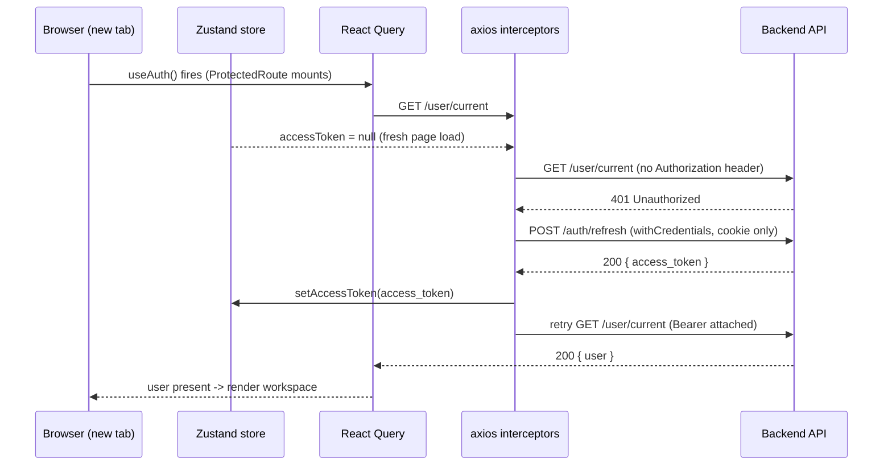

# Authentication & Authorization — Frontend

> Part of the [AstriX engineering curriculum](../Architecture.md), under [Frontend](./00-master-frontend-architecture.md).

The backend chapter on this topic ([`docs/backend/02-authentication-and-authorization.md`](../backend/02-authentication-and-authorization.md)) answers "how does the server decide a request carries a real identity, and what is that identity allowed to do." This chapter answers the other half of the same question, asked from inside the browser: how does the SPA itself know "am I logged in," where does it keep the credential that proves it, how does it recover silently when that credential expires mid-session, and how does it decide what UI to show a user once it knows who they are. Everything below is deliberately read as a continuation of the backend chapter, not a standalone document — wherever this file says "the backend does X," it is citing that chapter by section number rather than re-deriving server behavior from scratch, and you should have it open alongside this one.

The single most important idea to hold onto for the whole chapter: **none of what follows is a security boundary.** Every mechanism described here — token storage, route guards, permission checks, conditional rendering — is a UX layer that makes the *legitimate* user's experience coherent (don't show a delete button to someone who can't delete anything; redirect an unauthenticated visitor to sign-in instead of a blank crashed page). The actual enforcement, the thing that stops a malicious or merely curious user from doing something they shouldn't, lives entirely on the server, covered in the backend chapter's §3.3 (`authenticate`) and §3.7 (`roleGuard`). §6 below returns to this point in depth, because it's the one a lot of frontend auth code quietly gets wrong by implication.

---

## 1. The Landscape

### 1.1 Where does a SPA keep its access token?

Once a backend hands a browser-based single-page app some kind of bearer credential, the SPA has to put it *somewhere* it can read it back out on every subsequent request, and that "somewhere" is one of the most consequential decisions in the whole system — it's the difference between an XSS bug being an inconvenience and an XSS bug being a full account takeover that outlives the vulnerable page load. Four real, named approaches cover essentially the whole design space in production apps today.

**(a) `localStorage` / `sessionStorage`.** The simplest option, and still extremely common in tutorials and smaller apps: stash the token as a string, read it back on boot.

```js
// illustrative — not AstriX code
localStorage.setItem("access_token", token);
// later, anywhere in the app:
const token = localStorage.getItem("access_token");
```

It's trivial to implement, and `localStorage` specifically persists across reloads and even browser restarts with zero extra plumbing — no refresh dance needed, the token is just *there* next time the page loads. The cost is the thing every SPA-auth writeup eventually has to say plainly: `localStorage` and `sessionStorage` are both ordinary JavaScript-readable storage. Any script that executes in the page's origin — your own code, a compromised npm dependency, a successful XSS payload injected through an unescaped user-generated field — can read `localStorage.getItem("access_token")` just as easily as your own app can. This is the textbook XSS-token-theft vector: one injection bug anywhere in the app's dependency tree turns into "attacker has a copy of every logged-in visitor's bearer token," exfiltratable with a one-line `fetch()` to an attacker-controlled endpoint, and — critically — that stolen copy remains valid and usable from the attacker's own machine for as long as the token itself is valid, completely independent of whether the victim's page is still open.

**(b) An httpOnly cookie holding the access token itself.** Instead of JS ever touching the token, the server sets it directly as a cookie with the `HttpOnly` flag, and the browser attaches it automatically on every request to that origin — no `Authorization` header code needed on the client at all.

```
Set-Cookie: access_token=eyJhbGciOi...; HttpOnly; Secure; SameSite=Lax; Max-Age=900
```

This closes the JS-readable-storage hole completely: `document.cookie` cannot see an `HttpOnly` cookie, so a garden-variety XSS payload that runs `document.cookie` and exfiltrates the result gets nothing useful for this token. But it trades that win for two real costs. First, cookies are attached to a request *by the browser*, automatically, based on domain/path rules — not opted into per request by application code — so every request to that origin carries the cookie whether the calling code wanted it there or not, including background requests you didn't intend to authenticate, and it's the reason CSRF exists as a threat model at all (§6.4 below works through exactly this tradeoff for AstriX's actual cookie). Second, and easy to overlook: if the *access* token itself lives in an `HttpOnly` cookie, the frontend JavaScript can no longer read it — which means the app can't introspect the token's claims or expiry client-side (no "you'll be logged out in 2 minutes" countdown derived from decoding the JWT, no client-side check of "is my token about to expire" before firing a request) without a separate, non-`HttpOnly` signal for that purpose.

**(c) In-memory-only state.** Keep the token in a plain JS variable or a state-management store (Redux, Zustand, a `useState` at the app root) — nothing written to any persistent browser storage API at all.

```js
// illustrative — not AstriX code
let accessToken = null;
export const setToken = (t) => { accessToken = t; };
export const getToken = () => accessToken;
```

This is the safest option against *persistent* exfiltration: there is no storage API for a script to read from after the fact, no browser extension enumerating `localStorage` keys, no leftover token sitting on disk in a browser profile after the tab closes. An *active* XSS payload running on the page can still read the in-memory variable while the page is live (nothing stops JS from reading JS), which is why this is "safest against persistent exfiltration," not "immune to XSS" — that distinction matters and is revisited in §6.2. The cost of pure in-memory storage is UX friction: a hard reload, a new tab, or the browser restarting wipes the variable, so the app needs *some* other mechanism to re-establish "am I logged in" without asking the user to type their password in again every time they refresh the page.

**(d) Hybrid — in-memory access token + httpOnly refresh-token cookie. This is what AstriX does.** Combine (b) and (c): the short-lived access token used for ordinary API calls lives only in JS memory (option c's safety profile), while a separate, longer-lived refresh token — the credential actually capable of minting new access tokens — lives in an `HttpOnly` cookie the JS layer never touches directly (option b's theft resistance). On a hard reload, the in-memory access token is gone, exactly as option (c) predicts, but the app silently exchanges the still-present refresh cookie for a brand-new access token via a `/auth/refresh` call before the user notices — getting persistence-across-reloads without ever putting the long-lived, most-damaging-if-stolen credential (the refresh token) anywhere a script could read it. The cost is real: it's the most moving parts of any option here — you need the refresh endpoint, a client-side interceptor to catch expired-access-token errors and trigger that exchange transparently, and (as §3–§4 below cover in detail) careful handling so concurrent requests don't each independently try to refresh at once. §3.2–§3.3 show exactly how AstriX implements that plumbing.

### 1.2 Where does client-side authorization/permission-gating live?

A separate, smaller landscape question: once the app knows *who* a user is, where does the "should this user see/reach this UI" check actually live in the component tree? AstriX uses more than one of these, deliberately, for different granularities of the same underlying check.

- **Route guards** — a wrapper component sitting above an entire subtree of routes, deciding whether to render that subtree's `<Outlet />` or redirect elsewhere. This is the coarsest granularity: an all-or-nothing gate on a whole screen or set of screens. AstriX's `ProtectedRoute` and `AuthRoute` (§3.6) are both this pattern, gating "logged in at all," not any specific permission.
- **Component-level conditional rendering** — a component that takes a permission requirement and its children, and simply doesn't render those children (optionally rendering a small explanatory message instead) if the check fails. The surrounding page still renders normally; only one piece of it disappears. AstriX's `PermissionsGuard` (§3.5) is this pattern, and it's reached for constantly at the level of "hide this one button."
- **Higher-order components (HOCs)** — a function that wraps an entire page-level component and returns a new component that performs the check once, before rendering (or redirecting away from) the wrapped component entirely. This sits at a granularity between a route guard and inline conditional rendering: unlike a route guard it's attached to one specific component rather than a whole route subtree, but unlike `PermissionsGuard` it typically gates the *entire* wrapped component rather than one small piece of its output. AstriX's `withPermission` (§3.5) is this pattern, used exactly once, at page granularity — see §4.5 and §5 for exactly when AstriX reaches for this over `PermissionsGuard`, grounded in the codebase's real call sites rather than a hypothetical rule.

All three ultimately call the same underlying check (§3.4's `hasPermission`) — they're different *presentation* strategies for the identical boolean, not three independently-implemented authorization systems.

---

## 2. AstriX's Choice

AstriX uses option (d) from §1.1 end to end: the access token lives only in a Zustand store's in-memory state (no `persist` middleware, nothing written to `localStorage`), while the refresh token lives exclusively in the `HttpOnly` cookie the backend sets on login (backend §3.1, §6). A single axios instance's request/response interceptors make that hybrid invisible to the rest of the app — every component just calls a normal API function, and the token-attachment and silent-refresh-on-401 machinery happens underneath it. On top of that authentication layer, AstriX layers client-side RBAC built from one shared `hasPermission()` closure, exposed through `AuthProvider`'s React Context, and consumed through two different UI patterns from §1.2 — `PermissionsGuard` for fine-grained conditional rendering and `withPermission` for page-level gating — chosen per call site based on whether the surrounding screen still makes sense to show at all without the permission in question.

---

## 3. AstriX Implementation

### 3.1 The request interceptor — attaching the token

Every outgoing request passes through one function that reads the current access token directly out of the Zustand store and, if present, sets the `Authorization` header:

```ts
// client/src/lib/axios-client.ts:1-139
// client/src/lib/axios-client.ts
import { useStoreBase } from "@/store/store";
import { baseURL } from "@/lib/base-url";
import { CustomError } from "@/types/custom-error.type";
import axios, { AxiosError, InternalAxiosRequestConfig } from "axios";

const options = {
  baseURL,
  withCredentials: true, // CRITICAL: Sends cookies with every request
  timeout: 10000,
};

const API = axios.create(options);

// ============================================
// REFRESH TOKEN STATE
// ============================================

let isRefreshing = false;
let failedQueue: Array<{
  resolve: (token: string) => void;
  reject: (error: unknown) => void;
}> = [];

const processQueue = (error: unknown, token: string | null = null) => {
  failedQueue.forEach((promise) => {
    if (error) {
      promise.reject(error);
    } else {
      promise.resolve(token!);
    }
  });
  failedQueue = [];
};

// ============================================
// REQUEST INTERCEPTOR
// ============================================

API.interceptors.request.use((config) => {
  const accessToken = useStoreBase.getState().accessToken;
  if (accessToken) {
    config.headers["Authorization"] = "Bearer " + accessToken;
  }
  return config;
});

// ============================================
// RESPONSE INTERCEPTOR - Auto Refresh
// ============================================

API.interceptors.response.use(
  (response) => response,
  async (error: AxiosError) => {
    const originalRequest = error.config as InternalAxiosRequestConfig & {
      _retry?: boolean;
    };

    // Build custom error
    const data = error.response?.data as { errorCode?: string } | undefined;
    const customError: CustomError = {
      ...error,
      errorCode: data?.errorCode || "UNKNOWN_ERROR",
    };

    // Only handle 401 errors
    if (error.response?.status !== 401) {
      return Promise.reject(customError);
    }

    // Don't retry refresh endpoint itself
    if (originalRequest.url?.includes("/auth/refresh")) {
      useStoreBase.getState().clearAuth();
      window.location.href = "/sign-in";
      return Promise.reject(customError);
    }

    // Don't retry if already retried
    if (originalRequest._retry) {
      return Promise.reject(customError);
    }

    // If already refreshing, queue this request
    if (isRefreshing) {
      return new Promise((resolve, reject) => {
        failedQueue.push({
          resolve: (token: string) => {
            originalRequest.headers.Authorization = `Bearer ${token}`;
            resolve(API(originalRequest));
          },
          reject: (err: unknown) => reject(err),
        });
      });
    }

    originalRequest._retry = true;
    isRefreshing = true;

    try {
      // Call refresh endpoint - refresh token sent via cookie automatically
      const response = await axios.post(
        `${baseURL}/auth/refresh`,
        {},
        { withCredentials: true }
      );

      const { access_token } = response.data;

      // Update store
      useStoreBase.getState().setAccessToken(access_token);

      // Process queued requests
      processQueue(null, access_token);

      // Retry original request
      originalRequest.headers.Authorization = `Bearer ${access_token}`;
      return API(originalRequest);
    } catch (refreshError) {
      processQueue(refreshError, null);
      useStoreBase.getState().clearAuth();

      // Redirect to login (unless already on auth pages)
      const currentPath = window.location.pathname;
      if (
        !currentPath.includes("/sign-in") &&
        !currentPath.includes("/sign-up")
      ) {
        window.location.href = "/sign-in";
      }

      return Promise.reject(refreshError);
    } finally {
      isRefreshing = false;
    }
  }
);

export default API;
```

Two design details worth flagging immediately, both revisited in §4 and §5. First, the request interceptor reads `useStoreBase.getState().accessToken` — the vanilla Zustand getter, not a React hook — because interceptors are plain functions that run entirely outside the component tree; there is no "current render" to subscribe from, so the only correct way to read live store state from non-React code is the imperative `getState()` escape hatch Zustand provides for exactly this situation. Second, `withCredentials: true` is set once on the shared `axios.create(options)` call, which means it applies uniformly to every request this instance ever makes, including the ones that don't strictly need cookies — this is what makes the refresh cookie flow automatically, and it's also the fact §6.4 has to reason through for CSRF exposure.

### 3.2 The Zustand auth slice — deliberately not persisted

The store the interceptor above reads from is a small, single-purpose Zustand slice, and its own comments are explicit about why it looks the way it does:

```ts
// client/src/store/store.ts:1-177
// client/src/store/store.ts
// ============================================
// ZUSTAND STORE - Updated for Secure Auth
// ============================================

import { create, StateCreator } from "zustand";
import { devtools } from "zustand/middleware";
import { immer } from "zustand/middleware/immer";
import createSelectors from "./selector";

/**
 * SECURITY NOTE: NO PERSISTENCE!
 *
 * We deliberately DO NOT persist the access token to localStorage/sessionStorage.
 *
 * Why?
 * 1. localStorage/sessionStorage can be accessed by JavaScript
 * 2. XSS attacks can steal tokens from storage
 * 3. Access tokens should be short-lived and refreshable
 *
 * How does this work?
 * - Access token lives in memory (Zustand state)
 * - When user refreshes page, access token is gone
 * - Frontend calls /auth/refresh to get new access token
 * - Refresh token is in httpOnly cookie (sent automatically)
 * - This is the most secure approach for SPAs!
 */

// ============================================
// USER TYPE
// ============================================

interface User {
  _id: string;
  email: string;
  name: string;
  profilePicture: string | null;
  currentWorkspace: {
    _id: string;
    name: string;
    owner: string;
    inviteCode: string;
  } | null;
}

// ============================================
// AUTH STATE
// ============================================

type AuthState = {
  // Access token - stored in memory only
  accessToken: string | null;

  // User data - also in memory
  user: User | null;

  // Loading state for initial auth check
  isAuthChecking: boolean;

  // Whether we've done initial auth check
  isInitialized: boolean;

  // Actions
  setAccessToken: (token: string) => void;
  setUser: (user: User) => void;
  setAuth: (token: string, user: User) => void;
  clearAuth: () => void;
  setAuthChecking: (checking: boolean) => void;
  setInitialized: (initialized: boolean) => void;
};

// ============================================
// AUTH SLICE
// ============================================

const createAuthSlice: StateCreator<
  AuthState,
  [["zustand/immer", never], ["zustand/devtools", never]]
> = (set) => ({
  accessToken: null,
  user: null,
  isAuthChecking: true, // Start as true, will be set false after check
  isInitialized: false,

  setAccessToken: (token) =>
    set(
      (state) => {
        state.accessToken = token;
      },
      false,
      "setAccessToken"
    ),

  setUser: (user) =>
    set(
      (state) => {
        state.user = user;
      },
      false,
      "setUser"
    ),

  setAuth: (token, user) =>
    set(
      (state) => {
        state.accessToken = token;
        state.user = user;
        state.isAuthChecking = false;
        state.isInitialized = true;
      },
      false,
      "setAuth"
    ),

  clearAuth: () =>
    set(
      (state) => {
        state.accessToken = null;
        state.user = null;
        state.isAuthChecking = false;
        state.isInitialized = true;
      },
      false,
      "clearAuth"
    ),

  setAuthChecking: (checking) =>
    set(
      (state) => {
        state.isAuthChecking = checking;
      },
      false,
      "setAuthChecking"
    ),

  setInitialized: (initialized) =>
    set(
      (state) => {
        state.isInitialized = initialized;
      },
      false,
      "setInitialized"
    ),
});

// ============================================
// STORE CREATION
// ============================================

type StoreType = AuthState;

export const useStoreBase = create<StoreType>()(
  devtools(
    immer((...a) => ({
      ...createAuthSlice(...a),
    })),
    {
      name: "auth-store",
      // Only enable devtools in development
      enabled: process.env.NODE_ENV === "development",
    }
  )
  // NOTE: No persist middleware! This is intentional for security.
);

export const useStore = createSelectors(useStoreBase);

// ============================================
// SELECTOR HOOKS (for convenience)
// ============================================

export const useAccessToken = () => useStore((s) => s.accessToken);
export const useUser = () => useStore((s) => s.user);
export const useIsAuthenticated = () => useStore((s) => !!s.accessToken);
export const useIsAuthChecking = () => useStore((s) => s.isAuthChecking);
export const useIsInitialized = () => useStore((s) => s.isInitialized);
```

The general-purpose treatment of *why* Zustand over Redux/Context/atoms for client state at large lives in [`03-client-state-management.md`](./03-client-state-management.md); what's specific to this file is the *absence* of the `persist` middleware most Zustand auth slices reach for by default — `persist` would checkpoint this exact state into `localStorage` on every change, which is precisely option (a) from §1.1, and precisely what the comment block rules out. The `accessToken` field here is never written to disk by this store; it is re-derived fresh, every page load, by the refresh flow described in §3.1 and traced end to end in §4. Notice also that `user` — a full profile snapshot, not just the token — lives in the same in-memory-only slice; that's a smaller, secondary version of the same reasoning: a stale, disk-persisted user object surviving a logout or a role change would be its own (lower-severity) correctness bug, not just a security one.

### 3.3 `AuthProvider` — composing auth, workspace, and permissions into one context

`AuthProvider` is the layer that turns "is there a valid session" (§3.1's job) and "what can this session's user do in this workspace" (§3.4 below) into one convenient context value, but — as the [master frontend file](./00-master-frontend-architecture.md) §1 already notes — it's mounted only inside the authenticated shell (`AppLayout`), never at the app root:

```tsx
// client/src/context/auth-provider.tsx:1-109
/* eslint-disable @typescript-eslint/no-explicit-any */
import {
  createContext,
  useCallback,
  useContext,
  useEffect,
  useMemo,
} from "react";
import useWorkspaceId from "@/hooks/use-workspace-id";
import useAuth from "@/hooks/api/use-auth";
import { UserType, WorkspaceType } from "@/types/api.type";
import useGetWorkspaceQuery from "@/hooks/api/use-get-workspace";
import { useNavigate } from "react-router-dom";
import usePermissions from "@/hooks/use-permissions";
import { PermissionType } from "@/constant";

// Define the context shape
type AuthContextType = {
  user?: UserType;
  workspace?: WorkspaceType;
  hasPermission: (permission: PermissionType) => boolean;
  error: any;
  isLoading: boolean;
  isFetching: boolean;
  workspaceLoading: boolean;
  refetchAuth: () => void;
  refetchWorkspace: () => void;
};

const AuthContext = createContext<AuthContextType | undefined>(undefined);

export const AuthProvider: React.FC<{ children: React.ReactNode }> = ({
  children,
}) => {
  const navigate = useNavigate();
  const workspaceId = useWorkspaceId();

  const {
    data: authData,
    error: authError,
    isLoading,
    isFetching,
    refetch: refetchAuth,
  } = useAuth();
  const user = authData?.user;

  const {
    data: workspaceData,
    isLoading: workspaceLoading,
    error: workspaceError,
    refetch: refetchWorkspace,
  } = useGetWorkspaceQuery(workspaceId);

  const workspace = workspaceData?.workspace;

  useEffect(() => {
    if (workspaceError) {
      if (workspaceError?.errorCode === "ACCESS_UNAUTHORIZED") {
        navigate("/unauthorized"); // Redirect if the user is not a member of the workspace
      }
    }
  }, [navigate, workspaceError]);

  const permissions = usePermissions(user, workspace);

  const hasPermission = useCallback(
    (permission: PermissionType): boolean => permissions.includes(permission),
    [permissions]
  );

  const error = authError || workspaceError;

  const value = useMemo(
    () => ({
      user,
      workspace,
      hasPermission,
      error,
      isLoading,
      isFetching,
      workspaceLoading,
      refetchAuth,
      refetchWorkspace,
    }),
    [
      user,
      workspace,
      hasPermission,
      error,
      isLoading,
      isFetching,
      workspaceLoading,
      refetchAuth,
      refetchWorkspace,
    ]
  );

  return <AuthContext.Provider value={value}>{children}</AuthContext.Provider>;
};

// eslint-disable-next-line react-refresh/only-export-components
export const useAuthContext = () => {
  const context = useContext(AuthContext);
  if (!context) {
    throw new Error("useCurrentUserContext must be used within a AuthProvider");
  }
  return context;
};
```

`AuthProvider` doesn't own any state of its own — it's purely a composition layer over two React Query hooks (`useAuth()`, covered in §3.7, and `useGetWorkspaceQuery`, covered in [`04-server-state-and-data-fetching.md`](./04-server-state-and-data-fetching.md)) and one derived-permissions hook (§3.4). The `useMemo`/`useCallback` wrapping is not incidental performance polish — it's load-bearing: `client/src/context/__tests__/auth-provider.test.tsx` (§4.6 below) exists specifically to assert that `hasPermission`'s identity stays stable across an unrelated re-render, because every consumer of this context (both `PermissionsGuard` and `withPermission`, §3.5) receives `hasPermission` as a dependency, and a fresh closure on every render would cascade into unnecessary re-renders everywhere permission checks are used.

### 3.4 `usePermissions` — deriving, not storing, the current permission set

```ts
// client/src/hooks/use-permissions.ts:1-23
import { PermissionType } from "@/constant";
import { UserType, WorkspaceWithMembersType } from "@/types/api.type";
import { useMemo } from "react";

// Derived, never stored: switching workspaces recomputes this on the same
// render as the new workspace arrives, so the previous workspace's
// permissions can never leak into the new one.
const usePermissions = (
  user: UserType | undefined,
  workspace: WorkspaceWithMembersType | undefined
): PermissionType[] =>
  useMemo(() => {
    if (!user || !workspace) return [];

    const member = workspace.members?.find(
      (member) => member.userId === user._id
    );

    return member?.role?.permissions ?? [];
  }, [user, workspace]);

export default usePermissions;
```

This is the entire client-side RBAC computation: find the current user inside the current workspace's already-fetched member list, and read that member's `role.permissions` array straight off it. Nothing here is cached independently, nothing is written to the Zustand store, and nothing survives a workspace switch by accident — `useMemo`'s dependency array is `[user, workspace]`, so the moment `useGetWorkspaceQuery` returns a *different* workspace's data (a user navigating from one workspace to another), this hook throws away the previous permission list and recomputes from the new one on the very same render pass, closing the gap where a stale permission set from workspace A could momentarily be applied against workspace B's UI. `role.permissions` here mirrors the exact shape the backend's `RolePermissions` map produces (backend §3.7) — the frontend isn't independently deciding what an `ADMIN` can do; it's reading a permission list the backend already computed and attached to the member record when the workspace was fetched.

### 3.5 Two UI patterns built on the same `hasPermission()` — `PermissionsGuard` and `withPermission`

Both of the following consume `AuthProvider`'s `hasPermission` from §3.3 — neither implements its own check.

```tsx
// client/src/components/reusable/permission-guard.tsx:1-36
import React from "react";
import { PermissionType } from "@/constant";
import { useAuthContext } from "@/context/auth-provider";

type PermissionsGuardProps = {
  requiredPermission: PermissionType;
  children: React.ReactNode;
  showMessage?: boolean;
};

const PermissionsGuard: React.FC<PermissionsGuardProps> = ({
  requiredPermission,
  showMessage = false,
  children,
}) => {
  const { hasPermission } = useAuthContext();
  if (!hasPermission(requiredPermission)) {
    return (
      showMessage && (
        <div
          className="text-center
          text-sm pt-3
          italic
          w-full
          text-muted-foreground"
        >
          You do not have the permission to view this.
        </div>
      )
    );
  }
  return <>{children}</>;
};

export default PermissionsGuard;
```

```tsx
// client/src/hoc/with-permission.tsx:1-38
/* eslint-disable @typescript-eslint/no-explicit-any */
import { PermissionType } from "@/constant";
import { useAuthContext } from "@/context/auth-provider";
import useWorkspaceId from "@/hooks/use-workspace-id";
import { useEffect } from "react";
import { useNavigate } from "react-router-dom";

const withPermission = (
  WrappedComponent: React.ComponentType,
  requiredPermission: PermissionType
) => {
  const WithPermission = (props: any) => {
    const { user, hasPermission, isLoading } = useAuthContext();
    const navigate = useNavigate();
    const workspaceId = useWorkspaceId();

    useEffect(() => {
      if (!user || !hasPermission(requiredPermission)) {
        navigate(`/workspace/${workspaceId}`);
      }
    }, [user, hasPermission, navigate, workspaceId]);

    if (isLoading) {
      return <div>Loading...</div>;
    }

    // Check if user has the required permission
    if (!user || !hasPermission(requiredPermission)) {
      return;
    }
    // If the user has permission, render the wrapped component
    return <WrappedComponent {...props} />;
  };
  return WithPermission;
};

export default withPermission;
```

Structurally, `PermissionsGuard` is a plain component that conditionally renders its `children` — it never navigates anywhere, it just decides whether one subtree exists in the output. `withPermission` is a factory: called once at module scope with a component and a required permission, it returns a *new* component that layers the check (and, on failure, an actual route change via `useNavigate`) around the original. Both read `hasPermission` from the exact same `AuthProvider` context described in §3.3; the difference is entirely about what happens on failure — render nothing in place vs. actively leave the page — which §4.5 traces against real call sites and §5 explains the reasoning behind.

### 3.6 Route guards — "am I logged in at all," independent of any specific permission

One layer beneath the permission checks above sits a coarser gate: is there a session at all. Two nearly-symmetric guards handle the two directions of that question.

```tsx
// client/src/routes/protected.route.tsx:1-15
import { DashboardSkeleton } from "@/components/skeleton-loaders/dashboard-skeleton";
import useAuth from "@/hooks/api/use-auth";
import { Navigate, Outlet } from "react-router-dom";
const ProtectedRoute = () => {
  const { data: authData, isLoading } = useAuth();
  const user = authData?.user;

  if (isLoading) {
    return <DashboardSkeleton />;
  }
  return user ? <Outlet /> : <Navigate to={"/sign-in"} replace />;
};

export default ProtectedRoute;
```

```tsx
// client/src/routes/auth.route.tsx:1-21
import useAuth from "@/hooks/api/use-auth";
import { Outlet, useLocation, Navigate } from "react-router-dom";
import { isAuthRoute } from "./common/routePaths";
import { DashboardSkeleton } from "@/components/skeleton-loaders/dashboard-skeleton";

const AuthRoute = () => {
  const location = useLocation();
  const { data: authData, isLoading } = useAuth();
  const user = authData?.user;

  const _isAuthRoute = isAuthRoute(location.pathname);

  if (isLoading && !_isAuthRoute) return <DashboardSkeleton />;

  if (!user) return <Outlet />;

  return <Navigate to={`workspace/${user.currentWorkspace?._id}`} replace />;
};

export default AuthRoute;
```

`ProtectedRoute` guards the workspace app: no user means an immediate `<Navigate to="/sign-in" />`. `AuthRoute` guards the opposite direction — the sign-in/sign-up screens — and redirects *away* from them straight into the user's current workspace if a session already exists, so a logged-in user can't land back on the sign-in form by typing the URL directly. Both call the exact same `useAuth()` hook (§3.7) rather than reading a locally-cached flag, which is the direct consequence of §1.1's landscape discussion: there is no durable client-side "am I logged in" bit to read (the access token doesn't survive a reload, by design), so both guards have to re-derive the answer from the server on every mount via a live query, not assume yesterday's answer is still true.

### 3.7 `useAuth` — the one query every "am I logged in" check ultimately depends on

```tsx
// client/src/hooks/api/use-auth.tsx:1-17
import { getCurrentUserQueryFn } from "@/lib/api";
import { useQuery } from "@tanstack/react-query";

const useAuth = () => {
  const query = useQuery({
    queryKey: ["authUser"],
    queryFn: getCurrentUserQueryFn,
    staleTime: 0,
    // Retries are left to QueryProvider's global predicate, which only retries
    // network errors. A 401 here means "logged out", not a transient failure,
    // so retrying it just multiplies refresh round trips on every page load.
  });
  return query;
};

export default useAuth;
```

`getCurrentUserQueryFn` hits `GET /user/current` — a route mounted behind the backend's `authenticate` middleware (backend §3.3), so this single query is simultaneously "fetch my profile" and "prove I have a valid session," which is exactly why both route guards in §3.6 and `AuthProvider` in §3.3 all converge on calling it rather than each maintaining a separate boolean. `staleTime: 0` means React Query never serves a cached answer to this specific question without at least attempting a background refetch — appropriate for something as consequential as "is this session still valid," where a stale "yes" is a much worse failure mode than an extra network round trip. The comment about retries matters for §8: this hook deliberately does *not* retry a failed auth check with backoff, because a 401 here is a meaningful signal (no session, or a session the refresh cycle already gave up on), not a flaky-network blip to paper over.

### 3.8 The Google OAuth button — the client half of the redirect flow

```tsx
// client/src/components/auth/google-oauth-button.tsx:1-28
import { baseURL } from "@/lib/base-url";
import { Button } from "../ui/button";

const GoogleOauthButton = (props: { label: string }) => {
  const { label } = props;
  const handleClick = () => {
    window.location.href = `${baseURL}/auth/google`;
  };
  return (
    <Button
      onClick={handleClick}
      variant="outline"
      type="button"
      className="w-full"
    >
      <svg xmlns="http://www.w3.org/2000/svg" viewBox="0 0 24 24">
        <path
          d="M12.48 10.92v3.28h7.84c-.24 1.84-.853 3.187-1.787 4.133-1.147 1.147-2.933 2.4-6.053 2.4-4.827 0-8.6-3.893-8.6-8.72s3.773-8.72 8.6-8.72c2.6 0 4.507 1.027 5.907 2.347l2.307-2.307C18.747 1.44 16.133 0 12.48 0 5.867 0 .307 5.387.307 12s5.56 12 12.173 12c3.573 0 6.267-1.173 8.373-3.36 2.16-2.16 2.84-5.213 2.84-7.667 0-.76-.053-1.467-.173-2.053H12.48z"
          fill="currentColor"
        />
      </svg>
      {label} with Google
    </Button>
  );
};

export default GoogleOauthButton;
```

There is deliberately almost nothing here. No OAuth library, no popup window, no `postMessage` handshake — the entire client-side contribution to the OAuth flow is one full-page navigation to `${baseURL}/auth/google`. Everything that makes this flow secure — generating and cookie-ing the CSRF `state` value, redirecting to Google's consent screen, validating `state` on the callback, exchanging the authorization code, creating the session — happens server-side, walked through in the backend chapter's §3.5–§3.6 and traced end to end in its §4.3. The client's only remaining job, once Google's consent flow redirects the browser back to AstriX with a session already established (backend §3.6 step 6's `302` redirect straight into the workspace URL), is the same one every other entry point into the app has: `useAuth()` fires on the freshly-loaded page, discovers the session via `/user/current`, and the route guards in §3.6 do the rest. This is also why `GoogleOauthButton` needs no `async`/await and no error-handling branch of its own — a full navigation either lands the browser on the workspace (success) or on whatever error page the backend's OAuth error paths redirect to; there's no in-page promise to catch a failure from.

---

## 4. Request/Data Flow



### 4.1 Cold page load: establishing "am I logged in" from nothing

A hard reload (or a first visit) starts with `useStoreBase`'s initial state: `accessToken: null`, `isAuthChecking: true` (§3.2). Whatever route the user landed on, one of the two guards in §3.6 mounts and immediately calls `useAuth()` (§3.7), which fires `GET /user/current`. Because the Zustand store has no token yet, the request interceptor (§3.1) attaches nothing, so this first call reaches the backend with no `Authorization` header at all — the backend's `authenticate` middleware (backend §3.3) rejects it with a `401` (`"Token not found"`) before it ever reaches a controller. That `401` is exactly what the response interceptor (§3.1) is built to catch: since the failing URL isn't `/auth/refresh` itself and the request hasn't already been retried, it falls into the refresh branch, `POST`s to `/auth/refresh` with `withCredentials: true` — which is what actually sends the `HttpOnly` refresh cookie, since JS never touches that cookie's value directly — and, if the backend accepts it (backend §3.4), gets back a fresh access token, writes it into the Zustand store, and transparently retries the original `/user/current` call with the new `Authorization` header attached. From the calling code's point of view (`useAuth()`, and therefore both route guards and `AuthProvider`), this entire detour is invisible: the promise the query awaited either resolves with a user or rejects, never exposing the intermediate 401/refresh/retry cycle. If the refresh call itself comes back with a `401` — no valid refresh cookie at all, e.g. a genuinely new visitor — the interceptor's `/auth/refresh`-specific branch fires instead: it clears the Zustand auth state and hard-redirects to `/sign-in` (§4.4 covers why that's a full redirect rather than a router navigation). Either way, by the time any guard or `AuthProvider` has to make a rendering decision, `useAuth()`'s query has a definitive answer, not a guess.

### 4.2 A normal authenticated request

Once the store holds a live access token — whether from the cold-load refresh above or from an explicit login — every subsequent axios call, from every hook in `hooks/api/`, passes through the same request interceptor from §3.1: `useStoreBase.getState().accessToken` is read fresh on each request (not captured once and cached), and if present, becomes the `Authorization: Bearer <token>` header. There's no per-hook, per-component token-passing needed anywhere in the app — this is the entire reason the interceptor pattern exists rather than, say, each `hooks/api/*.tsx` file manually attaching the header itself, which is the landscape this chapter's counterpart, [`07-api-layer-and-http-client.md`](./07-api-layer-and-http-client.md), covers in more depth for the HTTP-client layer generally.

### 4.3 An expired access token: the single-flight refresh-and-queue

This is the crux of the hybrid design's client-side complexity, and the part most naive access-token-in-memory implementations get subtly wrong. Consider a page that, on mount, fires several independent API calls at once — say `useGetWorkspaceQuery`, a projects list, and a members list, all racing in parallel — at the exact moment the access token has just expired. Each of those requests reaches the backend, each gets a `401` from `authenticate` (the JWT's signature is fine, but its expiry has passed — backend §3.3's `verifyAccessTokenAndGetPayload` call fails), and each independently lands back in the same response interceptor. Naively, each of those three rejected requests could each independently `POST /auth/refresh` with the still-valid refresh cookie — and that's exactly the scenario the backend's rotation logic (backend §3.4, replayed step by step in backend §4.4) is specifically designed to treat as an attack: the *first* of those three refresh calls to land would succeed and rotate `session.refreshTokenHash` to a new value; by the time the *second* near-simultaneous refresh call reaches the server, the hash it's comparing against has already changed, and the server can no longer tell "this is the same legitimate client calling again a few milliseconds later" apart from "this is a thief replaying a token that's already been rotated away" — both look identical from the server's side of that comparison. Hit that path for real, and the backend's `refreshAccessTokenService` fires its reuse-detection branch and calls `invalidateSessionService`, killing the *entire* session — logging out a perfectly legitimate user because their own browser tab raced itself.

The `isRefreshing` boolean and `failedQueue` array in §3.1 exist specifically to make that race impossible. The first 401 to reach the interceptor sets `isRefreshing = true` and kicks off the one and only `/auth/refresh` call for this browser tab; every other request that 401s *while that call is still in flight* doesn't start its own refresh — it instead returns a `new Promise` that just pushes a `{ resolve, reject }` pair onto `failedQueue` and waits. When the single in-flight refresh eventually resolves, `processQueue(null, access_token)` walks that array and resolves every queued promise with the new token, which — per each `resolve` closure's body — reattaches the fresh `Authorization` header to that request's own original config and re-issues it through `API(originalRequest)`. If the refresh instead fails, `processQueue(refreshError, null)` rejects every queued promise identically, so nothing is left hanging. The net effect: no matter how many requests 401 concurrently, exactly one HTTP call ever reaches `/auth/refresh` per expiry event, which is precisely the invariant the backend's single-use rotation needs held on the client side for reuse detection to mean what it's supposed to mean — a genuine second holder of the token, not an artifact of the SPA's own concurrency.

### 4.4 A failed refresh: hard redirect, not a router navigation

When the refresh call itself fails — either because the failing original request *was* `/auth/refresh` (the branch right after the 401 check in §3.1) or because the `catch` block around the refresh attempt is reached — the interceptor calls `useStoreBase.getState().clearAuth()` and then sets `window.location.href = "/sign-in"` rather than calling a React Router `navigate()`. This is a deliberate choice, not an oversight from writing interceptor code outside the component tree (`navigate()` wouldn't even be reachable from a plain axios interceptor without extra plumbing to expose the router imperatively — but that's not the only reason this shape was likely chosen). `window.location.href` triggers a full browser navigation: the entire JavaScript heap for the current page is torn down and a fresh page load begins. That means React Query's whole in-memory cache — every workspace, project, task, and member list fetched under the now-invalid session — is discarded wholesale, not just invalidated; every component instance, including anything that might have captured a piece of now-stale auth-derived data into its own local state, is unmounted rather than re-rendered with new props; and any pending timers, subscriptions, or in-flight promises tied to the dead session are simply gone rather than needing to be individually cancelled. A `navigate("/sign-in")` call, by contrast, only swaps which route's component tree is mounted — the rest of the JS process, including React Query's cache and any component that happens to still be alive off-route, keeps running underneath it. Given that this code path fires specifically when authentication has definitively failed, guaranteeing a completely clean slate (no lingering authenticated data anywhere in memory) is worth more than preserving the SPA-navigation speed a client-side route change would normally buy. `clearAuth()` firing first is a belt-and-suspenders measure on top of that: even in the brief window before the full reload actually completes, any component that already had `accessToken`/`user` in scope sees them cleared rather than continuing to render under a stale identity.

### 4.5 RBAC in practice: which pattern AstriX actually reaches for, and when

`usePermissions` (§3.4) and `hasPermission` (§3.3) are the same single source of truth everywhere, but the two consuming patterns from §3.5 are used for genuinely different situations in the real codebase, not interchangeably. `withPermission` (the HOC) has exactly one call site:

```tsx
// client/src/page/workspace/Settings.tsx:33-38
const SettingsWithPermission = withPermission(
  Settings,
  Permissions.MANAGE_WORKSPACE_SETTINGS
);

export default SettingsWithPermission;
```

The entire `/workspace/:workspaceId/settings` page is wrapped, once, as a unit — if the current member's role lacks `MANAGE_WORKSPACE_SETTINGS`, there is no partial or degraded version of this screen to show; the whole page is meaningless without that permission, so `withPermission` actively navigates the user away (`navigate(`/workspace/${workspaceId}`)`) rather than rendering anything in place.

`PermissionsGuard` (the children-conditional pattern), by contrast, shows up repeatedly at a much finer grain, gating individual affordances inside pages that are otherwise completely legitimate for the current user to be looking at:

```tsx
// client/src/components/workspace/settings/delete-workspace-card.tsx:56-59
<PermissionsGuard
  showMessage
  requiredPermission={Permissions.DELETE_WORKSPACE}
>
```

```tsx
// client/src/components/asidebar/nav-projects.tsx:113
<PermissionsGuard requiredPermission={Permissions.CREATE_PROJECT}>
```

```tsx
// client/src/components/asidebar/nav-projects.tsx:182-183
<PermissionsGuard
  requiredPermission={Permissions.DELETE_PROJECT}
>
```

In `nav-projects.tsx` alone, `PermissionsGuard` wraps the sidebar's "add project" button, the empty-state "create your first project" link, and the "delete project" menu item independently — three separate, small, unrelated pieces of one screen, each hidden or shown on its own, while the rest of the sidebar renders identically for every workspace member regardless of role. The concrete rule this codebase actually follows, read straight off these call sites rather than asserted in the abstract: reach for `withPermission` when the *entire* destination is meaningless without the permission and a real navigation away is the correct outcome (one page, one gate, one redirect); reach for `PermissionsGuard` when the surrounding screen is legitimately usable regardless, and only a specific button, menu item, or card should disappear for users who lack that one capability — no navigation, just a smaller render tree. It's also worth naming a small rough edge visible directly in `withPermission`'s own code (§3.5): while the permission check is pending navigation (the `useEffect` runs after the render that discovered `!hasPermission(...)`), the component's synchronous return path is `return;` — an explicit `undefined`, rendering nothing — so there is one render frame where the gated page is blank before the redirect actually takes effect, rather than an immediate synchronous redirect. It's a minor visual flicker, not a logic bug, but it's the direct, observable consequence of gating an entire page through a `useEffect`-driven side effect instead of a route-level guard.

### 4.6 What the test file actually asserts

`client/src/context/__tests__/auth-provider.test.tsx` doesn't test the permission logic itself — it tests a narrower, easy-to-regress property of `AuthProvider`'s composition:

```tsx
// client/src/context/__tests__/auth-provider.test.tsx:48-74
describe("AuthProvider context value stability", () => {
  beforeEach(() => {
    mockIsFetching = false;
  });

  it("keeps the same context value reference across an unrelated re-render", () => {
    // #given a mounted AuthProvider with a stable user/workspace/permissions
    const { result, rerender } = renderHook(() => useAuthContext(), {
      wrapper: AuthProvider,
    });
    const firstValue = result.current;

    // #when a background react-query tick flips isFetching without
    // changing user/workspace/permissions data
    act(() => {
      mockIsFetching = true;
    });
    rerender();
    const secondValue = result.current;

    // #then hasPermission's closure stays referentially stable — before the
    // useCallback fix in auth-provider.tsx, a fresh closure was created on
    // every render, propagating as a needless identity change to every
    // context consumer (and anything downstream depending on hasPermission)
    expect(secondValue.hasPermission).toBe(firstValue.hasPermission);
  });
});
```

This is a regression test for exactly the `useCallback`/`useMemo` wiring called out in §3.3: it simulates React Query flipping `isFetching` in the background (a routine, frequent event — any background refetch does this) without any of the actual `user`/`workspace`/`permissions` data changing, and asserts `hasPermission` keeps the same function identity across that re-render. It's a useful, concrete illustration of why the memoization in §3.3 isn't cosmetic — every `PermissionsGuard` and every `withPermission`-wrapped component reads `hasPermission` off this context, and an unstable reference there would mean routine background data refetching silently causes unrelated permission-gated UI throughout the app to re-evaluate (and, depending on what else depends on that reference downstream, potentially re-render) far more often than the underlying permission set ever actually changes.

---

## 5. Design Decisions & Tradeoffs

**Why the hybrid over the three simpler options in §1.1.** Plain `localStorage` (a) was ruled out for the reason its own store comment states plainly — any XSS anywhere in the dependency tree becomes a durable, exfiltratable credential theft, not a contained one. An access-token-only `HttpOnly` cookie (b) was not chosen either, and the reason is visible in how thoroughly the codebase leans on decoding and reacting to the access token client-side: `axios-client.ts`'s interceptor needs to read and attach it per request, and the whole single-flight refresh design in §4.3 depends on the client being able to hold, replace, and reason about the access token's presence/absence directly — none of which is possible if the token itself is sealed inside a cookie the JS layer can't see. Pure in-memory-only (c), with no refresh mechanism at all, would have meant a real access-token credential every hard reload, which is a materially worse UX than any production SPA ships today. The hybrid gets the safety property of (c) — nothing long-lived ever sits in JS-readable storage — while getting persistence-across-reloads by putting only the *refresh* token, not the access token, into the one piece of storage a script genuinely cannot read (the `HttpOnly` cookie), and paying for that with the real implementation cost worked through in §4.3: an interceptor, a single-flight guard, and a queue, rather than a one-line `localStorage.getItem`.

**Why the single-flight `isRefreshing`/`failedQueue` guard specifically, rather than letting each 401 refresh independently.** §4.3 already makes the mechanical case — independent concurrent refreshes race the backend's rotation logic and can trigger a false reuse-detection lockout for a perfectly legitimate user. It's worth stating the tradeoff explicitly: the module-level `isRefreshing`/`failedQueue` variables are simple, but they're also *module-scoped, not request-scoped* state, living for the lifetime of the page. That's exactly the right lifetime for "one refresh in flight per tab," and it's also why this mechanism, on its own, says nothing about *multiple tabs* — each tab loads its own copy of this module with its own `isRefreshing` flag, a point §7 returns to.

**Why a hard redirect (`window.location.href`) instead of `navigate()` on refresh failure.** Covered mechanically in §4.4; the tradeoff is responsiveness (a full page reload is visibly slower and heavier than a client-side route swap) traded for a hard correctness guarantee (nothing stale survives in memory) at exactly the moment that guarantee matters most — the point at which the app has just discovered it can no longer trust its own auth state.

**Why two different RBAC UI patterns instead of standardizing on one.** A single universal pattern would either over-gate (using `withPermission`'s whole-component-redirect approach for every small button would mean wrapping dozens of tiny components in HOCs and accepting a navigation-away for what should be an inline hide) or under-gate (using `PermissionsGuard`'s silent-omission approach for an entire page would leave a permission-less user looking at a broken, half-populated screen with no explanation and no path forward, rather than being moved somewhere coherent). §4.5's real call sites show AstriX drawing that line by granularity — whole destination vs. one affordance within an otherwise-valid destination — which is a reasonable, defensible split, not an accidental inconsistency between two components that happen to do almost the same thing.

---

## 6. Security Considerations

This is the most important section in this chapter, and the framing has to be stated without hedging: **nothing described in §3 through §5 is a security boundary.** `hasPermission()`, `withPermission`, `ProtectedRoute`, `AuthRoute`, and `PermissionsGuard` are all UX affordances running entirely inside a browser the user fully controls. Anyone who opens devtools can inspect and modify the Zustand store's state, anyone can delete a `disabled` attribute or a conditional render in the rendered DOM, and — more fundamentally — anyone can skip the UI entirely and call the API directly with `curl` or Postman, presenting whatever `Authorization` header and request body they like. A hidden delete button is not access control; it's a hint to a well-behaved client about what the *server* will allow, nothing more. If `roleGuard` (backend §3.7) had a bug that let a `MEMBER` delete a workspace, no amount of client-side `PermissionsGuard` correctness would matter — the request would simply be made without going through the UI at all. Every real enforcement decision in this system is made by `authenticate` (backend §3.3) and `roleGuard` (backend §3.7), full stop; everything in this chapter exists to make the legitimate, unmodified client's experience match what the server will actually allow, not to prevent a determined or merely curious user from asking the server for something it shouldn't grant. Treat every permission check in this file as a *convenience*, and treat every permission check in the backend chapter as the *actual answer*.

**The memory-only token's real threat model.** §1.1 and §3.2 establish *that* the access token is memory-only; it's worth being precise about *what specific threat that decision addresses*, because it's narrower than "protects against XSS" stated flatly. An XSS payload that successfully executes on a live, open AstriX tab can still do real damage under this design: it can read `useStoreBase.getState().accessToken` directly (it's just a JS variable, readable by any script running in that page's context, same as the app's own code reads it) and exfiltrate it, or — more simply — it doesn't even need the token at all, since it can just make authenticated `fetch()`/`axios` calls itself, riding the same in-page session the legitimate app is using, for as long as the tab stays open. What memory-only storage actually defends against is a *different* class of exposure: a **past or passive** compromise, not an active one. A stolen or forensically-imaged laptop's disk holds no `localStorage` entry to recover a session from. A shared or public computer, once the browser tab is closed, leaves nothing behind for the next user of that machine to find. A browser extension with broad storage-read permissions, or a leaked browser profile/backup, similarly comes up empty for this specific credential. In every one of those scenarios, an attacker gets nothing usable *after the fact* — the access token simply doesn't exist anywhere once the page that held it is gone, and even while it does exist, its 15-minute lifetime (backend §4, `ACCESS_TOKEN_EXPIRES_IN`) bounds how long a captured copy would even remain valid. That's a real, meaningful reduction in blast radius — it's just a different blast radius than "stops XSS," which no client-side storage choice can fully claim on its own.

**The hard redirect as a defense against stale in-memory state.** §4.4 explains the mechanical reasoning; from a security angle specifically, the value is that a full page reload is a hard guarantee against a subtle failure mode common to SPA logout flows — a component that captured `user` or `accessToken` into local state, a closure, or a still-mounted subscription *before* `clearAuth()` ran, and that would otherwise keep referencing the old identity (rendering cached data, or worse, still attaching a since-invalidated token to a request it fires off after the "logout" already happened) if the app merely re-rendered in place rather than tearing down and reloading entirely. This doesn't stop an active attacker; it stops AstriX's own code from accidentally behaving as if a killed session were still alive.

**CSRF exposure given `withCredentials: true` on every request.** This deserves reasoning through rather than a flat "it's fine" — the setup genuinely has a real attack surface to consider. Because `options.withCredentials` is set once on the shared axios instance (§3.1), *every* request this app makes to the API carries whatever cookies the browser has for that origin, automatically, including the `HttpOnly` refresh-token cookie — this is unavoidable given the design in §1.1(d): the whole point of putting the refresh token in a cookie is that the browser attaches it without the app having to do anything, and there's no way to make that automatic *only* for the one endpoint (`/auth/refresh`) that actually needs it without either a second axios instance or per-request overrides. The mitigation this design leans on entirely is the cookie's own `sameSite: "lax"` flag, set server-side (backend §6's `setRefreshTokenCookie` snippet) — and reasoning through what that flag actually restricts: a `lax` cookie is withheld from cross-site requests initiated by JavaScript (an attacker-hosted page's `fetch()` or `XMLHttpRequest` to AstriX's API won't carry it), withheld from cross-site subresource loads (an `` or hidden auto-submitting `<form>` on an attacker's page targeting AstriX also won't carry it), and is only attached on a top-level cross-site *navigation*, and even then only for safe (`GET`-style) requests. AstriX's actual state-changing surface — `/auth/refresh` is a `POST`, and every other mutating REST route documented in the backend module is a `POST`/`PUT`/`DELETE`, never a state-changing `GET` — doesn't fall into that narrow top-level-navigation carve-out at all, since none of it is reachable by a plain link click or top-level redirect the way the OAuth callback intentionally is (and that specific route, backend §3.6, has its own separate `state`-cookie CSRF defense, not `sameSite` alone). Reasoned through this way, `sameSite: "lax"` is a genuinely adequate mitigation for the specific shape of requests this app makes, without needing a second, independent CSRF-token layer (a synchronizer token or double-submit cookie) on top — but it's worth being honest that this conclusion depends on that request shape holding: if AstriX ever exposed a state-changing action behind a plain `GET` route, or needed to support a browser/webview old enough to ignore `SameSite` entirely, this specific reasoning would no longer hold and an explicit CSRF token would become necessary rather than optional.

---

## 7. Best Practice Check

The core shape of this design — a short-lived access token held only in memory, paired with a long-lived refresh token sealed in an `HttpOnly` cookie, recovered transparently via a single-flight refresh-and-queue interceptor — is close to current (2026) industry-standard practice for browser-based SPA authentication, and for the same underlying reason the backend chapter's §7 gives the server-side rotation scheme credit: it's the pattern that best serves a client (a browser tab) that cannot be trusted to keep a long-lived secret perfectly confidential, without falling back to the weaker "just put it in `localStorage`" default a large fraction of tutorials and smaller apps still ship. The single-flight guard in particular (§4.3) is the kind of detail that's easy to skip in a first pass and often is — plenty of hand-rolled refresh-interceptor implementations elsewhere naively let every concurrent 401 trigger its own refresh call, which is fine against a non-rotating refresh token but actively dangerous (as §4.3 details) against exactly the kind of rotation-with-reuse-detection scheme AstriX's backend implements. Getting that specific interaction right is a real, non-obvious correctness win, not a coincidence.

Two things are honestly worth naming as gaps on the frontend side specifically, reasoned through rather than assumed:

- **No dedicated CSRF token layer beyond `sameSite`.** §6 works through why this is currently adequate given AstriX's actual request shapes (no state-changing `GET`s, no legacy-webview requirement visible anywhere in the stack described in [`00-master-frontend-architecture.md`](./00-master-frontend-architecture.md)). It's a reasonable, currently-defensible choice rather than a "fix this" gap today — but it is a single-layer defense (`sameSite` alone) where many 2026-era guides for high-value applications recommend defense-in-depth (a synchronizer or double-submit token *in addition to* `sameSite`), precisely so a future change in request shape, a browser regression, or a legacy client requirement doesn't silently reopen the hole. Worth flagging as a place to add a second layer if AstriX's request surface or supported-browser matrix ever changes, not a place that's currently broken.
- **No multi-tab/multi-window token-sync mechanism — and reasoning through whether that's actually a problem.** There is no `BroadcastChannel`, no `storage` event listener, nothing in `store.ts` or `axios-client.ts` that makes one tab's auth state aware of another tab's. This is a direct, structural consequence of the in-memory design itself: Zustand's `create()` produces a store instance scoped to the JS module graph of the page that loaded it, and each browser tab loads its own independent copy of the app's JS bundle with its own independent module graph — there is no default channel connecting two tabs' Zustand stores to each other, unlike the `HttpOnly` refresh cookie, which genuinely is shared across tabs at the browser/domain level. Worked through concretely: if a user has two tabs open and logs out (or their session is killed server-side, e.g. via reuse detection) in Tab A, Tab B's Zustand store still holds whatever access token it had before — Tab B keeps working *as if* nothing happened until its own access token naturally expires and its own 401-triggered refresh cycle (§4.3) independently discovers the refresh cookie is now invalid, at which point Tab B reaches the same `clearAuth()` + hard-redirect path Tab A already went through. The reverse case — logging in via Tab A while Tab B is sitting on a stale logged-out or wrong-user state — behaves the same way: Tab B only reconciles the next time one of its own requests hits the interceptor. Reasoned through rather than just flagged, this is a bounded, self-healing UX gap, not a security hole: the *cookie* — the credential that actually matters for revocation — is consistent across tabs at all times; only the *convenience mirror* of it sitting in each tab's own memory can lag, for at most one access-token lifetime (backend's configured `ACCESS_TOKEN_EXPIRES_IN`, 15 minutes by default). Whether that's worth fixing depends entirely on product expectations around multi-tab consistency that this codebase doesn't currently state one way or the other — but it's a real, honestly-reportable gap on the multi-tab UX axis, not on the security axis.

Everything else in this chapter — the token-storage split itself, the single-flight refresh guard, deriving permissions fresh rather than caching them, the hard redirect on auth failure, and building two distinctly-scoped RBAC UI patterns on one shared check rather than duplicating the logic — reads as solid, deliberate, current practice rather than either a gap or something carried forward out of habit.

---

## 8. Debug Drill

**Scenario:** users occasionally report getting logged out mid-session with no clear trigger, or — a related but distinct complaint — being bounced straight back to the sign-in screen immediately after a successful login. Tickets are sporadic, don't cluster around any one account or action, and nothing in the frontend error tracker points at an obvious thrown exception. Where do you look first, on the *frontend* side specifically, and why? (The backend chapter's own [§8 Debug Drill](../backend/02-authentication-and-authorization.md) works the server-side half of this exact investigation — session expiry, reuse-detection triggers, clock skew, multi-instance secret mismatches — treat that as running in parallel with everything below, not as something to re-derive here.)

1. **First, reproduce with the network tab open, not by reading code.** Before touching anything, get a real affected session — devtools, or a support screen-share — and watch what actually happens around the moment of the unexpected logout: is there a `401` on `/auth/refresh` immediately before the redirect, a `401` on some other endpoint with no refresh call following it at all, or no failed request visible at all (which would point away from the interceptor entirely and toward something else clearing the store). These are different bugs with different starting points, and guessing which one you're looking at from a support ticket alone wastes the first pass.

2. **If several requests appear to 401 at once and only one visible `/auth/refresh` call follows, check whether the queueing is actually working as designed** — that's likely correct behavior, not the bug (§4.3). But if you instead see *multiple* concurrent calls to `/auth/refresh` in the network tab for what should be one expiry event, that's the specific regression to hunt for: something bypassing the shared `isRefreshing`/`failedQueue` state in `client/src/lib/axios-client.ts`. A common way this breaks in practice: a second axios instance created somewhere else in the codebase (rather than importing the shared `API` default export) would have its own independent `isRefreshing` flag, module-scoped and disconnected from the one the rest of the app shares — any request routed through that second instance would race the "real" one exactly as §4.3 describes, and could trigger the backend's reuse-detection lockout (backend §3.4) purely from the SPA racing itself, not from any actual credential theft. Grep for other `axios.create(` calls, or raw `axios.post`/`axios.get` calls that bypass the shared instance, as the first suspect.

3. **If the "bounced right after logging in" variant is the complaint, suspect a stale read rather than a stale token.** A component or hook that calls `useStoreBase.getState()` once — imperatively, outside of the `useStore` selector hooks in §3.2 — and holds onto that snapshot instead of subscribing to live updates would keep rendering against the pre-login `accessToken: null` / `user: null` state even after `setAuth()` has actually run, because a one-time `getState()` read is a snapshot, not a subscription; only `useStore((s) => s.field)` (or an equivalent Zustand hook usage) re-renders the calling component when that field changes. Grep for `useStoreBase.getState()` outside of `axios-client.ts` (where imperative reads are correct and necessary, per §3.1) as a first suspect, and check whether any such call site is being used to *drive rendering* rather than to read a value inside an event handler or interceptor, which is the misuse that would actually produce this symptom.

4. **If the complaint correlates with landing inside a specific workspace right after login, look at the race between `AuthProvider`'s two parallel queries.** `useAuth()` and `useGetWorkspaceQuery(workspaceId)` (§3.3) fire independently and can resolve in either order; the `workspaceError` `useEffect` only checks `errorCode === "ACCESS_UNAUTHORIZED"` before navigating to `/unauthorized`, with no check that `authError` has already been ruled out or that the auth query has even settled. On a slow or high-latency connection, it's plausible for the workspace query to receive a transient error shape that looks superficially like an authorization failure while the shared refresh cycle from §4.3 is still in flight for the *auth* query — if that happens, this effect could redirect a user who is, in fact, mid-authentication (not actually forbidden from the workspace) to `/unauthorized`, which would read to the user as "I just logged in and got kicked somewhere wrong," not as the "you're not a workspace member" message the redirect was written for. Confirm by checking whether `workspaceError`'s `errorCode` in the failing case is genuinely `ACCESS_UNAUTHORIZED` from a settled, authenticated request, or a transient error surfacing while `authError`/the refresh cycle hadn't yet resolved.

5. **If it only reproduces in local development, not in the deployed build, suspect `StrictMode`.** `client/src/main.tsx` mounts the whole app inside `<StrictMode>` (per [`00-master-frontend-architecture.md`](./00-master-frontend-architecture.md) §1), which deliberately double-invokes effects in development to surface exactly this class of bug — if any auth-related logic were ever written as a `useEffect` that fires a side effect without being idempotent (rather than the query-driven, React-Query-owned fetches this codebase actually uses), `StrictMode` would double-fire it in dev and could either mask a race (because the second invocation happens to "fix" a bad state the first one left behind) or expose one that production's single-invocation behavior wouldn't hit at all. It's a low-probability suspect given how little of this auth flow is implemented as raw `useEffect` side effects rather than React Query hooks, but it's a cheap one to rule out early specifically when a report is "dev-only" — temporarily rendering without `<StrictMode>` and seeing whether the symptom persists settles it in one step.

The transferable lesson, matching the backend chapter's own closing point: in a system built around one shared piece of mutable module state (`isRefreshing`/`failedQueue`) feeding one shared React context (`AuthProvider`), "random" auth glitches are almost always a *specific* concurrency or staleness bug in that shared state's consumers, not a mysterious flake in the network or the server. The job is narrowing down which of a small, enumerable set of known trouble spots — a second axios instance, an imperative `getState()` read standing in for a subscription, a redirect effect firing on incomplete information, or a dev-only double-invocation — is actually responsible, before writing a single line of a fix.
