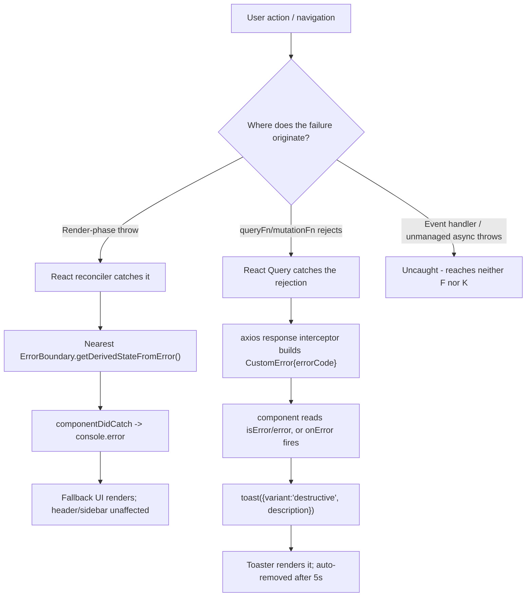

# Error Handling, Loading States & Resilience

> Part of the [AstriX engineering curriculum](../Architecture.md), under [Frontend](./00-master-frontend-architecture.md).

Every frontend eventually has to answer a question the happy-path demo never forces you to confront: what does the screen look like the instant *before* data exists, and what does it look like the moment *after* something breaks? A backend that throws a clean `AppError` and returns a well-formed `400` has done its job — but that JSON body still has to travel across the network, land in a promise rejection, and turn into something a human looking at a browser tab can actually understand and act on. Miss this layer and you get two familiar failure modes: a blank white screen that gives the user no signal at all (the app "crashed" with no explanation), or a jarring content-pop where a page renders with nothing, then snaps to fully-loaded with no transition in between.

This chapter is about the frontend half of that problem specifically: what happens when a component's own render logic throws, what happens while data is still in flight, and what happens when a request comes back as a failure instead of a success. AstriX answers all three with a small, deliberately unglamorous toolkit — a hand-rolled class-based `ErrorBoundary`, a couple of purpose-built skeleton components, a toast notification system adapted from a well-known open-source pattern, and one thin `CustomError` type that gives the rest of the app a consistent shape to reason about when a request fails. None of these pieces are exotic; the value here is in understanding *why* each one exists, what it does and doesn't cover, and where the seams between them are — because those seams are exactly where "blank white screen, no error, no idea why" bugs live.

---

## 1. The Landscape

"What happens when something goes wrong (or isn't ready yet)" is not one problem with one answer — in React specifically, it's at least four structurally different problems wearing the same trenchcoat, because React's rendering model splits synchronous render-phase code from event handlers from async work in ways that don't compose the way a backend's uniform `throw`/`catch` stack does. Knowing which of these four tools actually covers which class of failure is the single most useful piece of judgment this chapter can hand you — get it wrong and you'll wire up an error boundary and then be baffled when it silently does nothing for a failed API call.

### (a) `try`/`catch` inside components and event handlers

This is the tool every JavaScript engineer already knows, and it's the correct answer for exactly one class of failure: code you call directly, synchronously or via `await`, from inside an event handler or an effect.

```tsx
function DeleteWidgetButton({ id }: { id: string }) {
  const [error, setError] = useState<string | null>(null);

  const handleClick = async () => {
    try {
      await api.delete(`/widgets/${id}`);
    } catch (err) {
      setError(err instanceof Error ? err.message : "Delete failed");
    }
  };

  return (
    <>
      <button onClick={handleClick}>Delete</button>
      {error && <p role="alert">{error}</p>}
    </>
  );
}
```

**Tradeoffs.** This is completely ordinary, predictable JavaScript — no framework magic, no special API to learn, and it composes perfectly with `async`/`await`. The catch (pun intended) is the one thing every React engineer eventually gets burned by at least once: `try`/`catch` around an event handler can only catch errors thrown *by code that handler calls*. It has zero visibility into errors thrown during React's own render phase — if `handleClick` sets some state that then causes a *different* component further down the tree to throw while rendering (say, `widget.owner.name` when `widget.owner` turns out to be `null`), that throw happens on React's own call stack, walking back up through React's internal reconciler, nowhere near the `try` block that fired the state update. `try`/`catch` is real, necessary, and completely blind to that entire category of failure — which is exactly the gap the next tool exists to close.

### (b) React Error Boundaries

React ships exactly one first-class mechanism for catching a throw that happens *during rendering itself*, and it comes with an unusual constraint: it can only be implemented as a class component. As of React 19 (and true for every version before it), there is no hooks-based equivalent — `useErrorBoundary` does not exist in React's own API. The mechanism is two class-component lifecycle methods:

```tsx
class ErrorBoundary extends React.Component {
  state = { hasError: false };

  static getDerivedStateFromError() {
    // Runs during the render phase, right after a descendant throws.
    // Returns the state update that will drive the *next* render.
    return { hasError: true };
  }

  componentDidCatch(error, info) {
    // Runs during the commit phase, after the fallback has already
    // rendered — the right place for side effects like logging.
    logErrorToService(error, info.componentStack);
  }

  render() {
    if (this.state.hasError) return <FallbackUI />;
    return this.props.children;
  }
}
```

**Tradeoffs.** This is the only tool on this list that catches an error thrown synchronously while a descendant component is rendering — a `TypeError` from destructuring something unexpectedly `undefined`, a `.map()` called on something that isn't actually an array, any bug that reaches the render function itself. That coverage is also its exact limit, stated plainly by React's own documentation: an error boundary does **not** catch errors inside event handlers (case (a) above already covers those, separately), errors in `async` code (a `setTimeout` callback, a fetch's `.then()`), errors during server-side rendering, or errors thrown inside the boundary's own render method (only its children). This narrowness is deliberate, not an oversight — event-handler and async errors already have an obvious, ergonomic place to be handled (right where they're thrown, per (a)), so React scopes the boundary specifically to the one class of error that has no such natural home: render-phase throws, which by definition happen *outside* any code path a `try`/`catch` could wrap.

### (c) React Query's built-in `isError`/`error`/`isLoading`

For the specific, very common case of "a network request failed" or "a network request hasn't resolved yet," React Query (and libraries like it) makes error and loading state part of the query's own return value, rather than something you have to derive with your own `try`/`catch` and local state:

```tsx
function WidgetList() {
  const { data, isLoading, isError, error } = useQuery({
    queryKey: ["widgets"],
    queryFn: fetchWidgets,
  });

  if (isLoading) return <Skeleton />;
  if (isError) return <p>Failed to load widgets: {error.message}</p>;
  return <ul>{data.map((w) => <li key={w.id}>{w.name}</li>)}</ul>;
}
```

**Tradeoffs.** This is, in practice, where the overwhelming majority of a typical app's real-world failures get handled — a network blip, a `404`, a `500` from the backend — because those failures happen inside a `queryFn`/`mutationFn` that React Query is already wrapping and tracking. A rejected promise inside a query function never becomes an uncaught, render-crashing exception in the first place; React Query catches it internally and hands it back as data (`error`, `isError`), which is precisely why this tool and the error boundary in (b) aren't competing for the same failures — a query's own fetch failure never reaches the render phase as a throw, so a boundary sitting above it has nothing to catch. The cost is that this pattern is opt-in and per-consumer: every component reading a query has to remember to check `isError`/`isLoading` and render something sensible for both branches, and nothing enforces that discipline — a component that only destructures `data` and ignores `isError` will happily try to render `undefined` the moment a fetch fails, which (notably) *does* then become a render-phase throw a boundary would have to catch as a last resort.

### (d) `Suspense` and newer data-fetching-adjacent patterns

React's `<Suspense>` boundary was originally built for code-splitting (pause rendering while a `lazy()` chunk loads, show a fallback), but the same mechanism generalizes to data: a component can "suspend" by throwing a `Promise` instead of a value, and the nearest `<Suspense>` boundary shows its fallback until that promise resolves. React 19 formalized reading a promise this way via the `use()` hook, and TanStack Query v5 ships a parallel `useSuspenseQuery` that integrates directly with this model — instead of returning `isLoading`, it suspends the component and lets a `<Suspense fallback>` above it own the loading UI, and instead of returning `isError`, it re-throws the error during render so the nearest error boundary catches it, unifying case (b) and case (c) into one boundary pair per screen region.

```tsx
function WidgetList() {
  // suspends (Suspense fallback shows) while pending; throws to the
  // nearest ErrorBoundary during render on failure — no isLoading/isError
  const { data } = useSuspenseQuery({ queryKey: ["widgets"], queryFn: fetchWidgets });
  return <ul>{data.map((w) => <li key={w.id}>{w.name}</li>)}</ul>;
}

<ErrorBoundary fallback={<ErrorScreen />}>
  <Suspense fallback={<Skeleton />}>
    <WidgetList />
  </Suspense>
</ErrorBoundary>;
```

Separately, the open-source `react-error-boundary` library (not part of React itself) papers over case (b)'s biggest practical annoyance — a class-only API with no way to trigger it from an event handler — by exposing a `useErrorBoundary()` hook whose `showBoundary(error)` function lets code running in a handler or an effect imperatively hand an error to the nearest boundary, bridging (a) and (b) without a page reload.

**Tradeoffs.** The Suspense-based model is genuinely elegant once adopted consistently — one pair of boundaries (`Suspense` + `ErrorBoundary`) can cover several colocated queries at once instead of each component separately branching on `isLoading`/`isError`, and it composes naturally with code-splitting, which already uses the exact same mechanism. The cost is that it's a bigger conceptual and structural commitment than case (c): every consuming component has to be rewritten to suspend rather than branch locally, waterfalls need explicit management (multiple suspended siblings under one boundary can serialize unless deliberately parallelized), and a `useSuspenseQuery` that fails doesn't have a natural place to show an inline "retry" affordance the way a locally-checked `isError` does — the whole region unmounts to the boundary's fallback instead. It's also the newest of the four options here, with the smallest body of production experience to draw on relative to (b) and (c) individually.

---

## 2. AstriX's Choice

AstriX combines three of the four, deliberately not adopting the fourth. A class-based `ErrorBoundary` (option (b)) is mounted as a last-resort safety net — twice, once globally around the whole router and once per-route, keyed by `pathname` — to catch render-phase crashes that nothing else would. React Query's `isError`/`error`/`isLoading` (option (c)) is what actually handles the vast majority of AstriX's real, everyday failures: a failed login, a failed workspace fetch, a failed task update — because those are API calls, and API calls go through React Query, which catches their rejections internally and never lets them reach the render phase as a throw in the first place. On top of that, AstriX layers two more pieces that aren't in the landscape survey above because they're presentation, not error-catching mechanisms: a toast notification system (adapted from the `react-hot-toast` library's design, reimplemented locally rather than imported) that turns a caught error into a visible, dismissible message anywhere in the app, and a `CustomError` type that normalizes what a failed backend request looks like once it reaches the frontend, so every `onError` handler across the app is working with the same shape. There is no `Suspense`-for-data adoption (option (d)) anywhere in the codebase — this is called out explicitly in §7.

---

## 3. AstriX Implementation

### 3.1 The `ErrorBoundary` component itself

```tsx
// client/src/components/error-boundary.tsx:1-43
import { Component, ErrorInfo, ReactNode } from "react";
import { Button } from "@/components/ui/button";

type Props = {
  children: ReactNode;
  fallback?: ReactNode;
};

type State = {
  hasError: boolean;
};

class ErrorBoundary extends Component<Props, State> {
  state: State = { hasError: false };

  static getDerivedStateFromError(): State {
    return { hasError: true };
  }

  componentDidCatch(error: Error, info: ErrorInfo) {
    console.error("Unhandled error in component tree:", error, info);
  }

  render() {
    if (this.state.hasError) {
      return (
        this.props.fallback ?? (
          <div className="flex min-h-svh flex-col items-center justify-center gap-4 p-6 text-center">
            <h1 className="text-xl font-semibold">Something went wrong</h1>
            <p className="text-muted-foreground">
              An unexpected error occurred. Try reloading the page.
            </p>
            <Button onClick={() => window.location.reload()}>Reload</Button>
          </div>
        )
      );
    }

    return this.props.children;
  }
}

export default ErrorBoundary;
```

This is a direct, minimal implementation of landscape option (b) — no third-party library, ~40 lines. `getDerivedStateFromError` is a `static` method (it must be — React calls it before an instance-bound `this` would be meaningful, during the render phase, to compute the next state from the error alone) and does exactly one thing: flips `hasError` to `true`, discarding the actual error object rather than storing it in state. `componentDidCatch` receives both the `error` and React's `ErrorInfo` (which carries `componentStack`, a string naming every component in the tree between the boundary and the component that threw) and, in AstriX, does nothing with it beyond `console.error` — no remote logging, no retry mechanism, no error-code branching (see §6 and §7 for what this means in practice). The `render()` method is refreshingly plain given what it's protecting the whole app from: `hasError` true shows either a caller-supplied `fallback` prop or a generic centered message with a "Reload" button that does a full `window.location.reload()` — deliberately the bluntest possible recovery action, not a "try again" that re-renders the same broken subtree.

### 3.2 Verifying the boundary's actual behavior

```tsx
// client/src/components/__tests__/error-boundary.test.tsx:1-41
import { describe, expect, it, vi } from "vitest";
import { render, screen } from "@testing-library/react";
import ErrorBoundary from "@/components/error-boundary";

const Bomb = () => {
  throw new Error("boom");
};

describe("ErrorBoundary", () => {
  it("renders children when nothing throws", () => {
    // #given a subtree that renders normally
    // #when it mounts inside the boundary
    render(
      <ErrorBoundary>
        <p>All good</p>
      </ErrorBoundary>
    );

    // #then the children are shown as normal
    expect(screen.getByText("All good")).toBeInTheDocument();
  });

  it("shows a fallback instead of crashing when a child throws", () => {
    // #given a subtree that throws during render
    // React logs the caught error to the console by default; silence it so
    // the test output isn't noisy for an error we're deliberately causing.
    const spy = vi.spyOn(console, "error").mockImplementation(() => {});

    // #when it mounts inside the boundary
    render(
      <ErrorBoundary>
        <Bomb />
      </ErrorBoundary>
    );

    // #then a fallback UI is shown instead of the app crashing
    expect(screen.getByText(/something went wrong/i)).toBeInTheDocument();

    spy.mockRestore();
  });
});
```

Two things worth noticing in this test file beyond the obvious happy/unhappy path coverage. First, `Bomb` throws unconditionally *during its own render* (`const Bomb = () => { throw new Error("boom"); }` — the throw happens as the function component's body executes, not inside a handler or effect) — this is a deliberately precise reproduction of exactly the one failure class option (b) is built for, not a stand-in for a network error. Second, the test explicitly silences `console.error` via a `vi.spyOn` mock before rendering `Bomb`, and restores it afterward — a tell that `componentDidCatch`'s `console.error` call (§3.1) really does fire unconditionally, including in a test environment, which the test authors had to account for rather than suppress at the source.

### 3.3 Mounted twice: globally, and per-route keyed by `pathname`

The boundary appears at two different heights in the component tree, and the difference between them is the entire point.

The **global** mount wraps the whole router, at the very top of the app:

```tsx
// client/src/App.tsx:1-13
import AppRoutes from "./routes";
import ErrorBoundary from "./components/error-boundary";

function App() {
  return (
    <ErrorBoundary>
      <AppRoutes />
    </ErrorBoundary>
  );
}

export default App;
```

The **per-route** mount lives inside each of the two layout components that every actual page renders through — `AppLayout` for the authenticated app shell, `BaseLayout` for public pages:

```tsx
// client/src/layout/app.layout.tsx:1-40
import { Outlet, useLocation } from "react-router-dom";
import { SidebarProvider, SidebarInset } from "@/components/ui/sidebar";
import { AuthProvider } from "@/context/auth-provider";
import Asidebar from "@/components/asidebar/asidebar";
import Header from "@/components/header";
import CreateWorkspaceDialog from "@/components/workspace/create-workspace-dialog";
import CreateProjectDialog from "@/components/workspace/project/create-project-dialog";
import EmailVerificationBanner from "@/components/account/email-verification-banner";
import ErrorBoundary from "@/components/error-boundary";

const AppLayout = () => {
  const { pathname } = useLocation();

  return (
    <AuthProvider>
      <SidebarProvider>
        <Asidebar />
        <SidebarInset className="overflow-x-hidden">
          <div className="w-full">
            <>
              <Header />
              <EmailVerificationBanner />
              <div className="px-3 lg:px-20 py-3">
                {/* Keyed by route so a crash on one page doesn't stay
                    tripped after navigating away from it. */}
                <ErrorBoundary key={pathname}>
                  <Outlet />
                </ErrorBoundary>
              </div>
            </>
            <CreateWorkspaceDialog />
            <CreateProjectDialog />
          </div>
        </SidebarInset>
      </SidebarProvider>
    </AuthProvider>
  );
};

export default AppLayout;
```

```tsx
// client/src/layout/base.layout.tsx:1-22
import { Outlet, useLocation } from "react-router-dom";
import ErrorBoundary from "@/components/error-boundary";

const BaseLayout = () => {
  const { pathname } = useLocation();

  return (
    <div className="flex flex-col w-full h-auto">
      <div className="w-full h-full flex items-center justify-center">
        <div className="w-full mx-auto h-auto ">
          {/* Keyed by route so a crash on one page doesn't stay
              tripped after navigating away from it. */}
          <ErrorBoundary key={pathname}>
            <Outlet />
          </ErrorBoundary>
        </div>
      </div>
    </div>
  );
};

export default BaseLayout;
```

Notice that in both layouts, only the `<Outlet />` — the page-specific content for whatever route matched — sits inside the per-route boundary. `Header`, `Asidebar`, `EmailVerificationBanner`, and the two global dialogs in `AppLayout` sit *outside* it, at the same level as the boundary itself, not inside it. A crash confined to one page's content can never take the sidebar, header, or navigation down with it — the chrome around the broken page keeps working, so the user can still navigate away using it. That's a direct, practical consequence of *where* the boundary is placed in the tree, not something the `ErrorBoundary` component itself does.

### 3.4 Skeleton loading states

AstriX has two purpose-built skeleton components, both composed from the shared `Skeleton` primitive (a simple pulsing-gray-box component from the shadcn/ui set — see [`08-ui-component-library-and-styling.md`](./08-ui-component-library-and-styling.md)):

```tsx
// client/src/components/skeleton-loaders/dashboard-skeleton.tsx:1-66
import { Skeleton } from "@/components/ui/skeleton";
import { Loader } from "lucide-react";

export function DashboardSkeleton() {
  return (
    <div className="p-4">
      {/* Loader on top */}
      <div className="absolute inset-0 z-50 flex items-start pt-10 justify-center bg-[rgba(255,255,255,.01)]">
        <div className="flex items-center space-x-2">
          <Loader size="25px" className="animate-spin" />
          <span className="text-sm font-medium">TeamSync...</span>
        </div>
      </div>

      {/* Main layout */}
      <div className="flex space-x-4">
        {/* Sidebar */}
        <div className="w-64 space-y-4">
          {/* Workspace name */}
          <Skeleton className="h-8 w-40" />
          {/* Navigation items */}
          <div className="space-y-2">
            <Skeleton className="h-6 w-32" />
            <Skeleton className="h-6 w-28" />
            <Skeleton className="h-6 w-36" />
          </div>
          {/* Project Section */}
          <div className="space-y-2">
            <Skeleton className="h-6 w-40" />
            <div className="space-y-1">
              <Skeleton className="h-4 w-32" />
              <Skeleton className="h-4 w-28" />
              <Skeleton className="h-4 w-36" />
            </div>
          </div>
          {/* User info */}
          <Skeleton className="h-10 w-full rounded-md" />
        </div>

        {/* Main Content */}
        <div className="flex-1 space-y-6">
          {/* Header */}
          <Skeleton className="h-8 w-64" />
          {/* Overview cards */}
          <div className="grid grid-cols-3 gap-4">
            <Skeleton className="h-24 w-full rounded-lg" />
            <Skeleton className="h-24 w-full rounded-lg" />
            <Skeleton className="h-24 w-full rounded-lg" />
          </div>
          {/* Recent section */}
          <div className="space-y-4">
            <Skeleton className="h-6 w-48" />
            <div className="space-y-2">
              {Array.from({ length: 6 }).map((_, index) => (
                <div key={index} className="flex items-center justify-between">
                  <Skeleton className="h-6 w-64" />
                  <Skeleton className="h-6 w-12 rounded-full" />
                </div>
              ))}
            </div>
          </div>
        </div>
      </div>
    </div>
  );
}
```

`DashboardSkeleton` isn't just decorative filler — it's shaped, deliberately, to approximate the actual authenticated-app layout (a sidebar-width column of nav-item-shaped bars, then a header bar, three stat-card rectangles, and a list of row-shaped entries) so that when the real content swaps in, nothing jumps to a wildly different size or position; this is the same "content-aware skeleton" idea most design systems converge on, done here by hand rather than via a code generator. It's also the fallback passed to the top-level `<Suspense>` boundary in the router (`client/src/routes/index.tsx:87`, quoted in [`00-master-frontend-architecture.md`](./00-master-frontend-architecture.md) §2), so it's what a user sees not just while data loads, but while a lazily-split route's JavaScript chunk itself is still downloading — see [`02-routing-and-code-splitting.md`](./02-routing-and-code-splitting.md) for the `lazy()` mechanics that fallback is covering.

```tsx
// client/src/components/skeleton-loaders/table-skeleton.tsx:1-43
import React from "react";
import { Skeleton } from "@/components/ui/skeleton";

interface TableSkeletonProps {
  columns: number;
  rows?: number;
}

const TableSkeleton: React.FC<TableSkeletonProps> = ({
  columns,
  rows = 20,
}) => {
  return (
    <div className="w-full bg-white rounded-lg">
      {/* Table Header Skeleton */}
      <div className="flex h-10 bg-gray-50 rounded-t-lg">
        {[...Array(columns)].map((_, index) => (
          <div key={`header-col-${index}`} className={`flex-1 px-4 py-2`}>
            <Skeleton className="h-4 w-full rounded-lg" />
          </div>
        ))}
      </div>

      {/* Table Body Skeleton */}
      <div className="divide-y divide-gray-100">
        {[...Array(rows)].map((_, rowIndex) => (
          <div key={`row-${rowIndex}`} className="flex h-10">
            {[...Array(columns)].map((_, colIndex) => (
              <div
                key={`row-${rowIndex}-col-${colIndex}`}
                className={`flex-1 px-4 py-2`}
              >
                <Skeleton className="h-4 w-full rounded-lg" />
              </div>
            ))}
          </div>
        ))}
      </div>
    </div>
  );
};

export default TableSkeleton;
```

`TableSkeleton` is the narrower, reusable counterpart — parameterized by `columns` (required) and `rows` (defaulting to 20), it's dropped into any component rendering a `@tanstack/react-table` grid (tasks, members) while that grid's own `useQuery` is still `isLoading`, rendering the right number of header and row placeholder cells for whatever specific table is loading rather than one generic app-wide spinner.

### 3.5 The toast notification system

The toast stack is three files working together: a headless state manager (`use-toast.ts`), the visual primitives it renders through (`ui/toast.tsx`, generated via the shadcn/ui Radix wrapper pattern — see [08](./08-ui-component-library-and-styling.md)), and a single mount point (`ui/toaster.tsx`).

```ts
// client/src/hooks/use-toast.ts:1-189
"use client";

// Inspired by react-hot-toast library
import * as React from "react";

import type { ToastActionElement, ToastProps } from "@/components/ui/toast";

const TOAST_LIMIT = 3;
const TOAST_REMOVE_DELAY = 5000;

type ToasterToast = ToastProps & {
  id: string;
  title?: React.ReactNode;
  description?: React.ReactNode;
  action?: ToastActionElement;
};

let count = 0;

function genId() {
  count = (count + 1) % Number.MAX_SAFE_INTEGER;
  return count.toString();
}

type ActionType = {
  ADD_TOAST: "ADD_TOAST";
  UPDATE_TOAST: "UPDATE_TOAST";
  DISMISS_TOAST: "DISMISS_TOAST";
  REMOVE_TOAST: "REMOVE_TOAST";
};

type Action =
  | {
      type: ActionType["ADD_TOAST"];
      toast: ToasterToast;
    }
  | {
      type: ActionType["UPDATE_TOAST"];
      toast: Partial<ToasterToast>;
    }
  | {
      type: ActionType["DISMISS_TOAST"];
      toastId?: ToasterToast["id"];
    }
  | {
      type: ActionType["REMOVE_TOAST"];
      toastId?: ToasterToast["id"];
    };

interface State {
  toasts: ToasterToast[];
}

const toastTimeouts = new Map<string, ReturnType<typeof setTimeout>>();

const addToRemoveQueue = (toastId: string) => {
  if (toastTimeouts.has(toastId)) {
    return;
  }

  const timeout = setTimeout(() => {
    toastTimeouts.delete(toastId);
    dispatch({
      type: "REMOVE_TOAST",
      toastId: toastId,
    });
  }, TOAST_REMOVE_DELAY);

  toastTimeouts.set(toastId, timeout);
};

export const reducer = (state: State, action: Action): State => {
  switch (action.type) {
    case "ADD_TOAST":
      return {
        ...state,
        toasts: [action.toast, ...state.toasts].slice(0, TOAST_LIMIT),
      };

    case "UPDATE_TOAST":
      return {
        ...state,
        toasts: state.toasts.map((t) =>
          t.id === action.toast.id ? { ...t, ...action.toast } : t
        ),
      };

    case "DISMISS_TOAST": {
      const { toastId } = action;

      // ! Side effects ! - This could be extracted into a dismissToast() action,
      // but I'll keep it here for simplicity
      if (toastId) {
        addToRemoveQueue(toastId);
      } else {
        state.toasts.forEach((toast) => {
          addToRemoveQueue(toast.id);
        });
      }

      return {
        ...state,
        toasts: state.toasts.map((t) =>
          t.id === toastId || toastId === undefined
            ? {
                ...t,
                open: false,
              }
            : t
        ),
      };
    }
    case "REMOVE_TOAST":
      if (action.toastId === undefined) {
        return {
          ...state,
          toasts: [],
        };
      }
      return {
        ...state,
        toasts: state.toasts.filter((t) => t.id !== action.toastId),
      };
  }
};

const listeners: Array<(state: State) => void> = [];

let memoryState: State = { toasts: [] };

function dispatch(action: Action) {
  memoryState = reducer(memoryState, action);
  listeners.forEach((listener) => {
    listener(memoryState);
  });
}

type Toast = Omit<ToasterToast, "id">;

function toast({ ...props }: Toast) {
  const id = genId();

  const update = (props: ToasterToast) =>
    dispatch({
      type: "UPDATE_TOAST",
      toast: { ...props, id },
    });
  const dismiss = () => dispatch({ type: "DISMISS_TOAST", toastId: id });

  dispatch({
    type: "ADD_TOAST",
    toast: {
      ...props,
      id,
      open: true,
      onOpenChange: (open) => {
        if (!open) dismiss();
      },
    },
  });

  return {
    id: id,
    dismiss,
    update,
  };
}

function useToast() {
  const [state, setState] = React.useState<State>(memoryState);

  React.useEffect(() => {
    listeners.push(setState);
    return () => {
      const index = listeners.indexOf(setState);
      if (index > -1) {
        listeners.splice(index, 1);
      }
    };
  }, [state]);

  return {
    ...state,
    toast,
    dismiss: (toastId?: string) => dispatch({ type: "DISMISS_TOAST", toastId }),
  };
}

export { useToast, toast };
```

This is the exact reducer/store pattern popularized by the `react-hot-toast` library (the file's own comment says as much) and reused verbatim as the default scaffold shadcn/ui generates when you run its toast component generator — AstriX didn't hand-roll this from scratch, it kept what the generator produced. The core trick is that `toast()` is a **plain exported function, not a hook** — it can be called from anywhere (an `onError` callback deep inside a mutation, a promise `.catch()`, a plain utility function) without needing to be inside a component or have access to a React context. It achieves this by keeping the actual toast list in one module-level variable, `memoryState`, outside React entirely, and treating React components as *subscribers*: `dispatch()` runs the `reducer` against `memoryState` and then calls every function in the `listeners` array — and `useToast()`'s whole job is to push its own `setState` into that array on mount and remove it on unmount, so any component that calls `useToast()` re-renders whenever *any* call to `toast()` anywhere in the app fires. `Toaster` (below) is the one component in the tree that actually calls `useToast()` for this purpose.

Three details worth internalizing: `TOAST_LIMIT = 3` means a fourth simultaneous toast silently pushes the oldest one out of the array via `.slice(0, TOAST_LIMIT)`, not by dismissing it — it's just gone from state; `TOAST_REMOVE_DELAY = 5000` is the delay between a toast being marked `open: false` (dismissed, animating out) and actually being purged from the array via `REMOVE_TOAST`, giving the exit animation time to play; and `DISMISS_TOAST` with no `toastId` (undefined) dismisses *every* currently-open toast, not just one — used when nothing else needs a specific toast singled out.

```tsx
// client/src/components/ui/toaster.tsx:1-33
import { useToast } from "@/hooks/use-toast";
import {
  Toast,
  ToastClose,
  ToastDescription,
  ToastProvider,
  ToastTitle,
  ToastViewport,
} from "@/components/ui/toast";

export function Toaster() {
  const { toasts } = useToast();

  return (
    <ToastProvider>
      {toasts.map(function ({ id, title, description, action, ...props }) {
        return (
          <Toast key={id} {...props}>
            <div className="grid gap-1">
              {title && <ToastTitle>{title}</ToastTitle>}
              {description && (
                <ToastDescription>{description}</ToastDescription>
              )}
            </div>
            {action}
            <ToastClose />
          </Toast>
        );
      })}
      <ToastViewport />
    </ToastProvider>
  );
}
```

`Toaster` is mounted exactly once, at the app root, sibling to the router (`client/src/main.tsx`, quoted in full in [`00-master-frontend-architecture.md`](./00-master-frontend-architecture.md) §1) — which is precisely why any component anywhere can fire a toast just by calling `toast({...})`: there's no provider to thread through props to reach, because the visible portal and the state store are decoupled the way §3.5 above describes. The visual primitives it renders through come from Radix's `Toast` primitive, wrapped with `class-variance-authority` variants:

```tsx
// client/src/components/ui/toast.tsx:25-40
const toastVariants = cva(
  "group pointer-events-auto relative flex w-full items-center justify-between space-x-2 overflow-hidden rounded-md border p-4 pr-6 shadow-lg transition-all data-[swipe=cancel]:translate-x-0 data-[swipe=end]:translate-x-[var(--radix-toast-swipe-end-x)] data-[swipe=move]:translate-x-[var(--radix-toast-swipe-move-x)] data-[swipe=move]:transition-none data-[state=open]:animate-in data-[state=closed]:animate-out data-[swipe=end]:animate-out data-[state=closed]:fade-out-80 data-[state=closed]:slide-out-to-right-full data-[state=open]:slide-in-from-top-full data-[state=open]:sm:slide-in-from-bottom-full",
  {
    variants: {
      variant: {
        default: "border bg-background text-foreground",
        success: "border bg-green-100 text-green-600",
        destructive:
          "destructive group border-destructive bg-destructive text-destructive-foreground",
      },
    },
    defaultVariants: {
      variant: "default",
    },
  }
);
```

Three variants exist — `default`, `success`, `destructive` — and every error toast in the codebase passes `variant: "destructive"` explicitly (see §3.6), which is what gives a failed request its red, alarm-coded visual treatment versus a plain neutral or green success toast.

### 3.6 `CustomError` — normalizing what a failed request looks like

```ts
// client/src/types/custom-error.type.ts:1-3
export interface CustomError extends Error {
  errorCode?: string;
}
```

Three lines, and deliberately so: `CustomError` is nothing more than the built-in `Error` shape (`message`, `name`, `stack`) with one optional field bolted on, `errorCode` — a string that, when present, mirrors the backend's `ErrorCodeEnum` values (`VALIDATION_ERROR`, `RESOURCE_NOT_FOUND`, `ACCESS_UNAUTHORIZED`, …) documented in full in [`../backend/04-error-handling-patterns.md`](../backend/04-error-handling-patterns.md) §3.2. It's constructed in exactly one place — the axios response interceptor, every rejected request in the app funnels through it:

```ts
// client/src/lib/axios-client.ts:1-69
// client/src/lib/axios-client.ts
import { useStoreBase } from "@/store/store";
import { baseURL } from "@/lib/base-url";
import { CustomError } from "@/types/custom-error.type";
import axios, { AxiosError, InternalAxiosRequestConfig } from "axios";

const options = {
  baseURL,
  withCredentials: true, // CRITICAL: Sends cookies with every request
  timeout: 10000,
};

const API = axios.create(options);

// ============================================
// REFRESH TOKEN STATE
// ============================================

let isRefreshing = false;
let failedQueue: Array<{
  resolve: (token: string) => void;
  reject: (error: unknown) => void;
}> = [];

const processQueue = (error: unknown, token: string | null = null) => {
  failedQueue.forEach((promise) => {
    if (error) {
      promise.reject(error);
    } else {
      promise.resolve(token!);
    }
  });
  failedQueue = [];
};

// ============================================
// REQUEST INTERCEPTOR
// ============================================

API.interceptors.request.use((config) => {
  const accessToken = useStoreBase.getState().accessToken;
  if (accessToken) {
    config.headers["Authorization"] = "Bearer " + accessToken;
  }
  return config;
});

// ============================================
// RESPONSE INTERCEPTOR - Auto Refresh
// ============================================

API.interceptors.response.use(
  (response) => response,
  async (error: AxiosError) => {
    const originalRequest = error.config as InternalAxiosRequestConfig & {
      _retry?: boolean;
    };

    // Build custom error
    const data = error.response?.data as { errorCode?: string } | undefined;
    const customError: CustomError = {
      ...error,
      errorCode: data?.errorCode || "UNKNOWN_ERROR",
    };

    // Only handle 401 errors
    if (error.response?.status !== 401) {
      return Promise.reject(customError);
    }
    // ... 401-specific refresh-and-retry logic continues below —
    // owned in full by 06-authentication-and-authorization-ui.md and
    // 07-api-layer-and-http-client.md, not repeated here.
```

Every single rejected request — regardless of status code — passes through this interceptor's rejection branch first. It reads `error.response?.data` (the backend's JSON error body, exactly the shape `errorHandler` produces — see [backend §3.3](../backend/04-error-handling-patterns.md#33-the-centralized-errorhandler-full-precedence-chain)), pulls out `errorCode` if the backend supplied one, and spreads the original `AxiosError` (`...error`) into a new object typed as `CustomError` with that `errorCode` attached — falling back to the literal string `"UNKNOWN_ERROR"` if the backend's JSON body didn't include one at all (which happens for three of the eight branches in `errorHandler`'s precedence chain — the `SyntaxError`, payload-too-large, and generic-500 branches all omit `errorCode`, as [the backend chapter's Best Practice Check](../backend/04-error-handling-patterns.md#7-best-practice-check) flags directly). For anything other than a `401`, that `customError` is immediately rejected back to the caller — which is the object every `useQuery`/`useMutation` `onError` handler in the app actually receives.

`getErrorMessage()`, a small helper most `onError` call sites reach for instead of reading `.message` directly, narrows that value further:

```ts
// client/src/lib/helper.ts:1-18
import { isAxiosError } from "axios";

// Narrows an unknown mutation/query error down to a user-facing message,
// preferring the backend's own `{ message }` response body (set by
// errorHandles.middleware.ts) over axios's generic "Request failed with
// status code N" text.
export const getErrorMessage = (
  error: unknown,
  fallback = "Something went wrong"
): string => {
  if (isAxiosError<{ message?: string }>(error)) {
    return error.response?.data?.message || error.message || fallback;
  }
  if (error instanceof Error) {
    return error.message || fallback;
  }
  return fallback;
};
```

This is the piece that actually closes the loop between a backend `AppError`'s curated `message` string and what a user sees: `error.response?.data?.message` is the exact `message` field `errorHandler` put in the JSON body (`"You do not have the necessary permissions to perform this action"`, `"Validation failed"`, etc.), preferred over axios's own generic `error.message` (`"Request failed with status code 403"`), which is only used as a fallback if the backend's body didn't carry a `message` at all.

Typed generics are how `CustomError` reaches React Query's own `error` field with its shape intact — one hook does this explicitly:

```tsx
// client/src/hooks/api/use-get-workspace.tsx:1-16
import { getWorkspaceByIdQueryFn } from "@/lib/api";
import { CustomError } from "@/types/custom-error.type";
import { WorkspaceByIdResponseType } from "@/types/api.type";
import { useQuery } from "@tanstack/react-query";

const useGetWorkspaceQuery = (workspaceId: string) => {
  const query = useQuery<WorkspaceByIdResponseType, CustomError>({
    queryKey: ["workspace", workspaceId],
    queryFn: () => getWorkspaceByIdQueryFn(workspaceId),
    staleTime: 0,
    retry: 2,
    enabled: !!workspaceId,
  });
  return query;
};

export default useGetWorkspaceQuery;
```

`useQuery<TData, TError>`'s second generic tells TypeScript that this query's `error` field is a `CustomError`, not React Query's default `Error` — meaning anything consuming `useGetWorkspaceQuery().error?.errorCode` gets real compile-time type checking on that access, rather than reading a property TypeScript doesn't know exists. §5 covers why this isn't done consistently everywhere.

Finally, two real `onError` call sites showing `CustomError` actually reaching a toast, end to end:

```tsx
// client/src/components/workspace/settings/delete-workspace-card.tsx:22-43
const { mutate, isPending } = useMutation({
  mutationFn: deleteWorkspaceMutationFn,
});

const handleConfirm = () => {
  mutate(workspaceId, {
    onSuccess: (data) => {
      queryClient.invalidateQueries({
        queryKey: ["userWorkspaces"],
      });
      navigate(`/workspace/${data.currentWorkspace}`);
      setTimeout(() => onCloseDialog(), 100);
    },
    onError: (error) => {
      toast({
        title: "Error",
        description: error.message,
        variant: "destructive",
      });
    },
  });
};
```

```tsx
// client/src/components/workspace/task/table/table-row-actions.tsx:38-73
const { mutate, isPending } = useMutation({
  mutationFn: deleteTaskMutationFn,
});

const handleConfirm = () => {
  if (isPending) return;

  mutate(
    { workspaceId, taskId },
    {
      onSuccess: (data) => {
        queryClient.invalidateQueries({
          queryKey: ["all-tasks", workspaceId],
        });
        queryClient.invalidateQueries({
          queryKey: ["project-analytics", task.project?._id],
        });

        toast({
          title: "Success",
          description: data.message,
          variant: "success",
        });

        setOpenDialog(false);
      },
      onError: (error) => {
        toast({
          title: "Error",
          description: getErrorMessage(error),
          variant: "destructive",
        });
      },
    }
  );
};
```

Both follow the same shape — `mutate(payload, { onSuccess, onError })`, with the side effects decided at the call site rather than baked into a shared hook (see [`04-server-state-and-data-fetching.md`](./04-server-state-and-data-fetching.md) §3.4 for why AstriX consistently structures mutations this way) — but they reach for the error message two slightly different ways: `delete-workspace-card.tsx` reads `error.message` directly (safe, because `CustomError extends Error` guarantees `.message` exists, but this is whatever `AxiosError`'s own `.message` happens to be unless the interceptor's spread preserved something more specific), while `table-row-actions.tsx` reaches for `getErrorMessage(error)`, which actively prefers the backend's curated `message` field over axios's generic one. Both are common in the codebase; §5 discusses the inconsistency.

---

## 4. Request/Data Flow

### (a) A page loads, then a query resolves successfully

1. The router matches a protected route; `AppLayout` renders, and the matched page component — lazily imported via `lazy()` (see [02](./02-routing-and-code-splitting.md)) — is still downloading its JS chunk. The top-level `<Suspense fallback={<DashboardSkeleton />}>` in `client/src/routes/index.tsx` shows `DashboardSkeleton` for however long that download takes.
2. The page component mounts. Inside it, a hook like `useGetWorkspaceQuery` fires `useQuery`. If nothing is cached yet, `isLoading` is `true` on the very first render; the component (not shown in this doc — see [04](./04-server-state-and-data-fetching.md)) typically branches on that flag to render `TableSkeleton` or an inline loading state local to that component, distinct from the router-level `DashboardSkeleton`.
3. The `queryFn` calls a function from `lib/api.ts`, which calls through the shared `API` axios instance. The request interceptor attaches the `Authorization` header from Zustand (§3.6 above).
4. The backend responds `200`. Axios's response interceptor's fulfilled branch — a no-op pass-through, `(response) => response` — does nothing. React Query updates its cache, `isLoading` flips to `false`, `data` is populated, and the component re-renders with real content in place of the skeleton.

### (b) A mutation fails with a typed backend error

1. A user clicks "Delete Workspace." `mutate(workspaceId, { onSuccess, onError })` fires (§3.6, `delete-workspace-card.tsx`).
2. The backend's `roleGuard` (or an equivalent check) throws a `ForbiddenException` — an `AppError` subclass (see [backend §3.4](../backend/04-error-handling-patterns.md#34-real-throw-sites)) — which the backend's own `errorHandler` catches, matching `error instanceof AppError`, and responds `403` with `{ message: "You do not have the necessary permissions to perform this action", errorCode: "ACCESS_UNAUTHORIZED" }`.
3. That non-2xx response reaches axios's response interceptor. `error.response?.status !== 401` is true (it's a `403`), so the interceptor builds `customError` — spreading the raw `AxiosError` and attaching `errorCode: "ACCESS_UNAUTHORIZED"` read straight from the response body — and rejects immediately with it.
4. React Query's mutation machinery catches that rejection and calls the `onError` callback supplied at the `mutate()` call site, passing the `customError` object as `error`.
5. `onError` calls `toast({ title: "Error", description: error.message, variant: "destructive" })`. `toast()` generates an id, dispatches `ADD_TOAST` against the module-level `memoryState` (§3.5), which prepends the new toast and (if there were already 3 open) evicts the oldest.
6. Every listener registered via a mounted `useToast()` call re-renders — in practice, exactly one: the `Toaster` component mounted at the app root. It maps over `toasts`, rendering a `destructive`-variant `Toast` with the error's message.
7. Five seconds after the toast is dismissed (by the user clicking its close button, or — separately — whenever `DISMISS_TOAST` fires for it), `addToRemoveQueue`'s `setTimeout` fires `REMOVE_TOAST`, purging it from `memoryState` entirely.

### (c) A component crashes during render

1. Some page-level component, rendering normally, hits a bug — say, code that assumes a field is always present and it isn't for this particular record, throwing a `TypeError` synchronously inside the render function.
2. React's reconciler catches the throw internally (this is React's own machinery, not a `try`/`catch` anywhere in AstriX's code) and searches up the tree for the nearest class component implementing `getDerivedStateFromError`/`componentDidCatch`. Because every page renders inside `<ErrorBoundary key={pathname}>` (§3.3), that per-route boundary is the nearest one — the crash never reaches the global `App.tsx` boundary at all.
3. React calls `ErrorBoundary.getDerivedStateFromError()`, which returns `{ hasError: true }`; React re-renders that boundary with the new state.
4. In the commit phase, React calls `componentDidCatch(error, info)`, which logs to `console.error` (§3.1) — no toast fires, because nothing in this path ever reaches an `onError` handler; the failure never touched React Query at all.
5. The boundary's `render()` now returns the fallback UI — "Something went wrong" and a "Reload" button — in place of everything that would have been under `<Outlet />`. The header, sidebar, and any global dialogs (mounted outside the boundary, §3.3) remain fully interactive.
6. If the user then navigates to a different route via the still-working sidebar, `pathname` changes, `key={pathname}` on the boundary changes, and React unmounts the tripped boundary instance entirely and mounts a brand-new one — with `hasError` back to its initial `false` — for the new route.



---

## 5. Design Decisions & Tradeoffs

**Why a class component, not a choice AstriX could have avoided.** Unlike almost every other pattern in this curriculum, this isn't really a tradeoff AstriX weighed against alternatives — there is no functional-component equivalent of `getDerivedStateFromError`/`componentDidCatch` in React's public API, full stop, as of the version AstriX is on and as of React 19 more broadly. Any team that wants render-phase error catching in React is choosing between "write a small class component like this one" and "pull in `react-error-boundary`," which is itself a thin wrapper around the exact same two lifecycle methods. AstriX picked the former — a dependency-free ~40-line file — over the latter, trading away that library's extra conveniences (a `resetKeys` prop for automatic recovery, the `useErrorBoundary()` hook for imperatively triggering a boundary from outside render) for one less package to track.

**Why the boundary is a last-resort net, not the primary error-handling mechanism.** It would be a mistake to read `ErrorBoundary`'s prominent placement (twice, wrapping essentially everything) as AstriX's main line of defense against API failures — it isn't, and §4(b) versus §4(c) traces exactly why: a rejected `queryFn`/`mutationFn` promise is caught by React Query internally and handed back as `error`/`isError` state, never reaching the render phase as an uncaught throw in the first place. The boundary's actual job is catching the *other* class of bug — genuine programming errors (a missing null check, a bad array assumption) that would otherwise take down the entire visible tree with a blank screen and React's own "Minified React error" console output. That's a meaningfully different failure mode from "the API said no," and conflating the two — expecting the boundary to somehow show a nice message for a failed login — is a common enough misunderstanding of Error Boundaries generally (not specific to AstriX) that it's worth stating plainly here.

**Why `key={pathname}` instead of a `resetKeys` prop or a manual reset button.** Once an `ErrorBoundary` instance trips (`hasError: true`), nothing about its own `render()` logic ever sets that back to `false` — by design, React error boundaries do not self-heal. Three ways to handle that: give the fallback UI its own "try again" button that calls some reset function (the pattern `react-error-boundary`'s `resetKeys` formalizes), rely on a full page reload (which AstriX's fallback UI *does* offer, via `window.location.reload()`), or force React to discard the tripped instance and mount a fresh one by changing its `key`. AstriX's per-route boundaries do the third: `key={pathname}` means React treats the boundary as a structurally different element the instant the URL changes, unmounting the broken instance and mounting a brand-new, un-tripped one for whatever the user navigates to next — recovery is automatic and free the moment the user leaves the broken page, with no explicit "retry" affordance needed on the crashed page itself. The cost is exactly the flip side: if the *same* page is the one that keeps crashing (a systemic bug, not a one-off), navigating away and back reproduces the crash every time, because nothing about the fix is actually applied — `key={pathname}` resets the boundary's state, not the underlying bug.

**Why a hand-rolled toast reducer instead of importing `react-hot-toast`, `sonner`, or another library outright.** The file's own comment ("Inspired by react-hot-toast library") is candid about where the design came from, and this is the shadcn/ui-generated scaffold, not a from-scratch design — the actual choice AstriX made was accepting that generator's output rather than swapping to a maintained package. The tradeoff of vendoring this pattern locally instead of depending on the library it's modeled on: no external dependency to version-bump, and every piece of behavior (the 3-toast cap, the 5-second removal delay, the variant styling) is plain, readable, locally-owned TypeScript a new engineer can read start to finish in a few minutes — at the cost of not getting that library's own ongoing bug fixes, accessibility refinements, or new features for free; any improvement has to be applied here, by hand, same as any other vendored code.

**Why `toast()` is a free function backed by module-level state, not a Context-provided hook.** A Context-based design (`<ToastProvider>` wrapping the app, consumed via `useContext`) would have been the more "idiomatic React" choice on paper, but it comes with a real practical cost this codebase specifically needed to avoid: a Context value is only reachable from inside a component (or a hook called from one), which would make firing a toast from deep inside `lib/helper.ts`, an axios interceptor, or any other non-component utility function either impossible or require threading a reference through in some awkward way. The module-level `memoryState` + `listeners` design (§3.5) sidesteps that entirely — `toast()` needs no React context, no provider lookup, nothing but a plain import, which is exactly what lets `onError` callbacks scattered across dozens of unrelated components (§3.6) all call it identically.

**Why `CustomError`'s error-type generic is applied inconsistently across query hooks.** `useGetWorkspaceQuery` (§3.6) explicitly types `useQuery<WorkspaceByIdResponseType, CustomError>`, giving its `.error` field real `errorCode` type safety. `useAuth`, `useGetProjectInWorkspace`, and `useGetWorkspaceMembers` — the other three hooks under `hooks/api/` — call `useQuery` with no error generic at all, meaning React Query's default `TError = Error` applies, and `.error?.errorCode` on any of those three would be a TypeScript error even though the *actual* object at runtime is still a `CustomError` with an `errorCode`, constructed by the same interceptor for every request in the app. This is a real, minor inconsistency, not a deliberate design choice documented anywhere in the code — the value genuinely carries `errorCode` at runtime regardless of which hook fetched it, but only one of four hooks lets the type system see that. It costs nothing today because no component currently branches on `errorCode` from those three hooks' `error` field, but it's exactly the kind of gap that turns into a real bug the day someone tries to.

---

## 6. Security Considerations

**Are raw backend messages shown verbatim via toast?** Yes, by design — and that's the correct call given where the actual sanitization happens. Every toast description in this codebase ultimately traces back to `error.response?.data?.message` (via `getErrorMessage`) or `error.message`, i.e., whatever the backend's `errorHandler` decided to put in the response body. The frontend does **no** additional filtering or redaction of its own — it trusts the backend's own prod/dev split entirely. That split, covered in full in [the backend chapter's Security Considerations](../backend/04-error-handling-patterns.md#6-security-considerations), is what actually does the work: every branch of `errorHandler` except the generic 500 fallback already returns a fixed, curated message in every environment (never Mongoose's raw `CastError`/duplicate-key text, never a stack trace), and the one branch that is environment-conditional locks to the fixed string `"Unknown error occurred"` in production. Because the frontend relays whatever the backend sends without alteration, this boundary lives entirely on the backend side — the frontend is a faithful pass-through, not a second line of defense, which means a *new* backend throw site that accidentally puts something sensitive in an `AppError`'s `message` (a raw DB value, an internal path) would surface in a user-visible toast with nothing on the frontend to catch it. This is the same trust relationship any first-party client has with a backend it doesn't treat as adversarial — reasonable here, but worth naming explicitly rather than assuming.

**Is `console.error` in `componentDidCatch` gated by environment?** No — checking `error-boundary.tsx:20-22` directly, `console.error("Unhandled error in component tree:", error, info)` runs unconditionally, in every environment including production, with no `NODE_ENV`/`import.meta.env.PROD` check anywhere in the file. In practice this is a fairly low-severity gap: it logs to the local browser's devtools console, visible only to whoever has that tab's devtools open (the user themselves, or someone with physical/remote access to their machine), not sent anywhere over the network — so it isn't a remote-exposure or data-exfiltration risk the way a leaked stack trace in an HTTP response body would be. It does mean `info.componentStack` (a full list of component names on the path to the crash) is available to anyone who opens devtools on a production build, which is a mild amount of internal implementation detail (component naming, tree shape) handed to a sufficiently curious end user — contrast with the backend's `errorHandler`, which is explicit and deliberate about never putting `error.stack` in a response body in any environment (backend §6). The frontend boundary has no equivalent explicit gate; it simply always logs, the same way it always would in local development.

**Could the boundary's or toast's fallback UI leak stack traces or internal paths?** No — checked directly against both. `ErrorBoundary`'s fallback UI (`error-boundary.tsx:26-35`) renders a fixed, static string ("Something went wrong" / "An unexpected error occurred. Try reloading the page.") with no interpolation of the actual `error` object anywhere in the JSX — the caught error and its `componentStack` go only to `console.error`, never into rendered output. Toast descriptions do interpolate real error content (`error.message` / `getErrorMessage(error)`), but as established above, that content is the backend's own curated `message` field, not a stack trace or file path — nothing in the frontend ever reads or displays `error.stack` in a toast. The one place a *raw*, less-curated string could theoretically reach a toast is the fallback inside `getErrorMessage()` itself: if the backend's response had no `message` field, axios's own generic `error.message` (`"Request failed with status code 500"`) is shown instead — generic and unhelpful, but not sensitive.

---

## 7. Best Practice Check

**No error-monitoring / observability integration wired into `componentDidCatch` — checked directly, not assumed.** A repository-wide search for `sentry`, `datadog`, `bugsnag`, `logrocket`, and `rollbar` across `client/src` and `client/package.json` returns nothing. `componentDidCatch`'s only action is `console.error` (§3.1, §6) — there is no remote error-reporting service capturing render-phase crashes, no session-replay tooling, and no aggregation of how often or where boundaries actually trip in production. This is a real, honest gap relative to 2026 practice: for a production SPA, wiring `componentDidCatch` to a service like Sentry (whose React SDK ships an `Sentry.ErrorBoundary` component that does exactly this) is close to table stakes — without it, the only way anyone learns a user hit a crashed page is if that user reports it themselves, since nothing is currently capturing `error`/`info.componentStack` anywhere durable.

**Structured error codes reaching the client — a genuine strength, inconsistently exposed to the type system.** AstriX's backend already does the hard part right by 2026 standards: every `AppError` carries a machine-readable `errorCode`, and the frontend faithfully carries it through to `CustomError.errorCode` for every request. What's inconsistent, as §5 covers, is that only one of the four `hooks/api/` query hooks actually types that field so a consuming component gets compiler support for branching on it — the mechanism is sound, but not uniformly wired up.

**No Suspense-for-data adoption — consistent with, and directly caused by, the same finding already made in [04](./04-server-state-and-data-fetching.md#7-best-practice-check).** TanStack Query v5's `useSuspenseQuery` would let AstriX collapse per-component `isLoading`/`isError` branches into shared `<Suspense>`/`<ErrorBoundary>` pairs per screen region — closer to landscape option (d) — but nothing in the codebase uses it. Given that finding was already made independently while documenting the data-fetching layer, it's worth repeating here specifically because this chapter is where that choice's actual consequence lives: AstriX's two `ErrorBoundary` mounts (§3.3) exist at route granularity, not query granularity, precisely because there's no `useSuspenseQuery` re-throw mechanism feeding them anything finer-grained to catch.

**The toast scaffold itself is the older shadcn/ui pattern, not the current default.** shadcn/ui's own generator has, since this scaffold was likely first generated, shifted its *recommended* default toast solution toward the `sonner` library rather than this Radix-`Toast`-primitive-plus-hand-rolled-reducer combination — sonner ships built-in stacking/swipe/promise-based toast helpers (`toast.promise()`, tying a toast's loading/success/error states directly to a promise) that this implementation would have to hand-build itself if needed. This isn't a "wrong" choice — the current implementation is fully functional, well-tested (§3.2), and a completely reasonable thing for a team to have generated and kept — but it is a dated-relative-to-current-default one, in the same spirit as noting a library version is a minor release behind rather than actually broken.

---

## 8. Debug Drill

**Scenario:** A specific page in the app shows a blank white screen. No fallback UI appears (the "Something went wrong" message never renders), and no error toast appears either. The network tab may or may not show a failed request. Where do you look, and in what order?

The key diagnostic fact to hold onto throughout: this app has exactly two resilience mechanisms wired up (§2), and a blank screen with neither of them visibly active means the failure happened in a code path *neither one covers* — which, per the landscape in §1, narrows the search dramatically.

1. **Rule out a render-phase crash first, quickly.** Open the browser console. A genuine render-phase throw caught by `ErrorBoundary` always produces two things: React's own "The above error occurred in the `<ComponentName>` component" warning (logged by React itself, independent of anything AstriX wrote), and immediately after it, the `componentDidCatch` call's own `console.error("Unhandled error in component tree:", error, info)` (§3.1) — which is unconditional, so it fires in every environment (§6). If *either* of those is present, the boundary caught it and should be showing its fallback — a blank screen despite these logs existing would mean something else is additionally wrong (e.g., the fallback's own render failing, or CSS hiding it), which is a different, narrower investigation. If **neither** log is present, the crash never reached a boundary at all, and you're in one of the two paths below.

2. **Check for an error thrown in an event handler or an un-awaited/un-caught async call — the gap `try`/`catch` and Error Boundaries both leave open (§1(a), §1(b)).** A `Promise` that rejects with nothing downstream to `.catch()` it — a fire-and-forget `someAsyncCall()` in a `useEffect` with no `.catch()`, an `onClick={async () => { await x() }}` with no internal `try`/`catch` and not routed through `useMutation` — produces an "Uncaught (in promise)" entry in the console, distinguishable from React's own boundary-related logging by *not* mentioning a component name or `componentDidCatch`. This is the single most common source of "totally silent" failures: `ErrorBoundary` never sees it (it isn't a render-phase throw), and no `toast()` fires (nothing in this path calls `useMutation`/`useQuery`'s `onError`, so `CustomError` is never even constructed) — the request or computation simply fails and nothing downstream of it ever runs, including whatever state update was supposed to make the page render actual content in the first place. If the "blank" page is really "a page whose content depends on state that a silently-failed async call was supposed to set," this reads as a blank screen even though nothing crashed.

3. **Check whether the query/mutation path was ever reached at all.** If the page's content genuinely depends on a `useQuery` that should fire, confirm in the Network tab whether the request happened. If it never fired, the bug is upstream of any error-handling machinery entirely — a conditional (`enabled: !!workspaceId`) that's permanently false because some upstream value never resolved, which produces indefinite `isLoading: true` (often rendered as literally nothing, if the component's loading branch renders `null` or an empty fragment rather than a skeleton) — not a caught error, just a query that's stuck, forever, waiting on a condition.

4. **If the request did fire and failed, confirm it actually reached a component that checks `isError`.** Per §5, this is opt-in per consumer — a component that destructures only `data` from a `useQuery` result and renders `data.someField` without checking `isError`/`isLoading` first will, on failure, either render nothing meaningful (if `data` is `undefined` and the JSX tolerates that silently, e.g. `data?.someField ?? null`) or throw while rendering `undefined.someField` — which loops back to step 1, except this time it's a real render-phase crash caused indirectly by an unchecked query error, and the boundary *should* have caught it. If it didn't, verify the component in question is actually rendering underneath one of the two `ErrorBoundary` mounts (§3.3) and not, unusually, outside both — e.g., something rendered directly by a layout at the same level as the boundary itself, rather than inside the `<Outlet />` the boundary wraps.

5. **Only after all of the above, suspect the toast plumbing itself.** Because `use-toast.ts` keeps its state in a module-level `memoryState` object (§3.5) rather than through React context, a `toast()` call genuinely firing but never appearing on screen would mean either `Toaster` isn't mounted at all in the current render tree (check `client/src/main.tsx`), or `TOAST_LIMIT`'s eviction (§3.5) silently dropped it because three other toasts were already showing — worth a quick visual check for other toasts already on screen before assuming the call itself failed.

---

**Related chapters:** [`00-master-frontend-architecture.md`](./00-master-frontend-architecture.md) for where both `ErrorBoundary` mounts and `Toaster` sit in the full provider/component tree · [`02-routing-and-code-splitting.md`](./02-routing-and-code-splitting.md) for the `lazy()`/`Suspense` boundary `DashboardSkeleton` covers · [`04-server-state-and-data-fetching.md`](./04-server-state-and-data-fetching.md) for the full React Query configuration whose `error`/`isLoading` state this chapter traces into UI · [`07-api-layer-and-http-client.md`](./07-api-layer-and-http-client.md) for the axios instance and interceptor `CustomError` is built inside · [`../backend/04-error-handling-patterns.md`](../backend/04-error-handling-patterns.md) for the `AppError`/`errorHandler` machinery that decides what `message` and `errorCode` ever reach the frontend in the first place.
